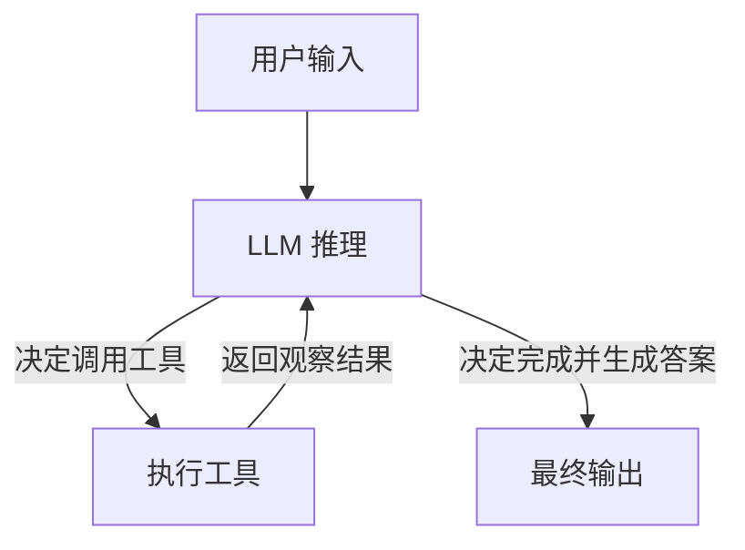

## LangChain 与 LangGraph

这两个库都来自 **LangChain 团队**，是当前 AI Agent 开发领域最主流的框架，但它们解决的是不同层面的问题。

> 一句话总结：**LangChain 是工具包，LangGraph 是编排引擎**。两者不是竞争关系，而是同一系统的不同抽象层级。

### 官方文档

| 框架 | 英文官网 | 中文官网 |
|------|---------|---------|
| **LangChain** | [docs.langchain.com](https://docs.langchain.com/) | [langchain.com.cn](https://www.langchain.com.cn/) |
| **LangGraph** | [langchain-ai.github.io/langgraph](https://langchain-ai.github.io/langgraph/) | [langgraph.com.cn](https://langgraph.com.cn/) |

## 前置知识：什么是 LLM

**LLM（Large Language Model，大语言模型）** 是一种基于深度学习的 AI 模型，通过在海量文本数据上训练，具备了理解和生成自然语言的能力。

> 简单理解：LLM 就是一个「超级文本补全器」，你给它一段话，它能根据上下文接着往下写，而且写得像人说的一样。

### 常见的 LLM

| 模型 | 厂商 | 说明 |
|------|------|------|
| GPT-4 / GPT-4o | OpenAI | 目前最知名的商用大模型 |
| Claude | Anthropic | 擅长长文本和推理 |
| Gemini | Google | Google 的多模态大模型 |
| 通义千问（Qwen） | 阿里巴巴 | 国内领先的开源大模型 |
| DeepSeek | DeepSeek | 国内高性价比开源模型 |
| LLaMA | Meta | 开源大模型的代表 |

### LLM 能做什么

- **文本生成**：写文章、写代码、写邮件
- **对话问答**：ChatGPT 这类聊天助手
- **文本理解**：总结、翻译、情感分析
- **工具调用**：根据意图调用 API、数据库查询等
- **代码生成**：根据自然语言描述生成代码

### LLM 的局限

- **知识有截止日期**：不知道训练数据之后发生的事
- **会「幻觉」**：可能一本正经地编造不存在的信息
- **无法访问外部数据**：默认不能联网、不能读你的文件

> 正是因为这些局限，才需要 LangChain / LangGraph 这样的框架——它们帮你把 LLM 和外部工具（搜索、数据库、文件系统等）连接起来，弥补 LLM 单独使用时的不足。

## 什么是 Agent（智能体）

Agent 是基于 LLM 的自主决策系统。它不是简单地「一问一答」，而是能**自己思考下一步该干什么**——需要查资料就调工具，信息够了就生成答案。

核心模式叫 **ReAct（Reasoning + Acting）**，流程如下：



**循环过程：**

1. **用户输入**：用户提出问题或任务
2. **LLM 推理**：大模型分析当前信息，决定下一步行动
3. **执行工具**：如果信息不够，调用工具（搜索、查数据库、执行代码等）
4. **返回观察结果**：工具执行结果反馈给 LLM
5. **循环判断**：LLM 再次推理，决定是继续调用工具还是已经可以生成最终答案
6. **最终输出**：信息充分后，生成最终回答

> 类比前端：Agent 就像一个会「自动调接口」的页面——它根据用户需求，自己决定调哪些 API，拿到数据后再决定下一步，最终渲染出结果。

---

## LangChain —— 模块化 AI 工具包

### 是什么

LangChain 是一个模块化的 LLM 应用开发框架，提供了一套开箱即用的「零件」，让你快速构建基于大语言模型的应用。

类比前端：LangChain 就像 **lodash + axios 的组合**，给你一堆好用的工具函数，你按顺序调用就行。

### 核心模块

| 模块 | 作用 | 前端类比 |
|------|------|----------|
| **Prompt Templates** | 管理和复用提示词模板 | 模板字符串 / EJS |
| **LLM / Chat Models** | 统一调用各种大模型（OpenAI、Gemini、通义千问等） | axios 封装各种 API |
| **Output Parsers** | 将模型输出解析为结构化数据（JSON、列表等） | 响应数据格式化 |
| **Retrievers** | 从知识库中检索相关文档 | 搜索引擎 |
| **Memory** | 为对话添加上下文记忆 | 会话状态管理 |
| **Document Loaders** | 加载各种格式的文档（PDF、网页、数据库等） | 文件读取器 |

### 核心设计：LCEL（LangChain Expression Language）

LangChain 的管道语法 `chain1 | chain2 | chain3`，像一条流水线，数据从左往右依次流过每个环节：

```python
from langchain_core.prompts import ChatPromptTemplate
from langchain_openai import ChatOpenAI
from langchain_core.output_parsers import StrOutputParser

# 定义一条链：提示词 → 模型 → 解析输出
chain = (
    ChatPromptTemplate.from_template("用一句话解释什么是 {topic}")
    | ChatOpenAI(model="gpt-4")
    | StrOutputParser()
)

result = chain.invoke({"topic": "微前端"})
# 输出: "微前端是一种将前端应用拆分为多个独立子应用的架构模式..."
```

### 适用场景

- 简单的问答聊天机器人
- RAG（检索增强生成）流水线
- 单步或线性多步的 LLM 工作流
- 快速原型开发、MVP 验证

## LangGraph —— 有状态的 AI 编排引擎

### 是什么

LangGraph 是 LangChain 团队开发的编排框架，它把工作流建模成**状态机**——节点是函数，边是转换——边可以是条件的。支持循环、分支、重试，还能暂停等人工介入。

类比前端：如果 LangChain 是组件库，那 LangGraph 就是**状态管理 + 路由系统（如 Redux + React Router）**，控制数据在不同节点之间怎么流转。

### 核心概念

| 概念 | 说明 | 前端类比 |
|------|------|----------|
| **State** | 在整个流程中传递和修改的状态对象 | Redux Store |
| **Node** | 流程中的一个处理步骤（函数） | React 组件 / 路由页面 |
| **Edge** | 节点之间的连接，决定执行顺序 | 路由跳转 |
| **Conditional Edge** | 根据条件决定下一步走向 | 路由守卫 / 条件跳转 |
| **Checkpoint** | 状态快照，支持暂停、恢复和时间旅行 | 状态快照 / Undo-Redo |

### 代码示例

```python
from langgraph.graph import StateGraph, END
from typing import TypedDict

# 1. 定义状态结构
class ReviewState(TypedDict):
    diff: str
    context: str
    analysis: str
    review: str
    confidence: float
    iterations: int

# 2. 定义节点函数
def context_node(state: ReviewState) -> ReviewState:
    context = fetch_context(state["diff"])
    return {**state, "context": context}

def analysis_node(state: ReviewState) -> ReviewState:
    result = run_analysis(state["context"])
    return {
        **state,
        "analysis": result["content"],
        "confidence": result["confidence"],
        "iterations": state.get("iterations", 0) + 1
    }

def review_node(state: ReviewState) -> ReviewState:
    review = write_review(state["analysis"])
    return {**state, "review": review}

# 3. 定义条件跳转
def should_loop(state: ReviewState) -> str:
    if state["confidence"] < 0.75 and state["iterations"] < 3:
        return "fetch_more_context"  # 置信度不够，回去重新获取上下文
    return "write_review"            # 置信度足够，继续写评审

# 4. 构建图
graph = StateGraph(ReviewState)
graph.add_node("get_context", context_node)
graph.add_node("analyze", analysis_node)
graph.add_node("review", review_node)

graph.set_entry_point("get_context")
graph.add_edge("get_context", "analyze")
graph.add_conditional_edges("analyze", should_loop, {
    "fetch_more_context": "get_context",  # 条件回跳
    "write_review": "review"
})
graph.add_edge("review", END)

pipeline = graph.compile()
```

### 适用场景

- 多 Agent 协作系统
- 需要条件分支、循环重试的复杂工作流
- 需要人工审核介入（Human-in-the-Loop）的流程
- 需要状态持久化和恢复的长时间任务

## 核心区别对比

| 维度 | LangChain | LangGraph |
|------|-----------|-----------|
| **定位** | 模块化工具包 | 编排引擎 |
| **编程模型** | 链式调用（线性流水线） | 图结构（状态机） |
| **数据流** | A → B → C 单向 | 支持循环、分支、回跳 |
| **状态管理** | 依赖函数参数传递 | 内置全局 State，自动流转 |
| **条件逻辑** | 需要在链外手动 if/else | 原生 Conditional Edge |
| **人工介入** | 不支持 | 原生 `interrupt()` 支持 |
| **持久化** | 无 | 内置 Checkpoint 机制 |
| **生态集成** | 600+ 集成（向量库、文档加载器等） | 复用 LangChain 生态 |
| **复杂度** | 低，上手快 | 较高，前置概念多 |
| **前端类比** | lodash + axios | Redux + React Router |

## 它们的关系：不是替代，是互补

一个关键事实：**从 LangChain v1.0 开始，LangChain 新的 Agent 抽象在底层就是构建在 LangGraph 之上的**。

调用 `create_react_agent()` 时，底层跑的其实就是 LangGraph 的状态机。所以真正的问题不是「选 LangChain 还是 LangGraph」，而是「要用高层封装，还是直接控制底层的图」。

### 推荐策略

```
简单线性流程 → 用 LangChain
                ↓ 碰到墙（循环、重试、条件分支、持久化）
复杂编排流程 → 用 LangGraph
```

实际项目中完全可以同时使用：

- **外层编排**用 LangGraph：事件路由、Agent 调度、重试管理
- **内层链**用 LangChain：格式化数据、总结文件、解析结构化输出

## 快速选型指南

| 你的需求 | 选择 |
|---------|------|
| 做一个简单的 RAG 问答 | LangChain |
| 给 LLM 加个工具调用 | LangChain |
| 多个 Agent 协作完成任务 | LangGraph |
| 流程中需要循环重试 | LangGraph |
| 需要人工审核节点 | LangGraph |
| 快速原型验证 | LangChain |
| 生产级复杂工作流 | LangGraph + LangChain |
