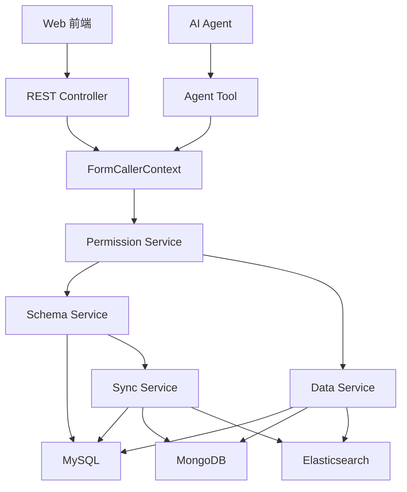
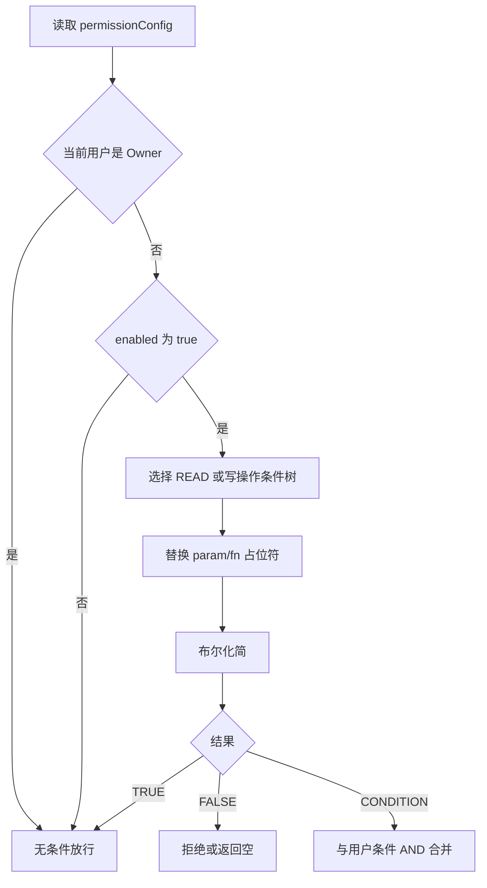
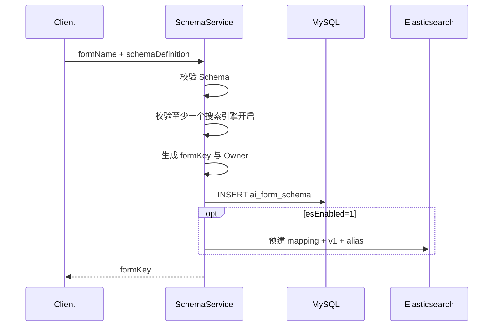
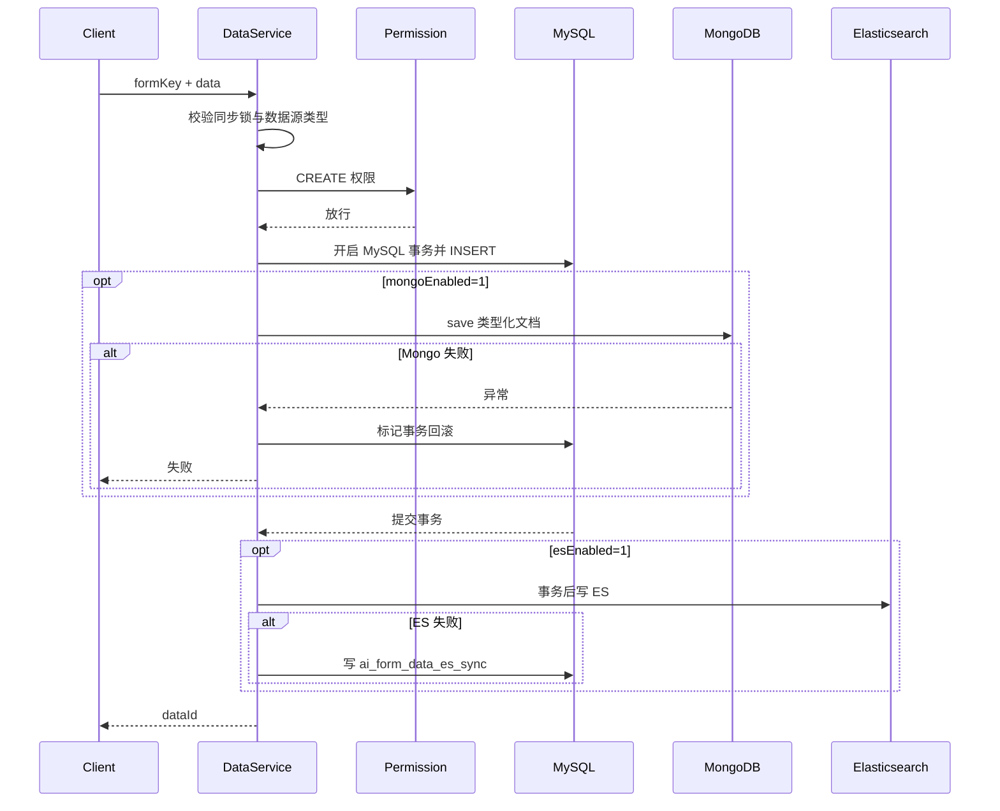
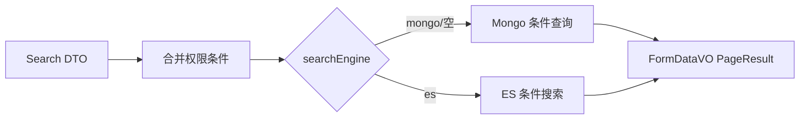
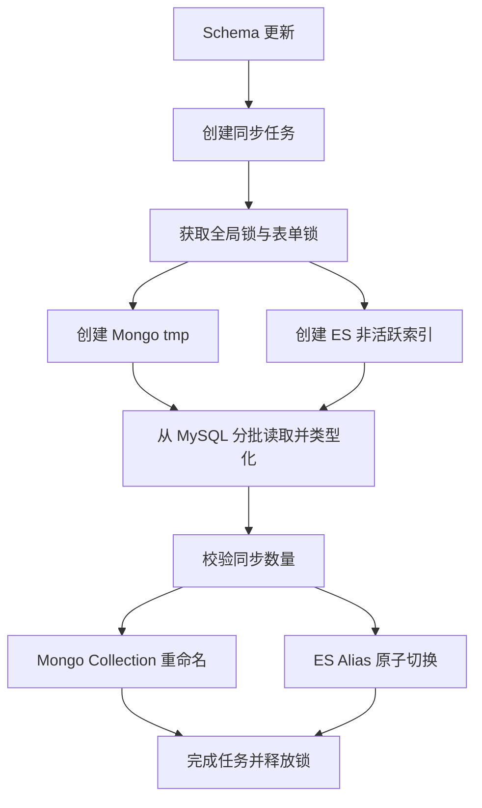

# aiForm 低代码表单平台技术方案
> 文档定位：不依赖源码的 aiForm 从零实施规格，同时保留旧实现行为作为迁移风险参考。
>
> 适用读者：后端、前端、测试、架构、SRE、Agent/Skill 开发者。
>
> 状态标识：**【现状】**只用于解释旧行为与迁移风险；**【增强】**表示从零开发必须实现的目标设计。
>
> **实施决策：本文件用于全新开发时，必须以生产增强方案和第 32 章最终决策为准，不得复刻“当前实现”的已知缺陷。若现状描述、早期示例与最终决策冲突，以第 32 章为唯一准则。**
## 1. 背景与目标
aiForm 用一套公共能力承载多种动态业务表单。传统方案通常为每张业务表单创建一张 MySQL 表，字段变化需要执行 `ALTER TABLE`、修改实体和发布代码。aiForm 将“表单结构”和“表单数据”抽象为元数据与 JSON 数据：
```text
一张逻辑 aiForm
= ai_form_schema 中 1 条 Schema
+ ai_form_data 中 N 条 Data
+ 可选的 MongoDB 查询副本
+ 可选的 Elasticsearch 搜索副本
```
每张表单由 32 位 `formKey` 唯一标识。所有动态字段存入 JSON，不映射成 MySQL 独立列，所以新增、删除或调整字段不需要修改 `ai_form_data` 表结构。
### 1.1 建设目标
1. 根据 JSON Schema 动态创建表单，不新增 Java 实体和 MySQL 业务表。
2. 提供统一新增、修改、删除、详情、分页、游标和批量接口。
3. 支持 MongoDB 动态条件查询与 Elasticsearch 大数据搜索、统计。
4. 支持 Owner、行级读权限和分操作写权限。
5. 同时向 REST 前端与 Agent Tool 暴露能力。
6. 支持 Schema 演进、全量同步和外部数据源接入。
7. 在生产增强方案中实现可追踪、可补偿、可回滚的最终一致性。
### 1.2 非目标
- aiForm 不负责前端页面布局 DSL、组件渲染器或可视化拖拽设计器。
- MySQL `LONGTEXT` 不负责动态字段复杂过滤和聚合。
- 当前实现不提供跨 MySQL、MongoDB、Elasticsearch 的分布式强事务。
- 当前 `version` 不是完整的 Schema 历史版本机制。
## 2. 总体架构
### 2.1 模块分层
| Maven 模块 | aiForm 职责 | 关键内容 |
|---|---|---|
| `ai-form-client` | 跨模块调用契约 | `FormCallerContext` |
| `ai-form-service` | 项目既有服务层模块 | 对外服务依赖边界 |
| `ai-form-core` | 核心业务与存储编排 | Schema、CRUD、权限、Mongo、ES、同步、Mapper |
| `ai-form-application` | 应用入口 | REST Controller、Agent Tool、数据源配置 |
推荐实现包按职责划分为 `client`、`domain`、`mapper`、`service`、`permission`、`query`、`sync`、`web` 和 `agent`，具体目录由目标工程规范决定。
### 2.2 组件图

### 2.3 核心类职责
| 类 | 职责 |
|---|---|
| `FormSchemaController` | Schema REST 创建、更新、删除、详情、列表、数据源开关 |
| `FormDataController` | 数据 REST CRUD、查询、批量操作 |
| `FormDataEsController` | ES 搜索、统计和索引管理 |
| `MongoIndexController` | Mongo 组合索引管理 |
| `AiFormSchemaAgentTools` | Agent 创建/查询 Schema、查询占位符 |
| `AiFormDataAgentTools` | Agent 数据 CRUD 与 Mongo 查询 |
| `AiFormEsAgentTools` | Agent ES 搜索、图表、计数 |
| `FormSchemaServiceImpl` | Schema 校验、Owner、开关、同步任务触发 |
| `FormDataServiceImpl` | CRUD 编排、权限、MySQL/Mongo/ES 写入与读取降级 |
| `FormPermissionServiceImpl` | 权限树解析、变量替换、布尔化简、写权限判定 |
| `FormDataMongoServiceImpl` | BSON 文档构建、Mongo CRUD、索引、Collection 切换 |
| `FormDataEsServiceImpl` | Mapping、ES 搜索和图表编排 |
| `EsIndexManager` | ES alias、物理索引、批量写入、原子切换 |
| `FormDataSyncServiceImpl` | 全量/外部增量同步、锁、心跳、进度 |
| `FormDataParser` | Schema 校验、动态值类型化、ES Mapping 生成 |
## 3. 核心领域模型
### 3.1 formKey
**【现状】**创建 Schema 时生成：
```java
UUID.randomUUID().toString().replace("-", "")
```
示例：
```text
c74ecb481f0a4ed591f14749c9b1c562
```
`formKey` 同时用于：
- `ai_form_schema.form_key` 唯一键。
- `ai_form_data.form_key` 逻辑关联键。
- Mongo Collection 后缀。
- ES alias 和物理索引后缀。
- API、Agent Tool、权限和同步任务的路由键。
### 3.2 Schema Definition
完整结构：
```json
{
  "fields": [
    {
      "fieldId": "customerName",
      "fieldName": "客户名称",
      "fieldType": "string",
      "required": true,
      "defaultValue": null
    },
    {
      "fieldId": "description",
      "fieldName": "客户描述",
      "fieldType": "text",
      "required": false
    },
    {
      "fieldId": "employeeCount",
      "fieldName": "员工数量",
      "fieldType": "integer"
    },
    {
      "fieldId": "annualRevenue",
      "fieldName": "年收入",
      "fieldType": "number"
    },
    {
      "fieldId": "establishedAt",
      "fieldName": "成立时间",
      "fieldType": "date",
      "dateFormat": "yyyy-MM-dd"
    },
    {
      "fieldId": "active",
      "fieldName": "是否有效",
      "fieldType": "boolean",
      "defaultValue": true
    },
    {
      "fieldId": "tags",
      "fieldName": "标签",
      "fieldType": "array",
      "arraySeparator": ",",
      "arrayElementType": "string"
    }
  ]
}
```
### 3.3 字段属性
| 属性 | 类型 | 必填 | 含义 |
|---|---:|---:|---|
| `fieldId` | String | 是 | 稳定字段标识，数据 JSON 的 key |
| `fieldName` | String | 是 | 展示名，可修改但不应影响存量数据 |
| `fieldType` | String | 是 | `string/text/integer/number/date/boolean/array` |
| `required` | Boolean | 否 | 创建和完整更新时必须存在且非 null |
| `defaultValue` | JSON value | 否 | 类型必须与 fieldType 一致；只在创建时补齐缺失字段 |
| `dateFormat` | String | 日期可选 | 仅允许 `yyyy-MM-dd` 或 ISO 8601 date-time |
| `arraySeparator` | String | 数组迁移可选 | 仅供外部导入兼容；正式 API 必须传 JSON Array |
| `arrayElementType` | String | 数组必填 | 只允许 string/integer/number/boolean/date |
### 3.4 类型映射
| fieldType | MySQL JSON | Java/BSON | ES Mapping | 示例 |
|---|---|---|---|---|
| `string` | JSON 字符串 | String | keyword | `"杭州公司"` |
| `text` | JSON 字符串 | String | text + keyword 子字段 | `"长文本说明"` |
| `integer` | JSON 整数 | Long | long | `120` |
| `number` | JSON 数字 | BigDecimal/Decimal128 | double | `99.50` |
| `date` | ISO 字符串 | LocalDate 或 Instant | date | `"2026-06-30"` |
| `boolean` | JSON 布尔 | Boolean | boolean | `true` |
| `array` | JSON 数组 | List | 按元素类型映射 | `["A","B"]` |
**【现状风险】**`parseData` 类型转换失败时可能返回原始字符串或 `null`，而不是拒绝写入。MySQL 仍保存原始 JSON，但 Mongo/ES 可能出现类型不一致或 Mapping 冲突。
### 3.5 Schema 校验
**【现状】**`FormDataParser.validateSchema` 校验：
1. JSON 可解析为 `FormSchemaBO`。
2. `fields` 非空。
3. `fieldId`、`fieldType`、`fieldName` 非空。
4. `fieldId` 不重复。
5. `fieldId` 不与系统字段重名。
6. `fieldType` 属于枚举白名单。
系统保留字段包括 `id`、`data`、`formKey`、`gmtCreate`、`gmtModified`、`creator`、`modifier`、`isDeleted/is_deleted` 等代码常量定义的字段。
**【增强】**还应校验：
- `fieldId` 匹配 `^[A-Za-z][A-Za-z0-9_]{0,63}$`。
- `fieldName` 长度不超过 128。
- `defaultValue` 能按类型解析。
- `arrayElementType` 属于允许的标量类型。
- 日期格式白名单，禁止任意复杂格式。
- Schema 总大小、字段数和嵌套深度上限。
- Schema 中 `required=true` 的字段在创建/更新数据时必须存在且非空。
## 4. MySQL 数据模型
本章先解释核心表，完整可执行 DDL 已内嵌在第 22 章，不依赖任何外部 SQL 文件。
### 4.1 ai_form_schema
一条记录描述一张逻辑表单。
| 列 | 类型 | 说明 |
|---|---|---|
| `id` | BIGINT | 自增主键 |
| `form_key` | VARCHAR(64) | 表单唯一键，唯一索引 |
| `form_name` | VARCHAR(128) | 表单名称 |
| `schema_definition` | LONGTEXT | 字段定义 JSON 字符串 |
| `version` | INT | 当前值创建时为 1 |
| `mongo_enabled` | TINYINT | 0 关闭，1 开启，默认 1 |
| `es_enabled` | TINYINT | 0 关闭，1 开启，默认 0 |
| `sync_status` | TINYINT | 0 正常，1 同步中 |
| `data_source_type` | TINYINT | 0 API，1 外部全量，2 外部增量 |
| `last_sync_time` | DATETIME | 外部增量同步游标 |
| `permission_config` | LONGTEXT | 权限配置 JSON |
| `owners` | VARCHAR(1024) | Owner 用户 ID JSON 数组 |
| `client_id` | VARCHAR(64) | 调用方标识 |
| `is_deleted` | TINYINT | Schema 逻辑删除 |
| 审计列 | VARCHAR/DATETIME | creator、modifier、创建/修改时间 |
关键索引：
```sql
PRIMARY KEY (id);
UNIQUE KEY uk_form_key (form_key);
KEY idx_is_deleted (is_deleted);
```
### 4.2 ai_form_data
每次表单提交产生一行。
```sql
CREATE TABLE ai_form_data (
  id BIGINT NOT NULL AUTO_INCREMENT,
  form_key VARCHAR(64) NOT NULL,
  data LONGTEXT DEFAULT NULL,
  date_key VARCHAR(128) DEFAULT NULL,
  is_deleted TINYINT NOT NULL DEFAULT 0,
  creator VARCHAR(64) DEFAULT NULL,
  gmt_create DATETIME DEFAULT NULL,
  modifier VARCHAR(64) DEFAULT NULL,
  gmt_modified DATETIME DEFAULT NULL,
  PRIMARY KEY (id),
  KEY idx_form_key_deleted_id (form_key, is_deleted, id),
  KEY idx_form_key_date_key (form_key, date_key),
  KEY idx_gmt_modified (gmt_modified)
) ENGINE=InnoDB DEFAULT CHARSET=utf8mb4;
```
注意：DDL 未声明物理外键，关联完整性由应用通过 `formKey` 保证。
### 4.3 一张 aiForm 在 MySQL 中的真实形态
Schema 行：
```text
id = 10
form_key = c74ecb481f0a4ed591f14749c9b1c562
form_name = 客户登记表
schema_definition = {"fields":[{"fieldId":"customerName",...}]}
version = 1
mongo_enabled = 1
es_enabled = 1
owners = ["100001"]
```
Data 行：
```text
id = 1001
form_key = c74ecb481f0a4ed591f14749c9b1c562
data = {"customerName":"杭州公司","employeeCount":120,"active":true}
creator = 100001
is_deleted = 0
```
第二次提交不会新增列，而是新增另一行：
```text
id = 1002
form_key = c74ecb481f0a4ed591f14749c9b1c562
data = {"customerName":"上海公司","employeeCount":80,"active":true}
```
### 4.4 字段变化行为
新增 `phone` 后：
```json
{"customerName":"新客户","phone":"13800000000"}
```
旧数据仍可保持：
```json
{"customerName":"旧客户"}
```
行为规则：
| 变更 | MySQL 是否改表 | 旧 JSON | 新 JSON | 风险 |
|---|---:|---|---|---|
| 新增可选字段 | 否 | 无该 key | 可带新 key | 低 |
| 修改 `fieldName` | 否 | 不变 | 不变 | 低 |
| 新增必填字段 | 否 | 无该 key | 应要求有 key | 需默认值/回填 |
| 删除字段 | 否 | 旧值仍存在 | 不再写入 | 存储残留 |
| 重命名 `fieldId` | 否 | 仍是旧 key | 使用新 key | 等价于删旧增新 |
| 修改类型 | 否 | 原值不变 | 按新类型解释 | Mongo/ES 转换风险 |
### 4.5 其他 MySQL 表
| 表 | 用途 | 当前状态 |
|---|---|---|
| `ai_form_data_mongo_sync` | Mongo 写失败记录 | 已写入；补偿闭环需核实/增强 |
| `ai_form_mongo_index` | Mongo 组合索引元数据 | 已使用 |
| `ai_form_sync_progress` | 全量同步任务与进度 | 已使用 |
| `ai_form_sync_cursor` | 旧 ES 增量游标 | DDL 注明当前未使用 |
| `ai_form_sync_lock` | 全局同步锁、节点、心跳 | 已使用 |
| `ai_form_data_external` | 外部全量覆盖数据 | 已使用 |
| `ai_form_data_incremental` | 外部增量 UPSERT 数据 | 已使用 |
| `ai_form_data_es_sync` | ES 写失败记录 | 已写入，DDL 明确重试尚未实现 |
### 4.6 MySQL 查询边界
推荐只用固定列执行：
```sql
SELECT * FROM ai_form_data
WHERE form_key = ? AND is_deleted = 0 AND id > ?
ORDER BY id ASC LIMIT ?;
```
不推荐在 `LONGTEXT data` 上做大量 `LIKE` 或 JSON 字段过滤。复杂动态条件交给 Mongo，全文搜索和统计交给 ES。
## 5. MongoDB 模型
### 5.1 连接与命名
- database：`ai_form`。
- Collection：`form_data_{formKey}`。
- 全量同步临时 Collection：`form_data_{formKey}_tmp`。
- 配置键：`spring.data.mongodb.uri`，各环境注入，不在文档保存真实凭据。
### 5.2 文档结构
```json
{
  "_id": 1001,
  "data": {
    "customerName": "杭州公司",
    "employeeCount": 120,
    "annualRevenue": 99.5,
    "establishedAt": "BSON Date",
    "active": true,
    "tags": ["重点", "华东"]
  },
  "gmtCreate": "BSON Date",
  "gmtModified": "BSON Date",
  "creator": "100001",
  "modifier": "100001"
}
```
`FormDataMongoServiceImpl.buildDocument` 会读取当前 Schema，用 `FormDataParser.parseData` 将 MySQL 原始 JSON 转成类型化字段。
### 5.3 Mongo 索引
`ai_form_mongo_index.index_keys` 保存字段 ID 数组，例如：
```json
["customerName", "active"]
```
创建的真实组合索引字段为：
```json
{"data.customerName": 1, "data.active": 1}
```
索引建议：
1. 只为高频筛选、排序字段建索引。
2. 组合索引顺序遵循等值、排序、范围原则。
3. 禁止每个动态字段都建索引。
4. 上线前用真实查询验证 explain 和选择性。
## 6. Elasticsearch 模型
### 6.1 Alias 与物理索引
```text
alias: form_data_{formKey}
physical: form_data_{formKey}_v1
physical: form_data_{formKey}_v2
```
对外读写始终使用 alias。全量同步写入非活跃物理索引，完成后原子切换 alias。
### 6.2 Mapping 示例
```json
{
  "properties": {
    "gmtCreate": {"type":"date","format":"yyyy-MM-dd HH:mm:ss"},
    "gmtModified": {"type":"date","format":"yyyy-MM-dd HH:mm:ss"},
    "creator": {"type":"keyword"},
    "modifier": {"type":"keyword"},
    "isDeleted": {"type":"integer"},
    "data": {
      "properties": {
        "customerName": {"type":"keyword"},
        "description": {
          "type":"text",
          "fields":{"keyword":{"type":"keyword","ignore_above":256}}
        },
        "employeeCount": {"type":"long"},
        "annualRevenue": {"type":"double"},
        "establishedAt": {"type":"date","format":"yyyy-MM-dd"},
        "active": {"type":"boolean"},
        "tags": {"type":"keyword"}
      }
    }
  }
}
```
### 6.3 搜索与聚合
- `page` 模式使用 `from + size`，适合浅分页。
- `cursor` 模式按 `id` 排序并使用 `search_after`，适合连续翻页。
- 查询强制过滤 `isDeleted=0`。
- 图表支持维度 terms/date 分组，以及 `sum/avg/max/min/count` 指标。
- `text` 字段精确匹配、排序、聚合使用 `.keyword`。
## 7. 条件树查询协议
### 7.1 JSON 结构
```json
{
  "logic": "AND",
  "children": [
    {"fieldId":"active","exp":"=","value":"true"},
    {
      "logic": "OR",
      "children": [
        {"fieldId":"employeeCount","exp":">=","value":"100"},
        {"fieldId":"customerName","exp":"like","value":"杭州"}
      ]
    }
  ]
}
```
逻辑节点使用 `logic + children`，叶子节点使用 `fieldId + exp + value`。`value` 是 JSON 标量或数组，不使用逗号字符串模拟集合；权限占位符使用 JSON 字符串，函数可额外使用 `fnArgs`。
### 7.2 运算符
| exp | 语义 | 推荐类型 |
|---|---|---|
| `=` | 等于 | 全部标量 |
| `!=` | 不等于 | 全部标量 |
| `>`、`>=`、`<`、`<=` | 范围比较 | integer/number/date |
| `like` | 包含/模糊匹配 | string/text |
| `in` | 字段值属于集合 | 标量，value 必须为 JSON 数组 |
| `arrIn` | 数组包含任一目标元素 | array，value 必须为 JSON 数组 |
| `arrAll` | 数组包含全部目标元素 | array，value 必须为 JSON 数组 |
查询值必须按 Schema 严格转换；任何类型错误返回 `CONDITION_INVALID`，禁止以字符串继续查询。
## 8. REST API 契约
统一响应：
```json
{"success":true,"code":"OK","message":"success","data":{},"traceId":"..."}
```
分页数据使用 `PageResult<T>`，主要包含 `pageNum`、`pageSize`、`total`、`list`、`hasNext`、`nextCursor`。
### 8.1 Schema API
| Method | URL | 用途 | 权限 |
|---|---|---|---|
| POST | `/api/form/schema/create` | 创建 Schema | 登录用户成为 Owner |
| PUT | `/api/form/schema/update` | 更新 Schema | Owner |
| DELETE | `/api/form/schema/delete` | 删除 Schema | Owner |
| GET | `/api/form/schema/detail` | Schema 详情 | 当前未强制 Owner |
| GET | `/api/form/schema/list` | Schema 分页列表 | 登录态 |
| PUT | `/api/form/schema/datasource` | 更新 Mongo/ES 开关 | Owner |
| GET | `/api/form/schema/placeholders` | 权限占位符 | 登录态 |
创建请求：
```http
POST /api/form/schema/create
Content-Type: application/json
```
```json
{
  "formName": "客户登记表",
  "schemaDefinition": "{\"fields\":[{\"fieldId\":\"customerName\",\"fieldName\":\"客户名称\",\"fieldType\":\"string\",\"required\":true}]}",
  "mongoEnabled": 1,
  "esEnabled": 1,
  "dataSourceType": 0,
  "permissionConfig": null
}
```
响应 `data` 是新生成的 `formKey`。创建人由登录态取得，调用方不能指定 Owner。
更新请求必须传当前 `version`，可同时传 `formName/schemaDefinition/mongoEnabled/esEnabled/dataSourceType/permissionConfig/owners`。`owners` 若传入不得为空；版本不匹配返回 HTTP 409 与 `SCHEMA_VERSION_CONFLICT`。
### 8.2 Data API
| Method | URL | 请求关键字段 | 上限 |
|---|---|---|---:|
| POST | `/api/form/data/add` | `formKey,data` + `Idempotency-Key` Header | 单条 |
| PUT | `/api/form/data/update` | `id,version,formKey,data` | 单条，全量覆盖 JSON |
| DELETE | `/api/form/data/delete` | Body `formKey,dataId,version` | 单条 |
| GET | `/api/form/data/detail` | Query `formKey,dataId` | 单条 |
| POST | `/api/form/data/search` | 查询 DTO | pageSize 最大 200 |
| POST | `/api/form/data/batch` | Data DTO 数组 | REST 最大 500 |
| DELETE | `/api/form/data/batch` | Body `formKey,items[{id,version}]` | REST 最大 500 |
新增请求：
```json
{
  "formKey": "c74ecb481f0a4ed591f14749c9b1c562",
  "data": "{\"customerName\":\"杭州公司\",\"employeeCount\":120}"
}
```
注意：`formKey` 必须位于请求根层级；`data` 是 JSON 字符串，不要误传成：
```json
{"data":{"formKey":"...","data":"..."}}
```
搜索请求：
```json
{
  "formKey": "c74ecb481f0a4ed591f14749c9b1c562",
  "searchEngine": "mongo",
  "conditionTree": {
    "logic":"AND",
    "children":[{"fieldId":"active","exp":"=","value":"true"}]
  },
  "pageMode":"page",
  "pageNum":1,
  "pageSize":20,
  "sortField":"employeeCount",
  "sortOrder":2
}
```
### 8.3 ES 与 Mongo 索引 API
| Method | URL | 用途 |
|---|---|---|
| POST | `/api/form/es/index` | 根据字段定义创建 mapping/index |
| POST | `/api/form/es/search` | ES 条件树搜索 |
| POST | `/api/form/es/chart` | 图表聚合 |
| GET | `/api/form/es/count` | 未删除数据计数 |
| GET | `/api/form/mongo-index/list` | Mongo 索引列表 |
| POST | `/api/form/mongo-index/create` | 创建组合索引 |
| DELETE | `/api/form/mongo-index/delete` | 删除索引 |
## 9. Agent Tool 契约
| Tool | 用途 | 读写 |
|---|---|---|
| `create_form_schema` | 创建 Schema | 写 |
| `update_data_source` | 更新数据源类型/开关 | 写，Owner |
| `get_form_schema_detail` | Schema 详情 | 读 |
| `get_form_schema_list` | Schema 列表 | 读 |
| `get_form_placeholders` | 权限占位符 | 读 |
| `search_form_data` | Mongo/默认条件查询 | 读 |
| `get_form_data_detail` | 数据详情 | 读 |
| `create_form_data` | 新增数据 | 写，Agent Tool 强制 Owner |
| `update_form_data` | 全量更新数据 | 写，Agent Tool 强制 Owner |
| `delete_form_data` | 逻辑删除 | 写，Agent Tool 强制 Owner |
| `batch_create_form_data` | 批量新增 | 写，最大 100 |
| `batch_delete_form_data` | 批量删除 | 写，最大 100 |
| `es_search_form_data` | ES 查询 | 读 |
| `es_chart_query` | ES 聚合 | 读 |
| `get_form_data_count` | ES 计数 | 读 |
Agent Tool 上下文链路：
```text
AgentRequestContext
→ employeeId
→ employeeNo
→ 组织单元信息
→ FormCallerContext
→ 权限变量预计算
→ Service
```
## 10. 权限模型
### 10.1 FormCallerContext
```json
{
  "userId": "100001",
  "clientId": "示例业务系统",
  "params": {
    "userId": "100001",
    "employeeNo": "WB100001",
    "orgPaths": ["华东大区"],
    "orgPathsWithSub": ["华东大区", "浙江团队"]
  }
}
```
REST 从统一身份认证系统登录态与 `WebRequestContext` 构建；Agent Tool 从 Agent 请求上下文构建。
### 10.2 permissionConfig
```json
{
  "enabled": true,
  "rootNode": {
    "logic": "OR",
    "children": [
      {"fieldId":"ownerEmployeeNo","exp":"=","value":"${param:employeeNo}"},
      {"fieldId":"orgName","exp":"in","value":"${param:orgPathsWithSub}"}
    ]
  },
  "writePermission": {
    "createCondition": {"fieldId":"orgName","exp":"in","value":"${param:orgPaths}"},
    "updateCondition": {"fieldId":"ownerEmployeeNo","exp":"=","value":"${param:employeeNo}"},
    "deleteCondition": {"fieldId":"ownerEmployeeNo","exp":"=","value":"${param:employeeNo}"}
  }
}
```
### 10.3 占位符
| 占位符 | 类型 | 值 |
|---|---|---|
| `${param:employeeNo}` | single | 当前用户员工编号 |
| `${param:orgPaths}` | list | 所属组织单元 |
| `${param:orgPathsWithSub}` | list | 所属组织单元及下级 |
| `${fn:managedOrgNames}` | list | 用户作为管理员负责的组织单元 |
| `${user.xxx}` | legacy | 兼容旧格式 |
### 10.4 权限解析

**【现状风险】**权限 JSON 解析失败时读权限逻辑按未启用处理，存在配置损坏后放大权限的风险。
**【增强】**生产环境应 fail closed：配置发布时强校验；运行时解析失败拒绝请求并告警；Owner 操作记录审计日志；`clientId` 必须纳入 Schema 列表、详情和数据访问隔离。
## 11. CRUD 与读取流程
本章图示说明旧实现的数据流和迁移风险；全新开发的写入流程必须执行第 32 章的 MySQL 事实源 + Outbox 方案。
### 11.1 Schema 创建

ES 预建失败只记录日志，不回滚 Schema 创建；后续全量同步兜底。
### 11.2 数据新增

### 11.3 更新与删除
- 更新是完整 `data` JSON 覆盖，不是 JSON Patch。
- 更新先读取原记录并校验 UPDATE 权限。
- MySQL 更新与 Mongo `save` 使用同一应用编排事务路径。
- 删除在 MySQL 中设置 `is_deleted=1`，Mongo 物理删除，ES 文档设置 `isDeleted=1`。
- 对外新增/更新/删除拒绝 `dataSourceType=1/2` 的外部表单直接写入。
### 11.4 详情读取降级
```text
Mongo 命中
→ 否则 ES 命中且未逻辑删除
→ 否则按 dataSourceType 从 MySQL 兜底
→ 对最终记录执行行级权限校验
```
### 11.5 搜索路由

## 12. 事务与一致性
### 12.1 当前事务边界
**【现状】**准确描述如下：
1. MySQL 由 `TransactionTemplate` 管理本地事务。
2. Mongo 写入在事务回调中调用，但 Mongo 并未加入 MySQL XA 事务。
3. Mongo 抛异常时应用调用 `status.setRollbackOnly()` 回滚 MySQL。
4. ES 在 MySQL 事务提交后写入。
5. ES 失败只记录 `ai_form_data_es_sync`，接口仍成功。
6. Mongo 失败记录在事务外写入 `ai_form_data_mongo_sync`，主请求失败。
因此可称为“应用编排的 MySQL + Mongo 双写”，不能称为严格跨库事务。
### 12.2 失败矩阵
| 阶段 | 客户端结果 | MySQL | Mongo | ES | 补偿 |
|---|---|---|---|---|---|
| MySQL 失败 | 失败 | 回滚 | 未写/不确定 | 不写 | 查日志 |
| Mongo 失败 | 失败 | 回滚 | 可能失败或部分完成 | 不写 | Mongo 失败表；需对账 |
| ES 失败 | 成功 | 已提交 | 已成功/未启用 | 缺失或旧值 | ES 失败表，当前重试未完整实现 |
| 响应丢失 | 客户端未知 | 可能成功 | 可能成功 | 可能成功 | 当前新增无幂等键 |
Mongo 不是 MySQL 事务参与者：若 Mongo 已成功但随后发生进程故障、MySQL 最终回滚，仍可能留下孤儿文档，必须依靠对账修复。
### 12.3 生产增强：Outbox 最终一致性
本节为概念说明；全新实现的最终 DDL、状态枚举、认领、重试、乱序保护与死信重放必须严格执行第 32.8 节。
推荐将 MySQL 设为唯一事实源：
```text
MySQL 事务：业务数据 + outbox 事件
→ 事务提交
→ 消费者读取 outbox
→ 幂等 upsert Mongo
→ 幂等 upsert ES
→ 标记各目标完成
→ 失败指数退避
→ 超限进入 DEAD 并告警
```
建议 Outbox DDL：
```sql
CREATE TABLE ai_form_outbox (
  id BIGINT NOT NULL AUTO_INCREMENT,
  event_id VARCHAR(64) NOT NULL,
  form_key VARCHAR(64) NOT NULL,
  data_id BIGINT NOT NULL,
  event_type VARCHAR(32) NOT NULL,
  payload LONGTEXT NOT NULL,
  mongo_status TINYINT NOT NULL DEFAULT 0,
  es_status TINYINT NOT NULL DEFAULT 0,
  retry_count INT NOT NULL DEFAULT 0,
  next_retry_time DATETIME DEFAULT NULL,
  last_error VARCHAR(1024) DEFAULT NULL,
  gmt_create DATETIME NOT NULL,
  gmt_modified DATETIME NOT NULL,
  PRIMARY KEY (id),
  UNIQUE KEY uk_event_id (event_id),
  KEY idx_retry (mongo_status, es_status, next_retry_time)
);
```
消费者以 `(formKey,dataId,eventVersion)` 幂等。删除使用墓碑事件，不能只依赖物理删除。只有 Mongo/ES 都完成后才归档事件。
## 13. Schema 演进与全量同步
### 13.1 当前行为
- Schema JSON 变化或搜索引擎从 0 切到 1 时创建全量同步任务。
- `ai_form_sync_progress` 分别创建 Mongo、ES 任务。
- 同步期间读操作继续读取旧 Collection/alias。
- 写操作通过 `sync_status` 被限制。
- Mongo 写入 `_tmp` Collection，完成后重命名切换。
- ES 写入非活跃 `_v1/_v2`，完成后原子切换 alias。

### 13.2 当前版本缺口
创建 Schema 时 `version=1`，但 `updateSchema` 未递增版本，也没有历史版本表。ES `_v1/_v2` 是双缓冲物理索引，不等于业务 Schema 版本。
### 13.3 生产增强：版本历史
本节 DDL 用于解释演进思路；全新实现必须使用第 32.2 节包含 clientId、JSON 类型和最终约束的表定义。
```sql
CREATE TABLE ai_form_schema_version (
  id BIGINT NOT NULL AUTO_INCREMENT,
  form_key VARCHAR(64) NOT NULL,
  version INT NOT NULL,
  schema_definition LONGTEXT NOT NULL,
  change_type VARCHAR(32) NOT NULL,
  change_summary VARCHAR(1024) DEFAULT NULL,
  migration_status TINYINT NOT NULL DEFAULT 0,
  creator VARCHAR(64) NOT NULL,
  gmt_create DATETIME NOT NULL,
  PRIMARY KEY (id),
  UNIQUE KEY uk_form_version (form_key, version)
);
```
更新采用乐观锁：
```sql
UPDATE ai_form_schema
SET schema_definition=?, version=version+1, modifier=?, gmt_modified=NOW()
WHERE form_key=? AND version=? AND is_deleted=0;
```
影响行数不是 1 时返回 409，要求客户端刷新 Schema 后重试。
### 13.4 兼容性等级
| 变更 | 等级 | 发布策略 |
|---|---|---|
| 修改 fieldName | 兼容 | 直接发布 |
| 新增可选字段 | 兼容 | 直接发布并同步索引 |
| 新增带默认值必填字段 | 条件兼容 | 先回填再启用 required |
| 删除字段 | 不兼容 | 先停止写入，保留读取窗口，再清理 |
| 重命名 fieldId | 不兼容 | 新旧字段双写并迁移 |
| string→text | 条件兼容 | 重建 ES Mapping |
| string→integer/date | 不兼容 | 预扫描、转换失败清单、迁移 |
| 修改数组元素类型 | 不兼容 | 全量迁移 |
迁移流程：草稿 Schema → diff → 兼容性检查 → 数据预扫描 → 创建版本 → 全量迁移 → 校验 → 切换 → 观察 → 清理旧版本。
## 14. 外部数据源
| dataSourceType | 数据表 | 写入模式 | API CRUD |
|---:|---|---|---|
| 0 | `ai_form_data` | 正常 API 写入 | 允许 |
| 1 | `ai_form_data_external` | 外部全量覆盖 | 拒绝普通 CRUD |
| 2 | `ai_form_data_incremental` | 按 date_key UPSERT | 拒绝普通 CRUD |
增量表使用唯一键：
```sql
UNIQUE KEY uk_form_datekey (form_key, date_key)
```
外部增量当前按 `gmt_modified` 查询 `[pt, nt)`。Mongo 或整体异常时不会推进游标；但 ES bulk 仅部分失败时当前实现仍会推进 `last_sync_time=nt`，存在失败记录越过时间窗口的风险。增强版必须在所有目标成功后再推进游标，或将失败 ID 持久化重试。
**【增强】**应增加：
- 源端稳定游标优先于纯时间戳。
- 时间戳相同记录使用 `(gmt_modified,id)` 复合游标。
- 批次 checksum、源/目标 count 和抽样 hash。
- 失败不推进游标，重跑依赖 `date_key` 幂等。
## 15. 配置、部署与安全
### 15.1 版本选择原则
全新项目以 LTS、生态兼容和可运维性优先，不直接沿用旧系统版本，也不采用 alpha、beta、rc、EA 或刚发布但依赖生态尚未验证的版本。表中 `x` 表示在对应大版本内使用通过测试的最新安全补丁，并通过 Maven Wrapper、`package-lock.json`、容器镜像 digest 和部署清单锁定实际版本。

旧实现兼容栈为 Java 17、Spring Boot 2.7.18、MyBatis 2.1.0 和 Elasticsearch Rest High Level Client 7.17.18，仅用于迁移或核对现状；全新开发禁止以该组合为默认基线。

### 15.2 全新项目推荐版本
| 类别 | 推荐基线 | 约束 |
|---|---|---|
| JDK | Eclipse Temurin JDK 25 LTS | 统一编译和运行版本，禁止使用 JRE-only 镜像 |
| Spring Boot | 4.1.x | 使用同系列最新补丁，依赖版本由 Boot BOM 管理 |
| Spring Framework | 由 Spring Boot 管理 | 禁止单独覆盖核心 Framework 版本 |
| 构建工具 | Maven 3.9.x + Maven Wrapper | CI 只执行 `./mvnw`，Java 编译目标为 25 |
| 数据访问 | MyBatis Spring Boot Starter 4.x | 与 Spring Boot 4.x 对齐，禁止继续使用 2.1.0 |
| JSON | Jackson 3.x，由 Boot BOM 管理 | 新代码不引入 FastJSON；时间格式集中配置 |
| MySQL | 8.4 LTS | `utf8mb4`、InnoDB，使用最新 8.4 安全补丁 |
| MongoDB | 8.0.x | 生产使用副本集或托管集群，不使用单节点 |
| Elasticsearch | 9.x | 集群与 Java API Client 保持同一大版本，优先同一小版本 |
| ES Java Client | Elasticsearch Java API Client 9.x | 禁止使用已淘汰的 Rest High Level Client |
| Node.js | 24 LTS | 仅用于管理前端构建，使用对应最新安全补丁 |
| 前端 | 最新稳定版 React、Ant Design、TypeScript、Vite | 初始化验证后由 `package-lock.json` 固定 |
| 容器规范 | OCI Image Spec | Linux `amd64` 和 `arm64` 构建至少验证目标生产架构 |
| 编排平台 | Kubernetes 1.32+ 的受支持版本 | 集群控制面采用供应商仍支持的当前版或前一版 |

若基础设施暂不支持上述版本，必须在项目启动前形成兼容矩阵和升级计划；不得在开发中途静默降级。数据库驱动、Spring Data MongoDB 和 Jackson 均优先使用 Spring Boot BOM 版本，不手工拼装依赖。

### 15.3 环境分层
必须具有独立的 `local`、`test`、`staging`、`production` 配置：
| 环境 | 用途 | 数据与依赖要求 |
|---|---|---|
| `local` | 本地开发 | 可使用 Docker Compose；免登录仅允许在此环境启用 |
| `test` | 自动化测试 | 独立临时数据库；集成测试可使用 Testcontainers |
| `staging` | 发布前验证 | 拓扑、版本和配置结构与生产一致，使用脱敏数据 |
| `production` | 正式流量 | 禁止 mock 身份、默认密码、调试端点和自动建表 |

禁止跨环境共用数据库、Mongo database、ES index alias、消息队列 topic 或密钥。所有资源名必须带环境标识；生产变更先经过 staging 验证。

### 15.4 配置模板
```yaml
spring:
  application:
    name: ai-form-platform
  datasource:
    url: ${MYSQL_URL}
    username: ${MYSQL_USERNAME}
    password: ${MYSQL_PASSWORD}
    hikari:
      maximum-pool-size: ${MYSQL_POOL_MAX:20}
      minimum-idle: ${MYSQL_POOL_MIN:5}
      connection-timeout: 3000
      validation-timeout: 1000
  data:
    mongodb:
      uri: ${MONGO_URI}
  lifecycle:
    timeout-per-shutdown-phase: 30s
server:
  shutdown: graceful
management:
  endpoints:
    web:
      exposure:
        include: health,info,prometheus
  endpoint:
    health:
      probes:
        enabled: true
aiform:
  auth:
    mode: ${AUTH_MODE:required}
  es:
    uris: ${ES_URIS}
    username: ${ES_USERNAME}
    password: ${ES_PASSWORD}
  sync:
    executor:
      core-pool-size: ${SYNC_CORE_POOL_SIZE:4}
      max-pool-size: ${SYNC_MAX_POOL_SIZE:8}
      queue-capacity: ${SYNC_QUEUE_CAPACITY:64}
```

`AUTH_MODE=mock` 只允许 `local/test` 且必须显式配置，默认 `required` 表示必须由正式身份提供器产生用户上下文。应用在 `staging/production` 检测到 mock 时必须启动失败。数据库连接池大小应根据实例连接上限、Pod 数量和后台任务并发共同计算，不能直接复制示例默认值。

### 15.5 数据服务部署
- MySQL 使用主从或托管高可用实例，开启自动备份、时间点恢复和慢 SQL 采集；Schema 迁移统一由 Flyway 执行，应用生产启动时禁止自动修改表结构。
- MongoDB 使用三节点副本集或托管高可用集群，启用认证、TLS、备份和磁盘告警；应用连接必须包含超时、重试写和副本集参数。
- Elasticsearch 使用至少三个 master-eligible 节点的生产集群或托管服务，数据节点按容量规划；启用 TLS、认证、快照仓库、磁盘水位和 JVM/GC 告警。
- MySQL、MongoDB 和 Elasticsearch 不与应用容器部署在同一 Pod，不使用容器临时磁盘保存生产数据。
- 三类存储的版本升级必须先验证驱动兼容、索引重建、备份恢复和回滚路径。

### 15.6 应用容器镜像
后端使用多阶段构建：构建阶段使用固定 digest 的 Temurin JDK 25 镜像，运行阶段使用非 root、包含完整 JDK 25 的精简安全镜像。镜像要求：
1. 进程使用固定非 root UID/GID，根文件系统只读。
2. `/tmp` 使用受限临时卷，禁止写入应用目录。
3. 不在镜像层写入密码、证书私钥或环境配置。
4. 使用 `-XX:MaxRAMPercentage` 等容器感知参数，不手工写死与 Pod limit 不匹配的 `-Xmx`。
5. 输出结构化日志到 stdout/stderr，不在容器内滚动日志文件。
6. 镜像必须执行依赖、许可证、漏洞和 SBOM 扫描；严重漏洞未豁免不得发布。
7. 镜像 tag 用于可读性，生产部署必须引用不可变 digest。

管理前端使用 Node.js 24 LTS 多阶段构建，执行 `npm ci`、测试和生产构建后，仅将静态产物复制到 Nginx 或静态资源服务。构建镜像不得进入生产运行镜像。

### 15.7 Kubernetes 部署
后端使用 `Deployment + Service + Ingress/Gateway`，初始至少两个副本，跨节点或可用区分散。必须配置：
- `startupProbe`：允许 Schema 缓存和依赖客户端完成初始化。
- `readinessProbe`：只决定是否接流量，不因短时 ES/Mongo 降级直接重启进程。
- `livenessProbe`：只检测进程是否失活，禁止执行重型数据库查询。
- `preStop` 与不少于 30 秒的 `terminationGracePeriodSeconds`，配合 Spring graceful shutdown。
- CPU/memory `requests` 和 `limits`，禁止无资源边界运行。
- `PodDisruptionBudget`、拓扑分散和滚动发布 `maxUnavailable=0`。
- `HorizontalPodAutoscaler` 以 CPU、请求延迟和队列积压综合扩缩容；同步 worker 与在线 API 负载较大时应拆为独立 Deployment。
- 默认拒绝的 NetworkPolicy，仅开放前端入口及到 MySQL、MongoDB、Elasticsearch、配置和观测服务的必要出口。

初始资源建议仅作为压测起点：API Pod `requests: 1 CPU/2Gi`、`limits: 2 CPU/4Gi`；同步 Worker `requests: 1 CPU/2Gi`、`limits: 4 CPU/8Gi`。最终值必须由真实 Schema 宽度、批量大小、并发和 GC 压测确定。

### 15.8 发布、迁移与回滚
1. CI 顺序为静态检查、单元测试、集成测试、前端测试、生产构建、镜像扫描、部署 staging、端到端验证、人工或策略准入、生产发布。
2. 数据库变更必须向前兼容，遵循“先扩展、再双写/迁移、后收缩”，禁止应用发布与破坏性 DDL 同时执行。
3. 后端使用滚动或金丝雀发布；Schema 版本和 API 至少兼容前后两个应用版本共存。
4. 应用回滚使用上一不可变镜像 digest；数据库、Mongo Collection 和 ES alias 必须具有独立回滚方案。
5. 发布期间监控错误率、P95/P99、JVM、连接池、同步积压和一致性差异，超过阈值自动停止或回滚。

### 15.9 安全与密钥
1. 禁止将真实地址、账号、密码和 token 写入 Git、镜像、启动参数或前端构建变量。
2. 密钥通过 Kubernetes Secret 对接外部密钥管理服务，以文件或受控环境变量注入并支持轮换。
3. 数据库账户按最小权限拆分运行账户与迁移账户；生产应用账户无 DDL 权限。
4. MongoDB、Elasticsearch 和 MySQL 仅允许后端私网访问，传输链路启用 TLS。
5. 日志不得输出完整 `data`、权限配置、请求凭据和异常中的连接 URI。
6. REST、Agent Tool 和 RPC 都必须验证身份、clientId 和权限；开发免登录不能进入 staging/production。
7. 容器、依赖和基础镜像按固定周期安装安全补丁并重新构建，不在运行容器内临时升级。

### 15.10 启动检查
1. Java、Spring Boot、数据库驱动与服务端版本符合锁定的兼容矩阵。
2. Flyway 校验通过，生产环境不存在待执行的未审批迁移。
3. MySQL、MongoDB 与 Elasticsearch 可连接，权限符合最小权限清单。
4. ES cluster health、模板、ILM/快照和 alias 权限正常。
5. 同步线程池、连接池和批量参数合法且未超过资源预算。
6. 失败表、锁表、任务表和 Outbox 可读写。
7. `staging/production` 未启用 mock 身份、调试日志或不安全管理端点。
8. readiness、liveness、graceful shutdown、指标和 trace 上报均通过部署验收。
## 16. 可观测性
推荐指标：
| 指标 | 标签 | 告警建议 |
|---|---|---|
| `aiform_api_latency` | api/formKey/result | P95 超阈值 |
| `aiform_write_total` | target/result/op | 错误率持续升高 |
| `aiform_sync_backlog` | target/formKey | 积压超阈值 |
| `aiform_sync_latency` | target/mode | 全量任务超时 |
| `aiform_consistency_diff` | target/formKey | 差异大于 0 |
| `aiform_permission_denied` | op/clientId | 异常突增 |
| `aiform_executor_active` | pool | 长期达到上限 |
| `aiform_dead_event_total` | target | 大于 0 立即告警 |
日志统一携带 `traceId/formKey/dataId/eventId/userId/clientId/op`。禁止记录密码和未经脱敏的大段表单数据。
## 17. 测试方案
### 17.1 单元测试
| 模块 | 必测场景 |
|---|---|
| Schema 校验 | 非法 JSON、空字段、重复 ID、保留字段、非法类型 |
| 类型转换 | 数字、整数截断、日期严格格式、布尔、数组、失败行为 |
| Mapping | 七种类型、text.keyword、系统字段 |
| 条件树 | AND/OR 嵌套、空节点、全部运算符、类型转换 |
| 权限 | Owner、无配置、变量缺失、OR/AND 恒真假、四种操作 |
| 文档构建 | MySQL JSON 到 BSON/ES 文档与审计字段 |
| Schema diff | 兼容与不兼容变更分类 |
### 17.2 集成测试
1. 创建 Schema 后当前版本、历史版本、Owner、clientId 正确。
2. Mongo/ES 同时关闭时创建失败。
3. 新增后 MySQL 事实行、幂等结果和 Outbox 位于同一事务；消费者最终生成正确类型副本。
4. Mongo/ES 故障时事实事务仍成功，Outbox 进入 RETRY；恢复后自动追平。
5. 重复 `Idempotency-Key` 和相同请求返回原 dataId；请求体不同返回冲突。
6. 更新与删除 version 不匹配返回 409，事实行和 Outbox 均不变化。
7. 删除后 MySQL 逻辑删除，消费者最终删除 Mongo 并处理 ES 墓碑。
8. Mongo/ES 未命中时详情降级到 MySQL，且仍执行 clientId 与行权限。
9. 行权限与用户查询条件正确 AND 合并；权限配置损坏时 fail closed。
10. 不同 clientId 即使猜中 formKey/dataId 也不可读取、修改或枚举。
11. Schema 修改后读请求无中断，切换后使用新类型；旧 version 更新冲突。
12. 外部增量重复执行不产生重复 sourceKey，相同时间戳按复合游标无遗漏。
13. 同步节点宕机后租约过期可接管，旧 fencing token 不能提交结果。
14. Outbox 重复、乱序和并发消费均保持最终版本正确；超限进入 DEAD 并可审计重放。
### 17.3 性能验收建议
| 数据量 | 查询方式 | 目标示例 |
|---:|---|---|
| 1 万 | Mongo 普通分页 | P95 < 300ms |
| 100 万 | Mongo 有索引筛选 | P95 < 500ms |
| 100 万 | ES 搜索/游标 | P95 < 500ms |
| 100 万 | ES 单维聚合 | P95 < 2s |
| 1000 条批量同步 | Mongo/ES bulk | 无单条循环网络瓶颈 |
实际阈值需按部署资源、字段数和查询复杂度压测确定，不能直接把示例作为线上承诺。
### 17.4 端到端验收
1. 免登录开发身份调用 `/api/auth/me`，核对用户、组织、角色和 clientId。
2. 创建七种字段 Schema，取得 formKey 和 version=1。
3. 使用幂等键新增两条数据，核对事实行、Outbox 和最终 Mongo/ES 副本。
4. 重复请求验证幂等；旧 version 更新验证 409。
5. Mongo 条件查询数字范围，ES 搜索文本并按字段排序。
6. ES 按组织单元分组 count。
7. 更新完整 JSON，等待投影完成后核对三端版本与内容。
8. 删除一条，确认事实源逻辑删除且两个副本最终不可见。
9. 新增可选字段并触发全量同步，切换期间旧数据持续可读。
10. 验证旧记录缺字段、新记录带字段均可读取。
11. 注入 Mongo/ES 故障，验证主写成功、Outbox 重试、死信与恢复追平。
12. 损坏权限配置，验证 fail closed；切换 clientId，验证资源完全隔离。
13. 执行外部快照和复合游标增量，验证失败不推进游标及对账归零。
14. 恢复服务并验证补偿、审计、指标和告警闭环。
## 18. 从零实施步骤
### 阶段一：基础工程与 MySQL
交付：Maven 多模块、统一 Result/PageResult、最终 Flyway baseline（用户/组织、Schema/Data、幂等、Outbox、同步、审计全表）、DO/Mapper/XML、事务模板。
验收：DDL 可重复管理；Schema/Data 基础 Mapper 集成测试通过。
### 阶段二：Schema 服务
交付：字段模型、类型枚举、Schema 校验、formKey、Owner、版本历史、兼容性 diff。
验收：合法 Schema 可创建；非法定义明确返回 400；并发更新返回 409。
### 阶段三：MySQL CRUD
交付：新增、全量更新、逻辑删除、详情、审计、外部数据源写保护、幂等键。
验收：同一业务幂等键只产生一条数据；所有操作有审计记录。
### 阶段四：Mongo 查询
交付：类型化文档、Collection、条件转换、分页/游标、组合索引、Outbox 消费者。
验收：七种字段类型正确；条件树与权限树查询结果一致。
### 阶段五：ES 搜索聚合
交付：Mapping、alias、v1/v2、搜索、search_after、图表聚合、Bulk 消费。
验收：Mapping 固定；深分页不使用超大 from；聚合值正确。
### 阶段六：权限系统
交付：CallerContext、Owner、读写条件树、占位符 Registry、fail-closed、clientId 隔离。
验收：跨用户、跨 clientId 不泄漏；变量缺失不会扩大权限。
### 阶段七：同步与迁移
交付：任务队列、锁、心跳、全量蓝绿切换、外部增量、版本迁移、回滚。
验收：同步期间可读；切换原子；失败可恢复；数据 count/hash 一致。
### 阶段八：REST、Agent Tool 与运维
交付：全部 API/Tool、限流、Metrics、Tracing、告警、管理查询、操作手册。
验收：契约测试、故障演练、容量压测和安全审计通过。
### 阶段九：管理前端
交付：独立 React + TypeScript 管理端、Schema 编辑器、动态数据管理、同步任务和图表统计页面。
验收：四类管理流程全部可在浏览器完成；路由刷新不丢失；接口失败展示服务端原始 `message`；生产构建与前端自动化测试通过。
## 19. 当前实现与生产增强差距
| 项目 | 当前实现 | 生产目标 | 优先级 |
|---|---|---|---:|
| 动态字段 | LONGTEXT JSON + 类型化副本 | 保持 | 已完成 |
| Schema 版本 | 固定/单行 version，无历史 | 历史、乐观锁、回滚 | P0 |
| 数据校验 | 转换失败可降级 | 写入前严格拒绝 | P0 |
| 一致性 | 应用双写 + ES 失败表 | Outbox + 幂等 + 重试 + 对账 | P0 |
| ES 重试 | 表已预留，未完整实现 | 指数退避和死信 | P0 |
| 新增幂等 | 无业务幂等键 | formKey + idempotencyKey | P0 |
| 权限损坏 | 部分场景放行 | fail closed | P0 |
| clientId 隔离 | 存字段，隔离需加强 | 所有查询强制过滤 | P0 |
| 类型迁移 | 全量重建副本 | 预扫描、迁移、回滚 | P1 |
| 可观测性 | 日志为主 | 指标、链路、差异报告 | P1 |
| 容量治理 | 基础分页限制 | 限流、配额、Schema 上限 | P1 |
| 数据清理 | 删除字段残留 JSON | 延迟清理与保留策略 | P2 |
## 20. 关键实现约束总结
1. `formKey` 是全链路唯一逻辑表标识，禁止复用或由客户端猜测生成。
2. MySQL 保存原始 JSON，Mongo/ES 保存按 Schema 类型化后的查询副本。
3. 字段身份由 `fieldId` 决定，`fieldName` 仅用于显示。
4. 新增字段不改 MySQL 表；不兼容类型变化必须经过迁移。
5. 至少启用 Mongo 或 ES 中一个搜索引擎。
6. 生产写入采用 MySQL 事实源 + 同事务 Outbox；Mongo/ES 仅是可重建的最终一致查询副本。
7. 所有查询必须合并行权限，Owner 豁免仍需审计。
8. Schema 变更必须重建受影响的 Mongo/ES 数据结构。
9. 生产实现必须具备幂等、Outbox、重试、死信、对账和版本回滚，具体算法以第 32 章为准。
10. 配置文件和技术文档不得包含真实连接凭据。
## 21. 脱离源码的工程实现规格
本章开始给出可直接编码的完整规格。实现者不需要访问原仓库，只需按本章及后续章节建立工程、数据表、对象模型和服务边界。
### 21.1 推荐工程结构
```text
aiform-platform/
├── backend/
│   ├── aiform-client/       context、DTO、VO、RPC 接口
│   ├── aiform-core/         domain、mapper、service、permission、query
│   ├── aiform-infra/        mysql、mongo、elasticsearch、outbox、sync
│   └── aiform-application/  REST、Agent Tool、RPC 实现、config、scheduler
├── frontend/
│   └── ai-form-admin/       React、TypeScript、Ant Design、Vite
├── deploy/
│   ├── compose/             本地 MySQL、MongoDB、Elasticsearch
│   └── kubernetes/          Deployment、Service、Ingress、ConfigMap
└── migrations/              Flyway 版本化 SQL
```
后端依赖方向固定为 `application → infra/core → client`；`client` 不依赖 Web、数据库或组织服务；`core` 不读取 HTTP Session。管理前端只调用 REST，不直连 MySQL、MongoDB 或 Elasticsearch。身份统一通过 `FormCallerContext` 显式传入。
### 21.2 核心接口边界
```java
public interface FormSchemaService {
    String createSchema(FormSchemaCreateDTO dto, FormCallerContext ctx);
    FormSchemaDetailVO updateSchema(FormSchemaUpdateDTO dto, FormCallerContext ctx);
    boolean deleteSchema(String formKey, Integer expectedVersion,
                         FormCallerContext ctx);
    FormSchemaDetailVO getSchemaDetail(String formKey, FormCallerContext ctx);
    PageResult<FormSchemaVO> getSchemaList(FormSchemaQueryDTO dto,
                                            FormCallerContext ctx);
    FormSchemaDetailVO updateDataSourceConfig(
        String formKey, Integer expectedVersion, Boolean mongoEnabled,
        Boolean esEnabled, FormCallerContext ctx
    );
}

public interface FormDataService {
    DataWriteResult addData(FormDataCreateDTO dto, FormCallerContext ctx);
    DataWriteResult updateData(FormDataUpdateDTO dto, FormCallerContext ctx);
    DataWriteResult deleteData(String formKey, Long dataId, Integer version,
                               FormCallerContext ctx);
    FormDataVO getDataDetail(String formKey, Long dataId, FormCallerContext ctx);
    PageResult<FormDataVO> search(ConditionTreeSearchDTO dto, FormCallerContext ctx);
    List<DataWriteResult> batchAddData(List<FormDataCreateDTO> list,
                                       FormCallerContext ctx);
    List<DataWriteResult> batchDeleteData(String formKey,
                                          List<DeleteItemDTO> items,
                                          FormCallerContext ctx);
}

public interface FormPermissionService {
    PermissionResolveResult resolve(String formKey, FormCallerContext ctx);
    void checkWritePermission(String formKey, WriteOpType op,
                              FormCallerContext ctx, Map<String, Object> dataDoc);
    boolean isOwner(String formKey, FormCallerContext ctx);
}
```
### 21.3 基础对象定义
```java
public class FormCallerContext implements Serializable {
    private String userId;
    private String clientId;
    private String employeeNo;
    private Set<String> orgIds;
    private Set<String> orgPaths;
    private Set<String> orgPathsWithSub;
    private Set<String> roleCodes;
    private Map<String, Object> params;
}

public class FormFieldDefinition {
    private String fieldId;
    private String fieldName;
    private String fieldType;
    private String dateFormat;
    private String arraySeparator;
    private String arrayElementType;
    private Boolean required;
    private JsonNode defaultValue;
}

public class ConditionNode implements Serializable {
    private String logic;
    private List<ConditionNode> children;
    private String fieldId;
    private JsonNode value;
    private String exp;
    private List<String> fnArgs;
    public boolean isLogicNode() { return logic != null && !logic.isBlank(); }
}

public class FormPermissionConfig implements Serializable {
    private Boolean enabled;
    private ConditionNode rootNode;
    private WritePermissionConfig writePermission;
}

public class WritePermissionConfig implements Serializable {
    private ConditionNode createCondition;
    private ConditionNode updateCondition;
    private ConditionNode deleteCondition;
}
```
### 21.4 请求 DTO
```java
public class FormSchemaCreateDTO {
    private String formName;
    private String schemaDefinition;
    private Integer mongoEnabled;
    private Integer esEnabled;
    private Integer dataSourceType;
    private String permissionConfig;
}

public class FormSchemaUpdateDTO {
    private String formKey;
    private Integer version;
    private String formName;
    private String schemaDefinition;
    private Integer mongoEnabled;
    private Integer esEnabled;
    private Integer dataSourceType;
    private String permissionConfig;
    private List<String> owners;
}

public class FormSchemaQueryDTO {
    private String formName;
    private String formKey;
    private Integer pageNum;
    private Integer pageSize;
}

public class FormDataCreateDTO {
    private String formKey;
    private String data;
    private String idempotencyKey;
}

public class FormDataUpdateDTO {
    private Long id;
    private Integer version;
    private String formKey;
    private String data;
}

public class DeleteItemDTO {
    private Long id;
    private Integer version;
}

public class ConditionTreeSearchDTO {
    private String formKey;
    private ConditionNode conditionTree;
    private String searchEngine;
    private Integer pageNum;
    private Integer pageSize;
    private String sortField;
    private Integer sortOrder;
    private String pageMode;
    private Long cursor;
    private String cursorDirection;
}

public class EsChartQueryDTO {
    private String formKey;
    private String dimensionField;
    private String dimensionInterval;
    private String metricField;
    private String metricAggType;
    private String metricSort;
    private ConditionNode conditionTree;
}
```
### 21.5 响应对象
```java
public class Result<T> {
    private boolean success;
    private String code;
    private String message;
    private T data;
    private String traceId;
}

public class PageResult<T> {
    private Integer pageNum;
    private Integer pageSize;
    private Long total;
    private Integer totalPages;
    private List<T> list;
    private Long nextCursor;
    private Boolean hasNext;
}

public class DataWriteResult {
    private Long id;
    private Integer version;
    private Boolean projectionPending;
}

public class FormDataVO {
    private Long id;
    private String formKey;
    private Integer version;
    private String data;
    private Instant gmtCreate;
    private Instant gmtModified;
    private String creator;
    private String modifier;
}

public class FormSchemaDetailVO {
    private Long id;
    private String formKey;
    private String formName;
    private String schemaDefinition;
    private Integer version;
    private Integer mongoEnabled;
    private Integer esEnabled;
    private Integer dataSourceType;
    private String permissionConfig;
    private List<String> owners;
    private String creator;
    private String clientId;
    private Instant lastSyncTime;
    private Instant gmtCreate;
    private Instant gmtModified;
}
```
所有时间在 Java 中使用 `Instant`，数据库使用 UTC，REST/RPC 统一输出 ISO 8601 UTC，例如 `2026-06-30T08:00:00Z`；前端按用户时区展示。`data` 和 `schemaDefinition` 在 REST/RPC 对象中均为 JSON 字符串，不能擅自改成嵌套对象，否则会破坏契约。
## 22. 旧实现 MySQL DDL（迁移参考）
以下 10 张表用于解释旧实现的数据结构和迁移来源，不是全新生产项目的最终建表集合。全新开发必须通过 Flyway 执行第 32 章规定的最终表集合及约束；已有环境禁止直接 `DROP TABLE`。
```sql
CREATE DATABASE IF NOT EXISTS ai_form
  DEFAULT CHARACTER SET utf8mb4 COLLATE utf8mb4_general_ci;
USE ai_form;

CREATE TABLE ai_form_schema (
  id BIGINT NOT NULL AUTO_INCREMENT,
  form_key VARCHAR(64) NOT NULL,
  form_name VARCHAR(128) NOT NULL,
  schema_definition LONGTEXT DEFAULT NULL,
  version INT NOT NULL DEFAULT 1,
  mongo_enabled TINYINT NOT NULL DEFAULT 1,
  es_enabled TINYINT NOT NULL DEFAULT 0,
  sync_status TINYINT NOT NULL DEFAULT 0,
  data_source_type TINYINT NOT NULL DEFAULT 0,
  last_sync_time DATETIME DEFAULT NULL,
  permission_config LONGTEXT DEFAULT NULL,
  owners VARCHAR(1024) DEFAULT NULL,
  client_id VARCHAR(64) DEFAULT NULL,
  is_deleted TINYINT NOT NULL DEFAULT 0,
  creator VARCHAR(64) DEFAULT NULL,
  gmt_create DATETIME DEFAULT NULL,
  modifier VARCHAR(64) DEFAULT NULL,
  gmt_modified DATETIME DEFAULT NULL,
  PRIMARY KEY (id),
  UNIQUE KEY uk_form_key (form_key),
  KEY idx_is_deleted (is_deleted)
) ENGINE=InnoDB DEFAULT CHARSET=utf8mb4;

CREATE TABLE ai_form_data (
  id BIGINT NOT NULL AUTO_INCREMENT,
  form_key VARCHAR(64) NOT NULL,
  data LONGTEXT DEFAULT NULL,
  date_key VARCHAR(128) DEFAULT NULL,
  is_deleted TINYINT NOT NULL DEFAULT 0,
  creator VARCHAR(64) DEFAULT NULL,
  gmt_create DATETIME DEFAULT NULL,
  modifier VARCHAR(64) DEFAULT NULL,
  gmt_modified DATETIME DEFAULT NULL,
  PRIMARY KEY (id),
  KEY idx_form_key_deleted_id (form_key, is_deleted, id),
  KEY idx_form_key_date_key (form_key, date_key),
  KEY idx_gmt_modified (gmt_modified)
) ENGINE=InnoDB DEFAULT CHARSET=utf8mb4;

CREATE TABLE ai_form_data_mongo_sync (
  id BIGINT NOT NULL AUTO_INCREMENT,
  form_key VARCHAR(64) NOT NULL,
  data_id BIGINT NOT NULL,
  sync_type TINYINT NOT NULL,
  sync_num INT NOT NULL DEFAULT 0,
  is_deleted TINYINT NOT NULL DEFAULT 0,
  creator VARCHAR(64), gmt_create DATETIME,
  modifier VARCHAR(64), gmt_modified DATETIME,
  PRIMARY KEY (id),
  KEY idx_form_key (form_key),
  KEY idx_sync_num (sync_num)
) ENGINE=InnoDB DEFAULT CHARSET=utf8mb4;

CREATE TABLE ai_form_mongo_index (
  id BIGINT NOT NULL AUTO_INCREMENT,
  form_key VARCHAR(64) NOT NULL,
  index_keys VARCHAR(512) DEFAULT NULL,
  index_name VARCHAR(128) DEFAULT NULL,
  index_status TINYINT NOT NULL DEFAULT 1,
  is_deleted TINYINT NOT NULL DEFAULT 0,
  creator VARCHAR(64), gmt_create DATETIME,
  modifier VARCHAR(64), gmt_modified DATETIME,
  PRIMARY KEY (id), KEY idx_form_key (form_key)
) ENGINE=InnoDB DEFAULT CHARSET=utf8mb4;

CREATE TABLE ai_form_sync_progress (
  id BIGINT NOT NULL AUTO_INCREMENT,
  form_key VARCHAR(64) NOT NULL,
  sync_type TINYINT NOT NULL,
  sync_mode TINYINT NOT NULL,
  sync_status TINYINT NOT NULL DEFAULT 1,
  total_count BIGINT NOT NULL DEFAULT 0,
  synced_count BIGINT NOT NULL DEFAULT 0,
  start_time DATETIME DEFAULT NULL,
  end_time DATETIME DEFAULT NULL,
  error_msg TEXT DEFAULT NULL,
  is_deleted TINYINT NOT NULL DEFAULT 0,
  creator VARCHAR(64), gmt_create DATETIME,
  modifier VARCHAR(64), gmt_modified DATETIME,
  PRIMARY KEY (id),
  KEY idx_status_mode (sync_status, sync_mode),
  KEY idx_form_key (form_key)
) ENGINE=InnoDB DEFAULT CHARSET=utf8mb4;

CREATE TABLE ai_form_sync_cursor (
  id BIGINT NOT NULL AUTO_INCREMENT,
  sync_type TINYINT NOT NULL,
  last_sync_time DATETIME NOT NULL,
  is_deleted TINYINT NOT NULL DEFAULT 0,
  creator VARCHAR(64), gmt_create DATETIME,
  modifier VARCHAR(64), gmt_modified DATETIME,
  PRIMARY KEY (id)
) ENGINE=InnoDB DEFAULT CHARSET=utf8mb4;

CREATE TABLE ai_form_sync_lock (
  id BIGINT NOT NULL AUTO_INCREMENT,
  lock_key VARCHAR(128) NOT NULL,
  server_id VARCHAR(128) DEFAULT NULL,
  lock_time DATETIME DEFAULT NULL,
  last_heartbeat DATETIME DEFAULT NULL,
  is_deleted TINYINT NOT NULL DEFAULT 0,
  creator VARCHAR(64), gmt_create DATETIME,
  modifier VARCHAR(64), gmt_modified DATETIME,
  PRIMARY KEY (id), UNIQUE KEY uk_lock_key (lock_key)
) ENGINE=InnoDB DEFAULT CHARSET=utf8mb4;

CREATE TABLE ai_form_data_external (
  id BIGINT NOT NULL AUTO_INCREMENT,
  form_key VARCHAR(64) NOT NULL,
  data LONGTEXT DEFAULT NULL,
  date_key VARCHAR(128) DEFAULT NULL,
  is_deleted TINYINT NOT NULL DEFAULT 0,
  creator VARCHAR(64), gmt_create DATETIME,
  modifier VARCHAR(64), gmt_modified DATETIME,
  PRIMARY KEY (id),
  KEY idx_form_key_id (form_key, id),
  KEY idx_form_key_date_key (form_key, date_key)
) ENGINE=InnoDB DEFAULT CHARSET=utf8mb4;

CREATE TABLE ai_form_data_incremental (
  id BIGINT NOT NULL AUTO_INCREMENT,
  form_key VARCHAR(64) NOT NULL,
  data LONGTEXT DEFAULT NULL,
  date_key VARCHAR(128) NOT NULL,
  is_deleted TINYINT NOT NULL DEFAULT 0,
  creator VARCHAR(64),
  gmt_create DATETIME DEFAULT CURRENT_TIMESTAMP,
  modifier VARCHAR(64),
  gmt_modified DATETIME DEFAULT CURRENT_TIMESTAMP ON UPDATE CURRENT_TIMESTAMP,
  PRIMARY KEY (id),
  UNIQUE KEY uk_form_datekey (form_key, date_key),
  KEY idx_form_key_modified (form_key, gmt_modified)
) ENGINE=InnoDB DEFAULT CHARSET=utf8mb4;

CREATE TABLE ai_form_data_es_sync (
  id BIGINT NOT NULL AUTO_INCREMENT,
  form_key VARCHAR(64) NOT NULL,
  data_id BIGINT NOT NULL,
  sync_type TINYINT NOT NULL,
  retry_count INT NOT NULL DEFAULT 0,
  max_retry INT NOT NULL DEFAULT 5,
  next_retry_time DATETIME DEFAULT NULL,
  error_msg VARCHAR(1024) DEFAULT NULL,
  is_deleted TINYINT NOT NULL DEFAULT 0,
  creator VARCHAR(64), gmt_create DATETIME,
  modifier VARCHAR(64), gmt_modified DATETIME,
  PRIMARY KEY (id),
  KEY idx_form_key (form_key),
  KEY idx_gmt_create (gmt_create)
) ENGINE=InnoDB DEFAULT CHARSET=utf8mb4;
```
### 22.1 状态枚举
| 对象 | 字段 | 值 |
|---|---|---|
| Schema | sync_status | 0 正常；1 同步中 |
| Schema | data_source_type | 0 内部 API；1 外部全量；2 外部增量 |
| SyncProgress | sync_type | 1 Mongo；2 ES |
| SyncProgress | sync_mode | 1 全量；2 保留的增量模式 |
| SyncProgress | sync_status | 1 待执行；2 执行中；3 完成；4 失败 |
| MongoIndex | index_status | 1 创建中；2 正常 |
| 失败记录 | sync_type | 1 新增/更新；2 删除 |
`ai_form_sync_cursor` 为历史保留表，当前实时 ES 三写不读取它。不要将它实现成新的定时 ES 游标任务，除非明确改变架构。
## 23. Mapper 与固定 SQL 规格
Mapper 必须只按固定列查询 MySQL，动态字段查询交给 Mongo/ES。核心 SQL 如下：
```sql
-- Schema
SELECT * FROM ai_form_schema
WHERE form_key = ? AND is_deleted = 0 LIMIT 1;

-- 内部数据游标分页
SELECT * FROM ai_form_data
WHERE form_key = ? AND is_deleted = 0 AND id > ?
ORDER BY id ASC LIMIT ?;

-- 逻辑删除
UPDATE ai_form_data
SET is_deleted=1, modifier=?, gmt_modified=?
WHERE id=? AND is_deleted=0;

-- 表单级同步锁
UPDATE ai_form_schema
SET sync_status=1, gmt_modified=NOW()
WHERE form_key=? AND is_deleted=0 AND sync_status=0;

-- 解锁
UPDATE ai_form_schema SET sync_status=0, gmt_modified=NOW()
WHERE form_key=? AND is_deleted=0;

-- 外部增量 UPSERT
INSERT INTO ai_form_data_incremental
(form_key,date_key,data,is_deleted,creator,modifier)
VALUES (?,?,?,?,?,?)
ON DUPLICATE KEY UPDATE
  data=VALUES(data), is_deleted=VALUES(is_deleted),
  modifier=VALUES(modifier), gmt_modified=CURRENT_TIMESTAMP;
```
每个更新/删除方法必须检查影响行数。Schema 与数据查询都默认过滤 `is_deleted=0`。批量插入需要回填自增 ID，否则无法构建 Mongo `_id` 和 ES document id。
## 24. 字段解析与存储算法
### 24.1 Schema 校验伪代码
```text
validateSchema(json):
  if json blank: error "Schema不能为空"
  schema = parse json; parse failure -> 400
  if fields empty: error
  seen = Set()
  for field in fields:
    require fieldId, fieldName, fieldType
    reject fieldId in SYSTEM_FIELDS
    reject duplicate fieldId
    reject fieldType not in seven-type whitelist
```
当前实现只校验结构，不强制 `required/defaultValue/dateFormat/arrayElementType` 的数据语义。若要复刻现状，不要在 CRUD 中额外拒绝缺少 required 的数据；若建设生产增强版，应在一个独立 `FormDataValidator` 中补齐，避免改变解析器兼容语义。
### 24.2 数据类型化伪代码
```text
parseData(dataJson, fieldDefs):
  result = {}
  blank -> result
  JSON parse failure -> 记录 error，返回空 result
  fieldDefs empty -> 原样返回全部 key/value
  for each fieldDef:
    if dataJson 不含 fieldId: continue
    raw = data[fieldId]
    null -> result[fieldId] = null
    else result[fieldId] = parseValue(raw, fieldDef)
  return result
```
当 Schema 存在时，未定义字段不会进入 Mongo/ES 文档，但原始字段仍保留在 MySQL `data` 中。类型转换规则：
```text
string/text -> 仅接受 JSON String
number -> BigDecimal；拒绝 NaN、Infinity 和超过实现精度上限的值
integer -> Long；输入包含小数或越界时失败
日期 -> `yyyy-MM-dd` 解析为 LocalDate；ISO date-time 解析为 Instant 并规范化 UTC
boolean -> 仅接受 JSON true/false
array -> 正式 API 必须为 JSON Array，逐项按 arrayElementType 严格转换
```
任何异常都返回字段级 `ValidationError(fieldId,code,message)`。正式新增/更新在存在任一错误时返回 `DATA_TYPE_MISMATCH` 且不写入；旧数据迁移可在隔离的导入适配器中使用 `arraySeparator` 等兼容规则，但不得复用到在线 API。
### 24.3 系统字段
```text
_id, data, formKey, gmtCreate, gmtModified,
creator, modifier, isDeleted
```
Mongo/ES 中 `_id` 使用 MySQL 数据主键。用户字段全部位于 `data` 对象下，禁止用户字段与系统字段同名。
## 25. 条件树转换算法
### 25.1 字段路径
```text
reserved field -> 原路径，例如 _id、creator、gmtCreate
user field     -> data.{fieldId}
text + ES like -> data.{fieldId}.keyword
```
### 25.2 运算符映射
| exp | Mongo | Elasticsearch | 值处理 |
|---|---|---|---|
| `=` | `Criteria.is` | `termQuery` | 按 Schema 类型化 |
| `!=` | `Criteria.ne` | `mustNot(termQuery)` | 按 Schema 类型化 |
| `>` | `gt` | `range.gt` | 数字/日期 |
| `>=` | `gte` | `range.gte` | 数字/日期 |
| `<` | `lt` | `range.lt` | 数字/日期 |
| `<=` | `lte` | `range.lte` | 数字/日期 |
| `like` | 转义后的 regex | wildcard keyword | 禁止直接接受正则表达式 |
| `in` | `in(list)` | `termsQuery` | JSON 数组逐项类型化 |
| `arrIn` | `in(list)` | `termsQuery` | 数组包含任一 |
| `arrAll` | `all(list)` | 多个 term must | 数组包含全部 |
### 25.3 递归转换伪代码
```text
toQuery(node):
  if node null: return null
  if node.logic exists:
    children = node.children.map(toQuery).filter(not null)
    if children empty: return null
    return AND ? and(children) : or(children)
  path = resolvePath(node.fieldId)
  typedValue = convertBySchema(node.fieldId, node.value, node.exp)
  return buildLeaf(path, node.exp, typedValue)
```
`logic` 只接受大小写不敏感的 AND/OR。字段 ID、排序字段必须在 Schema 或系统字段白名单中，禁止把客户端字段名直接拼入 Mongo/ES 查询。
### 25.4 分页
Mongo cursor：
```text
next:  _id > cursor，按 _id ASC，limit pageSize
prev:  _id < cursor，按 _id DESC，limit pageSize，返回前反转
```
ES cursor：按 `_id` 固定排序，使用 `search_after`；返回末条 `_id` 作为 `nextCursor`。普通分页 `from=(pageNum-1)*pageSize`，统一 `pageSize<=200`。生产环境应限制 `from+size<=10000`。
## 26. 权限引擎完整算法
### 26.1 上下文构建
Web 入口从登录态取得 `employeeId` 和用户组织信息：
```text
ctx.userId = employeeId
ctx.clientId = 调用系统固定标识
ctx.params.userId = employeeId
ctx.params.employeeNo = profile.employeeNo
ctx.params.orgPaths = 当前所属组织单元名称集合
ctx.params.orgPathsWithSub = 所属组织单元及递归下级名称集合
ctx.params.__orgList__ = 原始组织单元对象，仅函数执行内部使用
```
Agent Tool 入口必须从 Agent 请求上下文取得 `employeeId`；无法识别用户时直接失败，禁止使用 system 兜底账号。
### 26.2 函数占位符预计算
```text
preparePermission(formKey, op, ctx):
  schema = load schema
  schema/permissionConfig empty -> return
  owner -> return
  config invalid -> throw PERMISSION_CONFIG_INVALID（fail closed）
  tree = READ ? rootNode : writePermission.treeFor(op)
  collect every ${fn:name} in tree
  execute each distinct function once
  ctx.params["fn:" + name] = result
```
当前内置 `${fn:managedOrgNames}`：从 `__orgList__` 中筛选 `isManager=true` 的组织单元名并去重。带参函数可约定 `${fn:name:param}`，结果 key 保持 `fn:name:param`。
### 26.3 三态解析
解析结果只有：
```text
TRUE  = NO_RESTRICTION，无权限约束
FALSE = DENY_ALL，拒绝全部
NODE  = CONDITION，得到可执行条件树
```
叶子规则：字面量保持不变；占位符从 `ctx.params` 取值；值为 List 时逗号连接，若原 exp 为 `=` 则升级为 `in`；null 或空集合为 FALSE；空 fieldId 为 TRUE。
逻辑化简真值表：
| 节点 | 子结果 | 结果 |
|---|---|---|
| AND | 任一 FALSE | FALSE |
| AND | TRUE 子节点 | 丢弃该子节点 |
| AND | 全 TRUE/无剩余 | TRUE |
| OR | 任一 TRUE | TRUE |
| OR | FALSE 子节点 | 丢弃该子节点 |
| OR | 全 FALSE/无剩余 | FALSE |
| 任意 | 仅剩一个 NODE | 返回该 NODE |
### 26.4 读权限
```text
perm = resolve(formKey, ctx)
DENY_ALL -> 搜索返回空页，详情返回 null
NO_RESTRICTION -> 保留用户查询树
CONDITION -> searchTree = AND(userTree, perm.tree)
详情 -> matches(perm.tree, recordDocument) 才返回
```
### 26.5 写权限
```text
checkWritePermission(formKey, op, ctx, dataDoc):
  schema 不存在 -> error
  owner -> allow
  config 空/disabled -> allow
  treeFor(op) 空 -> allow
  resolved = resolveNode(tree, ctx)
  TRUE -> allow
  FALSE -> deny
  combined = dataDoc + ctx.params
  matches(resolved.node, combined) false -> deny
```
CREATE 使用提交数据加身份参数；UPDATE/DELETE 必须先读现有记录，用现有数据做权限判断，防止调用者通过新值绕过权限。批量删除当前只进行批次级校验；生产增强版应逐条校验或限制为 Owner。
### 26.6 内存 matches
```text
AND -> every child matches
OR  -> any child matches
=、!= -> 两边都可转数字时按 BigDecimal 比，否则按字符串
范围比较 -> 数字优先，否则字符串字典序
like -> actual.contains(expected)
in/arrIn -> 任一目标值命中
arrAll -> 所有目标值都存在
```
权限配置保存时必须强校验，运行时解析失败必须 fail closed 并返回 `PERMISSION_CONFIG_INVALID`。旧系统可能存在配置损坏后放行的数据，迁移前必须扫描并修复。
## 27. CRUD 编排伪代码
### 27.1 创建 Schema
```text
validate schema
mongo = dto.mongoEnabled ?? 1
es = dto.esEnabled ?? 0
if mongo==0 and es==0: error
require ctx.userId and ctx.clientId
formKey = uuidWithoutHyphen()
insert schema(version=1, owner=[userId], syncStatus=0, audit fields)
if es==1:
  try create mapping + physical _v1 + alias
  catch log error, do not rollback schema
return formKey
```
### 27.2 新增数据
```text
require idempotencyKey
load schema by clientId+formKey and require syncStatus==0
reject dataSourceType 1/2
strict validate and type data; any error -> 400
check CREATE permission against typed data
transaction:
  claim idempotency key and compare request hash
  completed duplicate -> return existing dataId/version
  insert MySQL fact row(version=1)
  insert Outbox UPSERT event(eventVersion=1, full typed snapshot)
  complete idempotency result
commit
return id/version/projectionPending=true
```
### 27.3 更新数据
必须携带当前 `version`。按 `clientId+formKey+id` 读取旧记录并校验 UPDATE 权限；严格校验完整替换 JSON；MySQL 以 version 条件更新并递增版本，同一事务写 UPSERT Outbox。影响行数不是 1 返回 `DATA_VERSION_CONFLICT`。
### 27.4 删除数据
必须携带当前 `version`。读取原记录并校验 DELETE 权限；MySQL 逻辑删除且 version+1，同一事务写 DELETE 墓碑 Outbox。Mongo 物理删除、ES 删除/墓碑由消费者异步执行。
### 27.5 批量规则
- REST 单批最大 500，Agent Tool 单批最大 100。
- 同一批必须使用相同 `formKey`，每条数据必须有独立幂等键。
- 全批先完成 Schema、权限和类型校验，再在一个 MySQL 事务中写事实行、幂等结果和 Outbox；任一失败整批回滚。
- 批量接口返回每条 `dataId/version/projectionPending`，副本由消费者批量写入。
## 28. 同步任务与蓝绿切换实现
### 28.1 任务创建
Schema 变化或引擎 0→1 时，为已启用目标各插入一条 `ai_form_sync_job`：`status=0`、`sync_mode=1`。执行器按 `status,gmt_create` 扫描待执行任务，竞争表单级租约锁；不同 formKey 可并行，同一 formKey 同时只允许一个迁移任务。
### 28.2 DB 租约锁与 fencing token
```text
tryLock(lockKey,ownerId):
  INSERT lock(fencingToken=1,expiresAt=now+120s)
  duplicate:
    UPDATE ownerId=?, fencingToken=fencingToken+1, expiresAt=now+120s
    WHERE lockKey=? AND expiresAt<now
  affected != 1 -> false
  return current fencingToken
heartbeat: 每 30s 延长 expiresAt，条件必须包含 lockKey+ownerId+fencingToken
release: DELETE，条件必须包含 lockKey+ownerId+fencingToken
```
同步任务每次更新进度和切换资源前都校验 fencing token，旧持有者即使恢复也不能覆盖新持有者结果。逻辑锁使用 `SYNC:{clientId}:{formKey}:{target}`；外部全量和增量使用独立 target。
### 28.3 全量同步伪代码
```text
executeFullSync(formKey):
  acquire form lock or skip
  schema = load
  sourceTable = routeByDataSourceType
  mongoTarget = form_data_{formKey}_tmp
  esTarget = inactive(form_data_{formKey}_v1/v2)
  drop stale temporary resources
  create temp collection / physical index with current mapping
  lastId = 0
  loop:
    rows = source.selectAfterId(formKey,lastId,batchSize)
    if empty: break
    typedDocs = rows.map(parse by current schema)
    bulk insert Mongo temp and ES target
    update progress syncedCount
    lastId = rows.last.id
  verify source count == target count
  Mongo: rename current to backup if needed, rename tmp to official
  ES: one alias request REMOVE old + ADD new
  mark task completed
  asynchronously delete old resources
on failure:
  drop temp resources only
  keep old serving resources
  mark task failed with truncated error
finally unlock form
```
Mongo 切换必须考虑正式 Collection 已存在：推荐 `official→backup`、`tmp→official`、成功后删除 backup；任一步失败应尝试恢复 backup。ES alias 切换必须在单个原子请求中完成。
### 28.4 外部全量与增量
外部全量：生成新的 `snapshot_version`，完整写入 `ai_form_external_snapshot_data`，按当前 Schema 严格类型化并构建新 Mongo Collection/ES 物理索引；count/hash 校验通过后，使用 Schema version 乐观锁切换 `active_snapshot_version` 和查询副本。失败时删除未激活快照，旧快照继续服务。

外部增量固定使用复合游标：
```text
cursor = (sourceModifiedAt, sourceId)
rows = SELECT ... WHERE formKey=? AND
       (source_modified_at > cursor.time OR
       (source_modified_at = cursor.time AND id > cursor.id))
       ORDER BY source_modified_at,id LIMIT batchSize
strict validate rows
UPSERT MySQL incremental facts
write Mongo and ES bulk with version protection
if all targets success:
  UPDATE cursor SET time=?,sourceId=?,version=version+1 WHERE version=?
else:
  persist every failed sourceKey to incremental_failure
  do not advance cursor
```
重复处理依靠 `formKey+sourceKey`、Mongo `_id` 和 ES external version 幂等。失败项按第 32.9 节优先重试；禁止出现“记录 ES 失败但仍推进时间窗口”的行为。
## 29. 完整 REST 契约
所有接口使用 `Content-Type: application/json`（纯 Query 接口除外），登录失败返回 401，权限失败返回 403，参数错误返回 400，冲突返回 409，内部错误返回 500。当前实现可能把业务异常统一包装为 500；新实现应按此规范映射。
### 29.1 Schema
| Method | URL | 输入 | 输出 data |
|---|---|---|---|
| POST | `/api/form/schema/create` | FormSchemaCreateDTO | formKey |
| PUT | `/api/form/schema/update` | FormSchemaUpdateDTO（含 version） | FormSchemaDetailVO |
| DELETE | `/api/form/schema/delete?formKey=&version=` | formKey,version | boolean |
| GET | `/api/form/schema/detail?formKey=` | formKey + 隐式上下文 | FormSchemaDetailVO |
| GET | `/api/form/schema/list` | query DTO + 隐式上下文 | `PageResult<FormSchemaVO>` |
| PUT | `/api/form/schema/datasource` | formKey,version,mongoEnabled,esEnabled | FormSchemaDetailVO |
| GET | `/api/form/schema/placeholders` | 无 | PlaceholderDefinition[] |
创建与更新必须校验 Mongo/ES 不同时为 0；Schema 更新必须携带 version，更新、删除、数据源开关只允许 Owner 或 `PLATFORM_ADMIN`，并始终校验 clientId。
### 29.2 Data
Data 接口契约见第 8 章，请额外执行：请求的 `id` 必须属于 `formKey`；查询 `sortField` 必须白名单；批量中 formKey 必须一致；更新是全量替换而不是 patch。
### 29.3 Sync
| Method | URL | 输入 | 行为 |
|---|---|---|---|
| POST | `/api/form/sync/full?formKey=` | formKey | 创建全量任务 |
| POST | `/api/form/sync/execute` | 无 | 调度执行待处理任务 |
| GET | `/api/form/sync/progress?formKey=` | formKey | 返回任务进度列表 |
| GET | `/api/form/sync/status?formKey=` | formKey | 返回是否同步中 |
| POST | `/api/form/sync/external` | 无/任务参数 | 执行外部全量同步 |
| POST | `/api/form/sync/incremental` | 无/任务参数 | 执行外部增量同步 |
同步管理接口必须限制为内部调度或管理员，不可直接暴露公网。
### 29.4 错误响应
```json
{
  "success": false,
  "code": "SCHEMA_INVALID",
  "message": "字段fieldType不合法: money, fieldId=price",
  "data": null,
  "traceId": "01J..."
}
```
调用方展示后端原始 `message`，服务端不得在 message 中返回 URI、凭据、SQL 或完整堆栈。
## 30. Agent Tool、RPC 与管理页面
### 30.1 Agent Tool 参数
| Tool | 必填参数 | 可选参数 | 返回关键字段 |
|---|---|---|---|
| create_form_schema | formName,schemaDefinition | mongoEnabled=1,esEnabled=0,dataSourceType=0,permissionConfig | success,formKey,errorMessage |
| get_form_schema_detail | formKey | 无 | success,data,errorMessage |
| get_form_schema_list | 无 | formName,formKey,pageNum=1,pageSize=20 | success,page,errorMessage |
| get_form_placeholders | 无 | 无 | success,list,errorMessage |
| update_data_source | formKey,version | mongoEnabled,esEnabled,dataSourceType | success,data,errorMessage |
| search_form_data | formKey | conditionTreeJson,pageNum,pageSize,sortField,sortOrder,pageMode,cursor,cursorDirection | success,page,errorMessage |
| get_form_data_detail | formKey,dataId | 无 | success,data,errorMessage |
| create_form_data | formKey,data,idempotencyKey | 无 | success,dataId,version,projectionPending,errorMessage |
| update_form_data | formKey,dataId,version,data | 无 | success,version,projectionPending,errorMessage |
| delete_form_data | formKey,dataId,version | 无 | success,deleted,projectionPending,errorMessage |
| batch_create_form_data | dataListJson（每项含idempotencyKey） | 无，最多100 | success,data,errorMessage |
| batch_delete_form_data | formKey,itemsJson（id+version） | 无，最多100 | success,deleted,errorMessage |
| es_search_form_data | formKey | 查询分页参数 | success,data,errorMessage |
| es_chart_query | formKey | 维度、指标、条件树 | success,data,errorMessage |
| get_form_data_count | formKey | 无 | success,count,errorMessage |
Agent Tool 写操作先构建登录用户上下文，再强制检查当前用户为表单 Owner。任何 Tool 异常都转换成 `success=false + errorMessage`，不向 Agent 抛裸堆栈。
### 30.2 RPC
```java
public interface FormDataRpcService {
    DataWriteResult addData(FormDataCreateDTO dto, FormCallerContext ctx);
    DataWriteResult updateData(FormDataUpdateDTO dto, FormCallerContext ctx);
    DataWriteResult deleteData(String formKey, Long id, Integer version,
                               FormCallerContext ctx);
    FormDataVO getDataDetail(String formKey, Long id, FormCallerContext ctx);
    PageResult<FormDataVO> search(ConditionTreeSearchDTO dto, FormCallerContext ctx);
}
```
外部系统必须自行提供稳定 `clientId`、用户 ID 和权限 params。RPC 层不得伪造用户或绕过 Service 权限。
### 30.3 独立管理前端
管理前端是 aiForm 的必交付模块，不是可选演示页。必须创建独立 TypeScript 工程，禁止使用 Thymeleaf、运行时 Babel、CDN 脚本拼装或单文件 HTML 作为正式实现。

技术栈规则：
- `react`、`react-dom`、`antd` 和 `@ant-design/icons` 使用项目初始化时 npm registry 的最新稳定版，不使用 alpha、beta、rc 或 canary 版本。
- 使用最新稳定版 TypeScript 与 Vite，开启 `strict`，禁止业务代码使用 `any` 绕过类型检查。
- 使用最新稳定版 `react-router-dom` 管理路由，使用 `@tanstack/react-query` 管理服务端状态、缓存失效和请求重试。
- 图表使用最新稳定版 ECharts；日期统一使用 Ant Design 当前适配的日期库。
- 初始化验证通过后提交 `package-lock.json`，生产、CI 和开发环境统一使用 `npm ci`，禁止持续漂移到新的 latest 版本。

初始化命令参考：
```bash
npm create vite@latest ai-form-admin -- --template react-ts
npm install react@latest react-dom@latest antd@latest @ant-design/icons@latest
npm install react-router-dom@latest @tanstack/react-query@latest echarts@latest
```
执行后必须运行 `npm ls`、类型检查、测试和生产构建；只有依赖树无冲突时才能锁定版本。

建议目录：
```text
ai-form-admin/
  src/
    api/             REST DTO、请求封装、错误转换
    components/      动态字段、条件树、Schema 编辑器
    layouts/         管理端布局与导航
    pages/           表单、数据、同步、统计页面
    providers/       QueryClient、主题、用户上下文
    routes/          路由定义与访问守卫
    types/           Schema、Data、Permission 类型
    utils/           字段转换、校验与格式化
```

默认访问前缀为 `/admin/ai-form`，路由定义如下：
| 路由 | 页面 | 功能 |
|---|---|---|
| `/admin/ai-form/forms` | 表单管理 | Schema CRUD、字段编辑、Owner、引擎开关、权限配置 |
| `/admin/ai-form/forms/:formKey/data` | 数据管理 | 动态表格、CRUD、条件树、分页和游标 |
| `/admin/ai-form/forms/:formKey/sync` | 数据同步 | 创建任务、执行、进度、外部同步和失败详情 |
| `/admin/ai-form/forms/:formKey/analytics` | 图表统计 | ES 搜索、维度/指标聚合和图表展示 |

`/admin/ai-form` 必须重定向到 `/admin/ai-form/forms`。浏览器直接刷新任意子路由时，Web Server 必须回退到 `index.html`，但 `/api/**` 仍转发后端。API 根地址从 `VITE_API_BASE_URL` 注入；同域部署时使用相对路径，禁止在源码中写死域名。

免登录开发模式仍保留完整用户链路：前端调用当前用户接口展示开发用户，实际 `FormCallerContext` 由后端身份提供器构建，前端不得自行提交或伪造 `userId`、`employeeNo`、组织信息、creator、modifier 或 clientId。后续接入正式认证时只替换用户提供器和路由守卫，不改业务页面。

页面包含四类管理能力，可使用侧边导航或页内 Tab，但路由必须独立、可复制和可刷新：
| 模块 | 功能 |
|---|---|
| 表单管理 | Schema CRUD、字段编辑、Owner、引擎开关、权限配置 |
| 数据管理 | 动态表格、CRUD、条件树、分页/游标 |
| 数据同步 | 创建任务、执行、进度、外部同步 |
| 图表统计 | ES 搜索、维度/指标聚合、图表展示 |

关键组件行为：
- `SchemaEditor` 维护 `fields[]`，fieldId 创建后默认不可修改，支持排序和类型属性。
- `FormFieldInput` 按类型渲染 Input/TextArea/InputNumber/DatePicker/Switch/Select。
- `ConditionNodeEditor` 递归编辑 AND/OR；叶子字段变化时重置不兼容运算符和值。
- 数据列由 Schema 动态生成，系统列固定追加。
- 权限弹窗分查询、新增、更新、删除四块；新增只展示身份维度字段。
- 所有请求显示 loading；失败直接展示响应 `message`；成功后使对应 React Query 缓存失效并重新查询服务端，不做乐观伪更新。
- 页面必须覆盖空状态、首次加载、局部刷新、无权限、依赖不可用和超时状态；破坏性操作必须二次确认。
- 桌面端优先适配 `1280px` 及以上宽度，并保证 `1024px` 下核心操作可用；动态表格允许表格容器内部横向滚动，不得撑开整页。

前端验收：
1. 可以完整创建 Schema、编辑字段、配置权限并启停 Mongo/ES。
2. 可以基于 Schema 动态新增、修改、删除、查询和分页数据。
3. 可以启动同步、查看实时进度与失败原因。
4. 可以配置聚合条件并渲染统计图表。
5. 开发免登录用户可正常执行 Owner 与组织权限流程，前端不能篡改身份字段。
6. `npm ci`、TypeScript 检查、单元测试和 `npm run build` 全部通过。
## 31. 异常、安全与实现完成标准
### 31.1 标准错误码
HTTP 状态表达协议结果，`Result.code` 使用稳定字符串供前端和调用方判断，`message` 提供可直接展示的安全文本。
| HTTP | code | 场景 |
|---:|---|---|
| 400 | `VALIDATION_FAILED` | 通用参数校验失败 |
| 400 | `SCHEMA_INVALID` | Schema JSON 或字段定义非法 |
| 400 | `DATA_TYPE_MISMATCH` | 动态字段无法按 Schema 严格转换 |
| 400 | `CONDITION_INVALID` | 条件树、运算符或排序字段非法 |
| 401 | `UNAUTHENTICATED` | 无法构建用户上下文 |
| 403 | `CLIENT_ACCESS_DENIED` | clientId 不匹配 |
| 403 | `PERMISSION_DENIED` | Owner、角色或行权限拒绝 |
| 403 | `PERMISSION_CONFIG_INVALID` | 权限配置损坏且无法安全解析 |
| 404 | `SCHEMA_NOT_FOUND` | 表单不存在或不属于当前 clientId |
| 404 | `DATA_NOT_FOUND` | 数据不存在或不可见 |
| 409 | `SCHEMA_VERSION_CONFLICT` | Schema 乐观锁冲突 |
| 409 | `DATA_VERSION_CONFLICT` | 数据乐观锁冲突 |
| 409 | `IDEMPOTENCY_CONFLICT` | 同一幂等键对应不同请求体 |
| 409 | `SYNC_CONFLICT` | 表单正在迁移或同步 |
| 429 | `RATE_LIMITED` | 超过调用配额 |
| 503 | `DEPENDENCY_UNAVAILABLE` | 必需依赖不可用 |
| 500 | `INTERNAL_ERROR` | 未知异常，只返回 traceId |

异常处理器必须记录完整内部异常，但响应 `message` 不得包含连接 URI、SQL、凭据或堆栈。未找到和无权限在高敏场景可统一返回 404，防止枚举资源。

### 31.2 安全检查
- 禁止客户端决定 creator、modifier、owners 初始值和 clientId。
- 禁止动态 SQL 拼接字段、排序和表名。
- Mongo/ES field path 必须来自 Schema 白名单。
- `like` 输入必须转义通配符和正则字符，并限制长度。
- `data`、permissionConfig、连接配置日志脱敏。
- 同步、索引创建、权限变更、Schema 删除和死信重放必须审计。
- 所有服务方法先执行 clientId 隔离，再执行 Owner/角色/行权限判断。

## 32. 从零开发最终决策规范
本章是全新实现的唯一决策层。前文“现状”用于理解迁移来源；出现冲突时必须执行本章，不得自行选择旧行为。

### 32.1 最终架构决策
1. MySQL 是唯一事实源；业务事务只写 MySQL 业务行、幂等记录和 Outbox，不在事务中同步调用 MongoDB 或 Elasticsearch。
2. MongoDB 和 Elasticsearch 是可重建查询副本，由 Outbox 消费者最终一致写入；详情查询允许回退 MySQL，搜索接口返回副本当前可见状态。
3. 新增、更新、删除成功以 MySQL 事务提交为准；响应携带数据 ID、数据版本和 `projectionPending`，表示查询副本可能尚未追平。
4. Schema 与数据更新都使用乐观锁。Schema 从版本 1 开始，数据从版本 1 开始，冲突统一返回 409。
5. `clientId` 只能由服务端身份提供器产生。所有 Schema、数据、同步、索引和审计查询都强制携带 clientId 条件，Owner 也不能跨 clientId。
6. 新写入严格执行 Schema 校验，任何字段转换错误整条请求失败；MySQL、MongoDB、Elasticsearch 不允许保存互相矛盾的类型。
7. `fieldId` 发布后不可直接修改。重命名按“新增字段、迁移数据、停写旧字段、删除旧字段”执行。
8. MySQL 8.4 最终表使用原生 `JSON` 类型；旧 `LONGTEXT` 仅作为迁移输入，迁移前必须逐行验证 `JSON_VALID`。
9. 数据库时间统一 UTC `DATETIME(6)`，Java 使用 `Instant`，REST 使用 ISO 8601 UTC。
10. REST、Agent Tool 和 RPC 只做协议适配，必须复用同一 Application Service、事务、权限和校验逻辑。
11. Mongo/ES 查询副本的系统字段固定包含 `_id/clientId/formKey/version/isDeleted/creator/modifier/gmtCreate/gmtModified`；用户字段只允许位于 `data` 下。

### 32.2 生产最终表集合
全新项目不创建第 22 章的历史保留表。Flyway 按下列职责建立最终表：
| 表 | 用途 |
|---|---|
| `sys_client` | 租户/调用方主数据 |
| `sys_user` | 用户主数据 |
| `sys_org` | 组织树 |
| `sys_user_org` | 用户组织关系 |
| `sys_role`、`sys_user_role` | 平台管理员和运维角色 |
| `ai_form_schema`、`ai_form_owner` | 当前 Schema 与 Owner |
| `ai_form_schema_version` | 不可变 Schema 历史 |
| `ai_form_data` | API 表单数据事实表 |
| `ai_form_external_snapshot_data` | 外部全量快照事实表 |
| `ai_form_incremental_data` | 外部增量事实表 |
| `ai_form_idempotency` | 新增请求幂等结果 |
| `ai_form_outbox` | Mongo/ES 最终一致事件 |
| `ai_form_sync_job`、`ai_form_sync_lock` | 同步任务与租约锁 |
| `ai_form_mongo_index` | Mongo 索引元数据 |
| `ai_form_incremental_cursor`、`ai_form_incremental_failure` | 复合游标与失败重试 |
| `ai_form_audit_log` | 高风险操作审计 |

以下是 `V1__baseline.sql` 的完整逻辑内容；可按 Flyway 文件拆分，但列、唯一约束和索引不得省略：
```sql
CREATE TABLE sys_client (
  client_id VARCHAR(64) NOT NULL,
  client_code VARCHAR(64) NOT NULL,
  client_name VARCHAR(128) NOT NULL,
  status TINYINT NOT NULL DEFAULT 1,
  gmt_create DATETIME(6) NOT NULL DEFAULT CURRENT_TIMESTAMP(6),
  gmt_modified DATETIME(6) NOT NULL DEFAULT CURRENT_TIMESTAMP(6) ON UPDATE CURRENT_TIMESTAMP(6),
  PRIMARY KEY (client_id), UNIQUE KEY uk_client_code (client_code),
  CHECK (status IN (0,1))
) ENGINE=InnoDB DEFAULT CHARSET=utf8mb4;

CREATE TABLE sys_user (
  user_id VARCHAR(64) NOT NULL,
  user_code VARCHAR(64) NOT NULL,
  employee_no VARCHAR(64) DEFAULT NULL,
  display_name VARCHAR(128) NOT NULL,
  status TINYINT NOT NULL DEFAULT 1,
  source VARCHAR(32) NOT NULL DEFAULT 'LOCAL',
  gmt_create DATETIME(6) NOT NULL DEFAULT CURRENT_TIMESTAMP(6),
  gmt_modified DATETIME(6) NOT NULL DEFAULT CURRENT_TIMESTAMP(6) ON UPDATE CURRENT_TIMESTAMP(6),
  PRIMARY KEY (user_id), UNIQUE KEY uk_user_code (user_code),
  UNIQUE KEY uk_employee_no (employee_no), CHECK (status IN (0,1))
) ENGINE=InnoDB DEFAULT CHARSET=utf8mb4;

CREATE TABLE sys_org (
  client_id VARCHAR(64) NOT NULL,
  org_id VARCHAR(64) NOT NULL,
  org_code VARCHAR(64) NOT NULL,
  org_name VARCHAR(128) NOT NULL,
  parent_org_id VARCHAR(64) DEFAULT NULL,
  org_path VARCHAR(1024) NOT NULL,
  status TINYINT NOT NULL DEFAULT 1,
  gmt_create DATETIME(6) NOT NULL DEFAULT CURRENT_TIMESTAMP(6),
  gmt_modified DATETIME(6) NOT NULL DEFAULT CURRENT_TIMESTAMP(6) ON UPDATE CURRENT_TIMESTAMP(6),
  PRIMARY KEY (client_id,org_id), UNIQUE KEY uk_org_code (client_id,org_code),
  KEY idx_parent (client_id,parent_org_id), KEY idx_org_path (client_id,org_path(191)),
  CONSTRAINT fk_org_client FOREIGN KEY (client_id) REFERENCES sys_client(client_id),
  CONSTRAINT fk_org_parent FOREIGN KEY (client_id,parent_org_id)
    REFERENCES sys_org(client_id,org_id)
) ENGINE=InnoDB DEFAULT CHARSET=utf8mb4;

CREATE TABLE sys_user_org (
  client_id VARCHAR(64) NOT NULL,
  user_id VARCHAR(64) NOT NULL, org_id VARCHAR(64) NOT NULL,
  is_primary TINYINT NOT NULL DEFAULT 0, is_manager TINYINT NOT NULL DEFAULT 0,
  gmt_create DATETIME(6) NOT NULL DEFAULT CURRENT_TIMESTAMP(6),
  PRIMARY KEY (client_id,user_id,org_id), KEY idx_org_user (client_id,org_id,user_id),
  CONSTRAINT fk_user_org_user FOREIGN KEY (user_id) REFERENCES sys_user(user_id),
  CONSTRAINT fk_user_org_org FOREIGN KEY (client_id,org_id)
    REFERENCES sys_org(client_id,org_id)
) ENGINE=InnoDB DEFAULT CHARSET=utf8mb4;

CREATE TABLE sys_role (
  role_code VARCHAR(64) NOT NULL, role_name VARCHAR(128) NOT NULL,
  status TINYINT NOT NULL DEFAULT 1,
  gmt_create DATETIME(6) NOT NULL DEFAULT CURRENT_TIMESTAMP(6),
  PRIMARY KEY (role_code)
) ENGINE=InnoDB DEFAULT CHARSET=utf8mb4;

CREATE TABLE sys_user_role (
  client_id VARCHAR(64) NOT NULL,
  user_id VARCHAR(64) NOT NULL, role_code VARCHAR(64) NOT NULL,
  gmt_create DATETIME(6) NOT NULL DEFAULT CURRENT_TIMESTAMP(6),
  PRIMARY KEY (client_id,user_id,role_code),
  KEY idx_role_user (client_id,role_code,user_id),
  CONSTRAINT fk_user_role_client FOREIGN KEY (client_id) REFERENCES sys_client(client_id),
  CONSTRAINT fk_user_role_user FOREIGN KEY (user_id) REFERENCES sys_user(user_id),
  CONSTRAINT fk_user_role_role FOREIGN KEY (role_code) REFERENCES sys_role(role_code)
) ENGINE=InnoDB DEFAULT CHARSET=utf8mb4;

CREATE TABLE ai_form_schema (
  id BIGINT NOT NULL AUTO_INCREMENT, client_id VARCHAR(64) NOT NULL,
  form_key VARCHAR(64) NOT NULL, form_name VARCHAR(128) NOT NULL,
  schema_definition JSON NOT NULL, permission_config JSON DEFAULT NULL,
  version INT NOT NULL DEFAULT 1, mongo_enabled TINYINT NOT NULL DEFAULT 1,
  es_enabled TINYINT NOT NULL DEFAULT 0, data_source_type TINYINT NOT NULL DEFAULT 0,
  sync_status TINYINT NOT NULL DEFAULT 0, active_snapshot_version BIGINT DEFAULT NULL,
  is_deleted TINYINT NOT NULL DEFAULT 0, creator VARCHAR(64) NOT NULL,
  modifier VARCHAR(64) NOT NULL,
  gmt_create DATETIME(6) NOT NULL DEFAULT CURRENT_TIMESTAMP(6),
  gmt_modified DATETIME(6) NOT NULL DEFAULT CURRENT_TIMESTAMP(6) ON UPDATE CURRENT_TIMESTAMP(6),
  PRIMARY KEY (id), UNIQUE KEY uk_form_key (form_key),
  UNIQUE KEY uk_client_form (client_id,form_key),
  KEY idx_client_deleted_name (client_id,is_deleted,form_name),
  CONSTRAINT fk_schema_client FOREIGN KEY (client_id) REFERENCES sys_client(client_id),
  CHECK (mongo_enabled IN (0,1) AND es_enabled IN (0,1)),
  CHECK (data_source_type IN (0,1,2)), CHECK (sync_status IN (0,1))
) ENGINE=InnoDB DEFAULT CHARSET=utf8mb4;

CREATE TABLE ai_form_owner (
  client_id VARCHAR(64) NOT NULL,
  form_key VARCHAR(64) NOT NULL, user_id VARCHAR(64) NOT NULL,
  gmt_create DATETIME(6) NOT NULL DEFAULT CURRENT_TIMESTAMP(6),
  PRIMARY KEY (client_id,form_key,user_id),
  KEY idx_owner_user (client_id,user_id,form_key),
  CONSTRAINT fk_owner_schema FOREIGN KEY (client_id,form_key)
    REFERENCES ai_form_schema(client_id,form_key),
  CONSTRAINT fk_owner_user FOREIGN KEY (user_id) REFERENCES sys_user(user_id)
) ENGINE=InnoDB DEFAULT CHARSET=utf8mb4;

CREATE TABLE ai_form_schema_version (
  id BIGINT NOT NULL AUTO_INCREMENT, client_id VARCHAR(64) NOT NULL,
  form_key VARCHAR(64) NOT NULL, version INT NOT NULL,
  schema_definition JSON NOT NULL, permission_config JSON DEFAULT NULL,
  change_type VARCHAR(32) NOT NULL, change_summary VARCHAR(1024) DEFAULT NULL,
  migration_status TINYINT NOT NULL DEFAULT 0, creator VARCHAR(64) NOT NULL,
  gmt_create DATETIME(6) NOT NULL DEFAULT CURRENT_TIMESTAMP(6),
  PRIMARY KEY (id), UNIQUE KEY uk_form_version (form_key,version),
  KEY idx_client_form (client_id,form_key)
) ENGINE=InnoDB DEFAULT CHARSET=utf8mb4;

CREATE TABLE ai_form_data (
  id BIGINT NOT NULL AUTO_INCREMENT, client_id VARCHAR(64) NOT NULL,
  form_key VARCHAR(64) NOT NULL, version INT NOT NULL DEFAULT 1,
  data JSON NOT NULL, is_deleted TINYINT NOT NULL DEFAULT 0,
  creator VARCHAR(64) NOT NULL, modifier VARCHAR(64) NOT NULL,
  gmt_create DATETIME(6) NOT NULL DEFAULT CURRENT_TIMESTAMP(6),
  gmt_modified DATETIME(6) NOT NULL DEFAULT CURRENT_TIMESTAMP(6) ON UPDATE CURRENT_TIMESTAMP(6),
  PRIMARY KEY (id), KEY idx_client_form_deleted_id (client_id,form_key,is_deleted,id),
  KEY idx_form_modified_id (form_key,gmt_modified,id)
) ENGINE=InnoDB DEFAULT CHARSET=utf8mb4;

CREATE TABLE ai_form_external_snapshot_data (
  id BIGINT NOT NULL AUTO_INCREMENT, client_id VARCHAR(64) NOT NULL,
  form_key VARCHAR(64) NOT NULL, snapshot_version BIGINT NOT NULL,
  source_key VARCHAR(128) NOT NULL, data JSON NOT NULL,
  creator VARCHAR(64) NOT NULL, gmt_create DATETIME(6) NOT NULL DEFAULT CURRENT_TIMESTAMP(6),
  PRIMARY KEY (id), UNIQUE KEY uk_snapshot_key (form_key,snapshot_version,source_key),
  KEY idx_snapshot_read (client_id,form_key,snapshot_version,id)
) ENGINE=InnoDB DEFAULT CHARSET=utf8mb4;

CREATE TABLE ai_form_incremental_data (
  id BIGINT NOT NULL AUTO_INCREMENT, client_id VARCHAR(64) NOT NULL,
  form_key VARCHAR(64) NOT NULL, source_key VARCHAR(128) NOT NULL,
  source_modified_at DATETIME(6) NOT NULL, data JSON NOT NULL,
  is_deleted TINYINT NOT NULL DEFAULT 0,
  gmt_create DATETIME(6) NOT NULL DEFAULT CURRENT_TIMESTAMP(6),
  gmt_modified DATETIME(6) NOT NULL DEFAULT CURRENT_TIMESTAMP(6) ON UPDATE CURRENT_TIMESTAMP(6),
  PRIMARY KEY (id), UNIQUE KEY uk_incremental_key (form_key,source_key),
  KEY idx_incremental_cursor (form_key,source_modified_at,id)
) ENGINE=InnoDB DEFAULT CHARSET=utf8mb4;

CREATE TABLE ai_form_idempotency (
  id BIGINT NOT NULL AUTO_INCREMENT, client_id VARCHAR(64) NOT NULL,
  form_key VARCHAR(64) NOT NULL, idempotency_key VARCHAR(128) NOT NULL,
  request_hash CHAR(64) NOT NULL, data_id BIGINT DEFAULT NULL,
  status TINYINT NOT NULL DEFAULT 0, expires_at DATETIME(6) NOT NULL,
  gmt_create DATETIME(6) NOT NULL DEFAULT CURRENT_TIMESTAMP(6),
  gmt_modified DATETIME(6) NOT NULL DEFAULT CURRENT_TIMESTAMP(6) ON UPDATE CURRENT_TIMESTAMP(6),
  PRIMARY KEY (id), UNIQUE KEY uk_idempotency (client_id,form_key,idempotency_key),
  KEY idx_idempotency_expire (expires_at), CHECK (status IN (0,1))
) ENGINE=InnoDB DEFAULT CHARSET=utf8mb4;

CREATE TABLE ai_form_outbox (
  id BIGINT NOT NULL AUTO_INCREMENT, event_id VARCHAR(64) NOT NULL,
  client_id VARCHAR(64) NOT NULL, form_key VARCHAR(64) NOT NULL,
  source_type TINYINT NOT NULL DEFAULT 0, data_id BIGINT NOT NULL,
  event_version INT NOT NULL, event_type VARCHAR(16) NOT NULL, payload JSON NOT NULL,
  mongo_status TINYINT NOT NULL DEFAULT 0, es_status TINYINT NOT NULL DEFAULT 0,
  retry_count INT NOT NULL DEFAULT 0, available_at DATETIME(6) NOT NULL,
  processing_owner VARCHAR(128) DEFAULT NULL, processing_at DATETIME(6) DEFAULT NULL,
  last_error VARCHAR(1024) DEFAULT NULL,
  gmt_create DATETIME(6) NOT NULL DEFAULT CURRENT_TIMESTAMP(6),
  gmt_modified DATETIME(6) NOT NULL DEFAULT CURRENT_TIMESTAMP(6) ON UPDATE CURRENT_TIMESTAMP(6),
  PRIMARY KEY (id), UNIQUE KEY uk_event_id (event_id),
  KEY idx_outbox_scan (available_at,mongo_status,es_status,id),
  KEY idx_outbox_aggregate (form_key,data_id,event_version)
) ENGINE=InnoDB DEFAULT CHARSET=utf8mb4;

CREATE TABLE ai_form_sync_job (
  id BIGINT NOT NULL AUTO_INCREMENT, job_id VARCHAR(64) NOT NULL,
  client_id VARCHAR(64) NOT NULL, form_key VARCHAR(64) NOT NULL,
  target_type TINYINT NOT NULL, sync_mode TINYINT NOT NULL,
  status TINYINT NOT NULL DEFAULT 0, total_count BIGINT NOT NULL DEFAULT 0,
  success_count BIGINT NOT NULL DEFAULT 0, failed_count BIGINT NOT NULL DEFAULT 0,
  cursor_json JSON DEFAULT NULL, error_message VARCHAR(1024) DEFAULT NULL,
  started_at DATETIME(6) DEFAULT NULL, finished_at DATETIME(6) DEFAULT NULL,
  creator VARCHAR(64) NOT NULL,
  gmt_create DATETIME(6) NOT NULL DEFAULT CURRENT_TIMESTAMP(6),
  gmt_modified DATETIME(6) NOT NULL DEFAULT CURRENT_TIMESTAMP(6) ON UPDATE CURRENT_TIMESTAMP(6),
  PRIMARY KEY (id), UNIQUE KEY uk_job_id (job_id),
  KEY idx_sync_scan (status,gmt_create), KEY idx_sync_form (client_id,form_key,id)
) ENGINE=InnoDB DEFAULT CHARSET=utf8mb4;

CREATE TABLE ai_form_sync_lock (
  lock_key VARCHAR(128) NOT NULL, owner_id VARCHAR(128) NOT NULL,
  fencing_token BIGINT NOT NULL, expires_at DATETIME(6) NOT NULL,
  gmt_modified DATETIME(6) NOT NULL DEFAULT CURRENT_TIMESTAMP(6) ON UPDATE CURRENT_TIMESTAMP(6),
  PRIMARY KEY (lock_key), KEY idx_lock_expire (expires_at)
) ENGINE=InnoDB DEFAULT CHARSET=utf8mb4;

CREATE TABLE ai_form_mongo_index (
  id BIGINT NOT NULL AUTO_INCREMENT, client_id VARCHAR(64) NOT NULL,
  form_key VARCHAR(64) NOT NULL, index_name VARCHAR(128) NOT NULL,
  index_keys JSON NOT NULL, status TINYINT NOT NULL DEFAULT 0,
  creator VARCHAR(64) NOT NULL,
  gmt_create DATETIME(6) NOT NULL DEFAULT CURRENT_TIMESTAMP(6),
  gmt_modified DATETIME(6) NOT NULL DEFAULT CURRENT_TIMESTAMP(6) ON UPDATE CURRENT_TIMESTAMP(6),
  PRIMARY KEY (id), UNIQUE KEY uk_mongo_index_name (form_key,index_name),
  KEY idx_mongo_index_form (client_id,form_key)
) ENGINE=InnoDB DEFAULT CHARSET=utf8mb4;

CREATE TABLE ai_form_incremental_cursor (
  client_id VARCHAR(64) NOT NULL, form_key VARCHAR(64) NOT NULL,
  source_modified_at DATETIME(6) NOT NULL, source_id BIGINT NOT NULL,
  version INT NOT NULL DEFAULT 1,
  gmt_modified DATETIME(6) NOT NULL DEFAULT CURRENT_TIMESTAMP(6) ON UPDATE CURRENT_TIMESTAMP(6),
  PRIMARY KEY (client_id,form_key)
) ENGINE=InnoDB DEFAULT CHARSET=utf8mb4;

CREATE TABLE ai_form_incremental_failure (
  id BIGINT NOT NULL AUTO_INCREMENT, client_id VARCHAR(64) NOT NULL,
  form_key VARCHAR(64) NOT NULL, source_key VARCHAR(128) NOT NULL,
  target_type TINYINT NOT NULL, retry_count INT NOT NULL DEFAULT 0,
  next_retry_at DATETIME(6) NOT NULL, status TINYINT NOT NULL DEFAULT 0,
  last_error VARCHAR(1024) DEFAULT NULL,
  gmt_create DATETIME(6) NOT NULL DEFAULT CURRENT_TIMESTAMP(6),
  gmt_modified DATETIME(6) NOT NULL DEFAULT CURRENT_TIMESTAMP(6) ON UPDATE CURRENT_TIMESTAMP(6),
  PRIMARY KEY (id), UNIQUE KEY uk_incremental_failure (form_key,source_key,target_type),
  KEY idx_incremental_retry (status,next_retry_at)
) ENGINE=InnoDB DEFAULT CHARSET=utf8mb4;

CREATE TABLE ai_form_audit_log (
  id BIGINT NOT NULL AUTO_INCREMENT, trace_id VARCHAR(64) NOT NULL,
  client_id VARCHAR(64) NOT NULL, user_id VARCHAR(64) NOT NULL,
  form_key VARCHAR(64) DEFAULT NULL, data_id BIGINT DEFAULT NULL,
  operation VARCHAR(64) NOT NULL, result VARCHAR(16) NOT NULL,
  detail JSON DEFAULT NULL, gmt_create DATETIME(6) NOT NULL DEFAULT CURRENT_TIMESTAMP(6),
  PRIMARY KEY (id), KEY idx_audit_form_time (client_id,form_key,gmt_create),
  KEY idx_audit_user_time (user_id,gmt_create)
) ENGINE=InnoDB DEFAULT CHARSET=utf8mb4;
```

最终状态枚举必须在 Java、SQL 注释、OpenAPI 和前端共用同一名称：
| 对象字段 | 数值 | 语义 |
|---|---:|---|
| `sys_client/sys_user/sys_org/sys_role.status` | 0/1 | DISABLED/ACTIVE |
| `ai_form_schema.data_source_type` | 0/1/2 | API/EXTERNAL_SNAPSHOT/EXTERNAL_INCREMENTAL |
| `ai_form_schema.sync_status` | 0/1 | READY/MIGRATING |
| `ai_form_schema_version.migration_status` | 0/1/2/3/4 | DRAFT/VALIDATING/MIGRATING/ACTIVE/FAILED |
| `ai_form_idempotency.status` | 0/1 | PROCESSING/COMPLETED |
| `ai_form_outbox.source_type` | 0/1/2 | API/EXTERNAL_SNAPSHOT/EXTERNAL_INCREMENTAL |
| `ai_form_outbox.event_type` | 字符串 | UPSERT/DELETE |
| `ai_form_outbox.mongo_status/es_status` | 0/1/2/3/4/5 | PENDING/PROCESSING/SUCCEEDED/RETRY/DEAD/SKIPPED |
| `ai_form_sync_job.target_type` | 1/2 | MONGO/ELASTICSEARCH |
| `ai_form_sync_job.sync_mode` | 1/2/3/4 | FULL/EXTERNAL_SNAPSHOT/EXTERNAL_INCREMENTAL/REPAIR |
| `ai_form_sync_job.status` | 0/1/2/3/4 | PENDING/RUNNING/SUCCEEDED/FAILED/CANCELLED |
| `ai_form_mongo_index.status` | 0/1/2/3 | CREATING/ACTIVE/FAILED/DELETING |
| `ai_form_incremental_failure.target_type` | 1/2 | MONGO/ELASTICSEARCH |
| `ai_form_incremental_failure.status` | 0/1/2/3 | PENDING/RETRYING/RESOLVED/DEAD |

`local/test` 的 `V2__dev_identity.sql` 可写入固定开发身份，生产迁移不得包含该文件：
```sql
INSERT INTO sys_client(client_id,client_code,client_name)
VALUES ('DEV_CLIENT','dev-client','开发租户');
INSERT INTO sys_org(client_id,org_id,org_code,org_name,org_path)
VALUES ('DEV_CLIENT','ORG_DEV','ORG_DEV','开发组织','/ORG_DEV/');
INSERT INTO sys_user(user_id,user_code,employee_no,display_name)
VALUES ('DEV_USER','dev-user','DEV000001','开发用户');
INSERT INTO sys_user_org(client_id,user_id,org_id,is_primary,is_manager)
VALUES ('DEV_CLIENT','DEV_USER','ORG_DEV',1,1);
INSERT INTO sys_role(role_code,role_name) VALUES ('PLATFORM_ADMIN','平台管理员');
INSERT INTO sys_user_role(client_id,user_id,role_code)
VALUES ('DEV_CLIENT','DEV_USER','PLATFORM_ADMIN');
```

### 32.3 身份与组织实现
```java
public interface IdentityProvider {
    FormCallerContext currentContext();
}
```
- `MockIdentityProvider` 仅在 `local/test + AUTH_MODE=mock` 加载，从 `sys_user/sys_org` 查询 `DEV_USER`，不存在则启动失败。
- 正式 `IdentityProvider` 验证 SSO/JWT/OAuth 后，将外部身份映射到 `sys_user.user_code`；用户不存在时按明确的同步策略创建或拒绝，禁止使用 system 兜底。
- `FormCallerContext` 必须填充 `userId/clientId/employeeNo/orgIds/orgPaths/orgPathsWithSub/roleCodes` 强类型字段；`params` 只保存经白名单注册的扩展权限变量，clientId 来自服务端配置或可信 token claim。
- `GET /api/auth/me` 返回当前用户基本信息、组织和角色；前端只用于展示，不把这些字段回传为可信身份。
- `PLATFORM_ADMIN` 可管理租户内 Schema、同步和死信；普通用户依赖 Owner 与行权限。任何角色都不能跨 clientId。

### 32.4 严格 Schema 与数据校验
最终限制固定如下：
| 项目 | 上限 |
|---|---:|
| 单 Schema 字段数 | 200 |
| Schema JSON | 1 MiB |
| 单条 data JSON | 2 MiB |
| 条件树深度 | 10 |
| 条件树节点数 | 200 |
| 数组元素数 | 1000 |
| `like` 输入长度 | 128 |
| pageSize | 200 |
| REST 批量条数 | 500 |
| Agent Tool 批量条数 | 100 |

`FormDataValidator` 返回 `ValidationResult<T>(typedValue, errors)`。新增和更新必须先完成全部校验，再开启事务：未知字段、缺少 required、非法默认值、整数含小数、非法布尔值、日期不匹配白名单格式、数组元素错误均返回 `DATA_TYPE_MISMATCH`，禁止截断、返回 null 或保留原字符串。默认值只在创建时对缺失字段补齐，显式 null 不触发默认值。更新是完整替换，required 字段必须再次满足。ES Mapping 设置 `dynamic: strict`。

### 32.5 clientId 与权限强制规则
1. Controller 不接收可信 clientId；Application Service 从 `FormCallerContext` 获取并校验非空。
2. 所有 Mapper 查询条件固定包含 `client_id=?`；按 ID 查询也必须使用 `client_id + form_key + id`。
3. Schema 创建时 clientId、creator、首个 Owner 均来自上下文；Owner 变化写 `ai_form_owner` 并记审计。
4. Owner 只绕过行条件，不绕过 clientId、Schema 状态、数据源只读和参数校验。
5. permissionConfig 保存前必须解析、检查字段/运算符/占位符白名单并编译成功。
6. 运行时解析失败一律返回 `PERMISSION_CONFIG_INVALID` 并告警；禁止使用旧配置损坏后放行的行为。
7. READ 的 `DENY_ALL`：搜索返回空页，详情返回 404；写操作返回 403。
8. UPDATE/DELETE 权限基于旧记录判断，UPDATE 通过后还需校验新记录 Schema，防止通过改值扩大权限。

### 32.6 幂等新增算法
客户端新增数据必须提供 `Idempotency-Key` 请求头，REST 适配层写入 `FormDataCreateDTO.idempotencyKey`。键长度 16～128，保留 24 小时。
```text
canonical = canonicalJson({formKey,data})
requestHash = SHA-256(canonical)
BEGIN
  INSERT idempotency(status=0, requestHash)
  duplicate:
    load existing FOR UPDATE
    hash different -> IDEMPOTENCY_CONFLICT
    status=1 -> return existing dataId
  validate schema and permission
  INSERT ai_form_data(version=1)
  INSERT outbox(eventVersion=1,eventType=UPSERT,payload=snapshot)
  UPDATE idempotency SET status=1,dataId=?
COMMIT
return dataId/version/projectionPending=true
```
事务失败时幂等行一并回滚。批量新增中每条记录必须有独立幂等键；同批任一校验失败则整批不写入。

### 32.7 数据与 Schema 乐观锁
```sql
UPDATE ai_form_data
SET data=?, version=version+1, modifier=?, gmt_modified=CURRENT_TIMESTAMP(6)
WHERE client_id=? AND form_key=? AND id=? AND version=? AND is_deleted=0;
```
影响行数不是 1 返回 `DATA_VERSION_CONFLICT`。同一事务写入 `event_version=旧version+1` 的 Outbox。删除也必须携带数据 version，并将事实表逻辑删除、version+1，再写 DELETE 墓碑事件。

Schema 更新必须携带当前 version：先执行兼容性 diff 和权限配置编译，再以 `WHERE client_id=? AND form_key=? AND version=?` 更新并递增版本，同时插入不可变 `ai_form_schema_version`。不兼容变更先创建迁移任务，不直接替换当前可服务版本。

### 32.8 Outbox 状态机与消费者
`mongo_status/es_status`：0 PENDING、1 PROCESSING、2 SUCCEEDED、3 RETRY、4 DEAD、5 SKIPPED。目标未启用时写 SKIPPED。
```text
claim:
  SELECT eligible rows WHERE available_at<=now
  ORDER BY id LIMIT 100 FOR UPDATE SKIP LOCKED
  set unfinished target PROCESSING, processingOwner/node, processingAt=now
process:
  UPSERT -> Mongo 使用 `_id + version<eventVersion` 条件更新并写入 version
            ES 使用 `version_type=external_gte` 和 eventVersion 索引文档
  DELETE -> Mongo 按 `_id + version<=eventVersion` 条件删除
            ES 使用 external version 删除或写统一墓碑
success:
  target status=SUCCEEDED
failure:
  retryCount += 1
  retryCount < 12 -> RETRY, availableAt=now+backoff
  otherwise -> DEAD and critical alert
```
退避公式为 `min(5秒 × 2^retryCount, 1小时) + 0～20% jitter`。PROCESSING 超过 5 分钟视为消费者失联，可恢复为 RETRY。Mongo 与 ES 文档必须保存 `version=eventVersion`。认领事件时，同一 `formKey+dataId` 只领取最小未完成 eventVersion；即使不同节点并发，Mongo 条件更新和 ES external version 也必须阻止旧事件覆盖新事件。只有两个目标均为 SUCCEEDED/SKIPPED 才可归档；成功事件保留 7 天，DEAD 不自动删除。管理员重放 DEAD 时创建新 eventId 并保留原事件审计链。

第 22 章的 Mongo/ES 失败表在全新实现中不再创建，所有实时副本失败统一进入 Outbox；全量同步失败记录在 `ai_form_sync_job`。

### 32.9 外部全量与增量最终规则
- 外部全量先写新的 `snapshot_version`，完成 count/hash 校验后以乐观锁更新 `active_snapshot_version`，失败时旧快照继续服务；旧快照保留 7 天。
- 外部增量游标固定为 `(source_modified_at, id)`，查询条件为 `source_modified_at > t OR (source_modified_at=t AND id>lastId)`。
- 每批只有 MySQL UPSERT、Mongo 与 ES 全部成功，或失败项已可靠写入 `ai_form_incremental_failure` 后，才能以 version 乐观锁推进游标。
- 失败项优先重试，最多 12 次后转 DEAD 并告警；手动重试接口仅允许 `PLATFORM_ADMIN`。
- 每日对账比较事实源与副本 count，并对固定比例记录做规范化 hash；差异不为 0 自动创建修复任务。

### 32.10 REST 最终补充契约
- `POST /api/form/data/add`：必须带 `Idempotency-Key`；返回 `{id,version,projectionPending}`。
- `PUT /api/form/data/update`：请求必须带 `id/formKey/version/data`；返回新版本。
- `DELETE /api/form/data/delete`：必须带 `formKey/dataId/version`。
- `PUT /api/form/schema/update` 与数据源开关：必须带 Schema version；返回更新后的详情。
- 所有列表接口从上下文隐式附加 clientId，禁止请求 DTO 提交 clientId。
- `GET /api/auth/me`：返回当前用户、组织和角色。
- `GET /api/form/outbox/dead`、`POST /api/form/outbox/replay`：仅平台管理员。
- `GET /api/form/sync/jobs`、`POST /api/form/sync/jobs/{jobId}/retry`：仅 Owner 或平台管理员。
- 写接口返回成功只代表事实源提交成功；`projectionPending=true` 时前端提示“数据已保存，检索索引同步中”。

### 32.11 管理前端确定性规则
- Schema 列表 `staleTime=60s`；Schema 详情 `staleTime=5min`；数据列表 `staleTime=30s`；同步进度每 2 秒轮询且 `staleTime=0`。
- 所有写操作成功后按 `clientId/formKey` 精确失效相关 Query Key，不做乐观伪更新。
- Schema 编辑页保存时必须提交 version；409 时保留本地草稿，展示服务端新版本并让用户选择重新应用修改。
- 数据编辑页提交 version；冲突时重新拉取并展示差异，禁止静默覆盖。
- `fieldId` 已发布后输入框只读；重命名入口启动迁移向导而不是直接编辑。
- 权限配置固定为 Read/Create/Update/Delete 四个页签，每个页签使用同一条件树编辑器和字段/运算符白名单。
- 动态表格列顺序跟随 Schema fields，最后追加 ID、版本、创建人、创建时间、修改人、修改时间。
- 离线时只允许查看已有缓存并明确显示离线状态，禁止缓存写请求等待自动重放。

### 32.12 首次部署清单
1. 锁定 JDK、Spring Boot、数据库、Node 和前端依赖版本，提交 Wrapper 与 lockfile。
2. 准备 MySQL 8.4、MongoDB 副本集、Elasticsearch 集群和四套隔离环境。
3. 使用迁移账户执行 Flyway；生产运行账户只授予 DML。
4. `local/test` 显式启用 mock 并执行开发身份种子；staging/production 必须拒绝 mock。
5. 构建后端、前端和不可变镜像，完成测试、SBOM 与漏洞扫描。
6. 部署 Secret、ConfigMap、NetworkPolicy、Deployment、Service、Ingress、PDB 和 HPA。
7. 验证 `/actuator/health/liveness`、`readiness`、`/api/auth/me` 和三类存储连接。
8. 创建七种字段 Schema，执行 CRUD、权限、幂等、乐观锁、Outbox、同步和故障注入验收。
9. 验证备份恢复、ES 快照、Mongo 恢复、Schema 回滚和镜像回滚。
10. staging 观察通过后逐步放量，生产稳定 24～48 小时再清理旧资源。

### 32.13 构建依赖清单
后端以 Spring Boot BOM 管理版本，至少包含：
| 作用 | Maven 坐标 |
|---|---|
| Web/JSON | `org.springframework.boot:spring-boot-starter-web` |
| 参数校验 | `org.springframework.boot:spring-boot-starter-validation` |
| 健康与指标 | `org.springframework.boot:spring-boot-starter-actuator`、Prometheus registry |
| 认证授权 | `org.springframework.boot:spring-boot-starter-security` |
| JDBC/事务 | `org.springframework.boot:spring-boot-starter-jdbc` |
| MyBatis | `org.mybatis.spring.boot:mybatis-spring-boot-starter:4.x` |
| MySQL 驱动 | `com.mysql:mysql-connector-j` |
| 数据迁移 | `org.flywaydb:flyway-core`、`org.flywaydb:flyway-mysql` |
| MongoDB | `org.springframework.boot:spring-boot-starter-data-mongodb` |
| Elasticsearch | `co.elastic.clients:elasticsearch-java:9.x` |
| API 文档 | 与 Spring Boot 4 兼容的最新稳定 OpenAPI Starter |
| 测试 | JUnit 5、Testcontainers MySQL/MongoDB/Elasticsearch、REST Assured |

必须配置 `maven-compiler-plugin`、`maven-surefire-plugin`、`maven-failsafe-plugin`、`jacoco-maven-plugin` 和 `spring-boot-maven-plugin`；实际版本由 Boot BOM 或 Maven pluginManagement 锁定。CI 必须生成 OpenAPI JSON，并通过契约测试验证 Controller 与 DTO 没有偏离第 29、32.10 节。

前端运行依赖固定为 React、React DOM、Ant Design、React Router、TanStack Query 和 ECharts；开发依赖固定为 TypeScript、Vite、ESLint、Vitest、Testing Library 和 Playwright。所有依赖先使用最新稳定版完成兼容验证，再提交 `package-lock.json`；CI 只执行 `npm ci`。

### 32.14 最终完成标准
仅当以下全部通过，才能声称“只依据本文档完成生产版 aiForm”：
1. Flyway 可从空库建立最终全部表、索引、约束和环境种子策略。
2. 用户、组织、角色、开发免登录和正式 IdentityProvider 可替换且行为一致。
3. 七种字段严格校验，错误数据不会进入任何存储。
4. 所有资源强制 clientId 隔离，权限配置损坏时 fail closed。
5. Schema/Data 乐观锁、幂等新增和批量原子性测试通过。
6. MySQL 事务提交后 Outbox 能幂等写入 Mongo/ES，重试、死信、重放和乱序保护有效。
7. Mongo/ES 清空后可从事实源全量重建，切换期间旧数据持续可读。
8. 外部全量快照、复合增量游标、失败重试和对账修复闭环通过。
9. REST、Agent Tool、RPC 对相同输入得到一致权限和业务结果。
10. 管理前端可完成 Schema、数据、权限、同步、统计、冲突处理和死信重放。
11. 单元、集成、契约、端到端、性能、故障注入和安全测试全部通过。
12. 容器、Kubernetes、监控告警、备份恢复和发布回滚完成演练。

至此，本文档同时保留旧实现迁移说明和从零开发的唯一生产决策。实现者无需访问源码或其他文档；所有旧行为与第 32 章冲突时，必须执行第 32 章。

