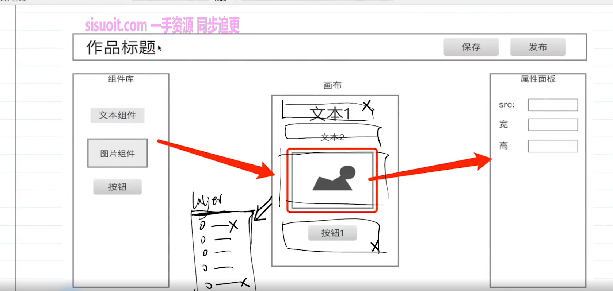
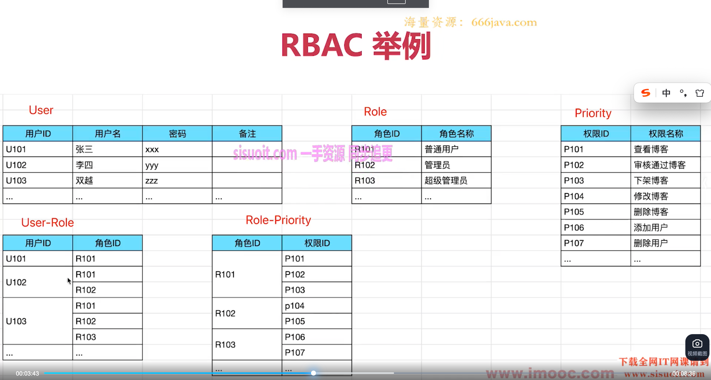

## 设计一个 H5 编辑器的数据模型和核心功能



1. 模型参考 vnode
2. 考虑排序，不要用对象，要用数组，对象的属性是无序的

```js
const schema = {
  title: '页面标题',
  /*扩展信息*/
  setting: {},
  /*页面属性*/
  props: {},
  /*活动的组件*/
  activeComponentsId:'xxx'
  /*有序用数组*/
  components: [
    {
      id: 'xxx',
      name: '文本1',
      type: 'text',
      styles: { fontSize: 16 },
      attrs: { className: 'xxx' },
      text: '这是一个text1',
      children: ['这是一个text1'],
    },
    {
      id: 'xxx',
      name: '文本2',
      type: 'text',
      styles: { fontSize: 16 },
      attrs: { className: 'xxx' },
      text: '这是一个text1',
      children: ['这是一个text1'],
    },
    {
      id: 'xxx',
      name: '图片1',
      type: 'img',
      styles: { width: 200 },
      attrs: { src: 'xxx' },
    },
  ],
};
```

## 设计一个“用户-角色-权限”的模型和功能

RBAC(用户-角色-权限)  

