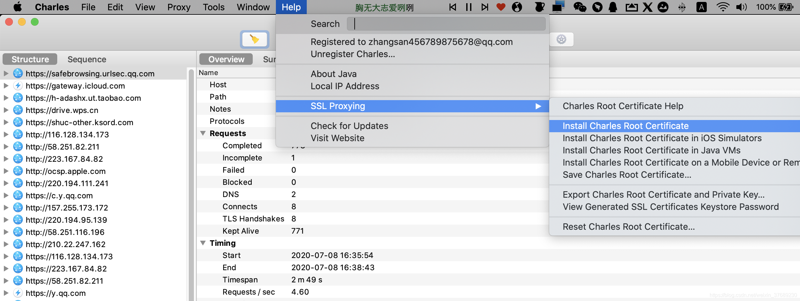
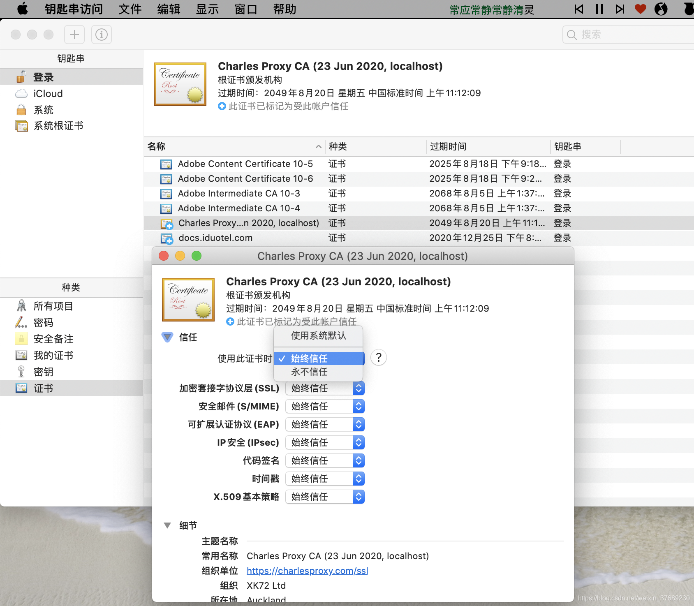
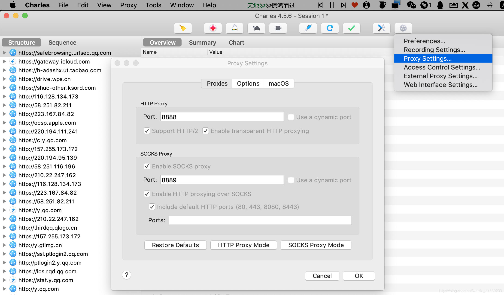
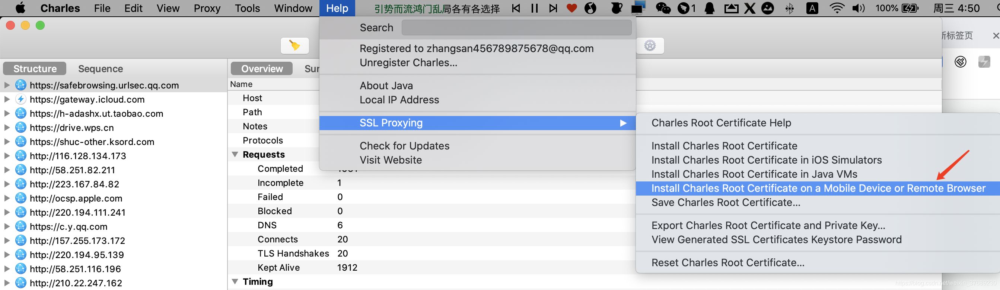
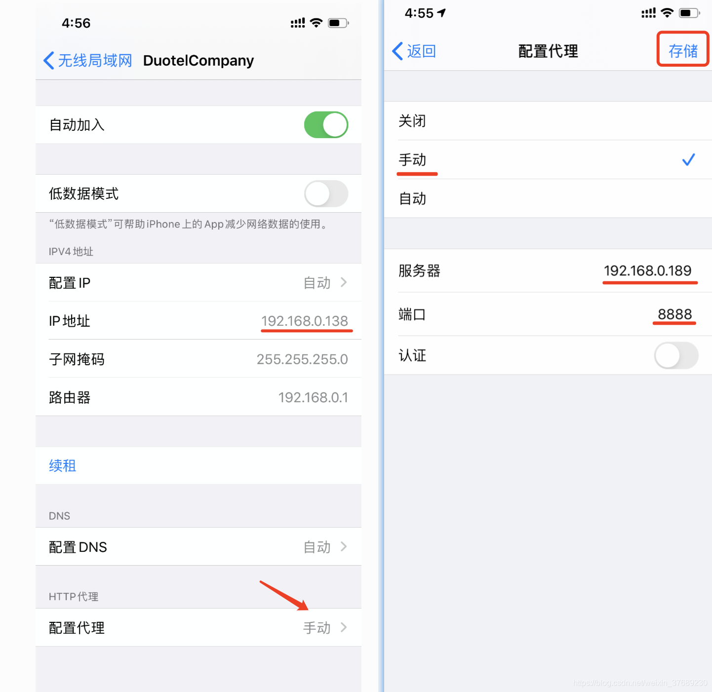
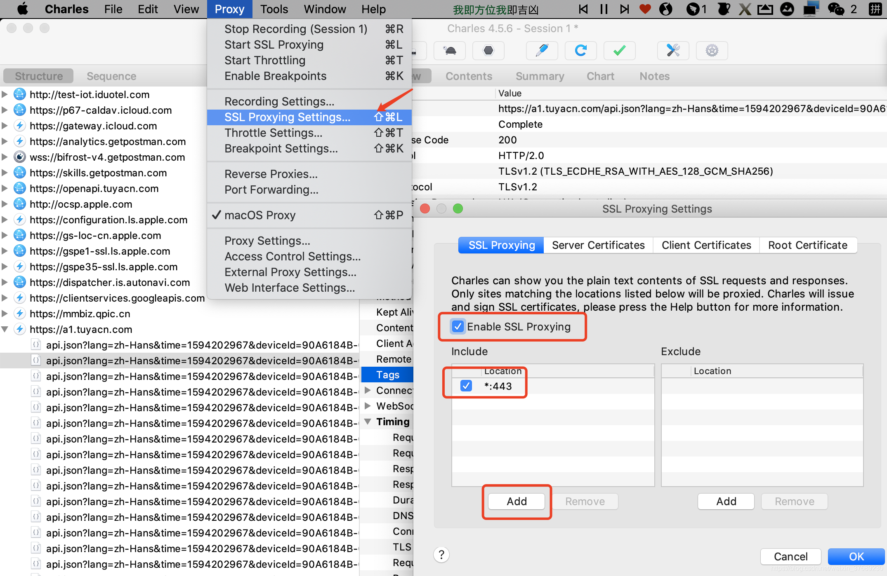
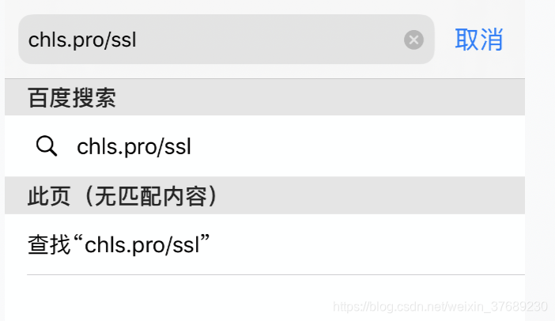
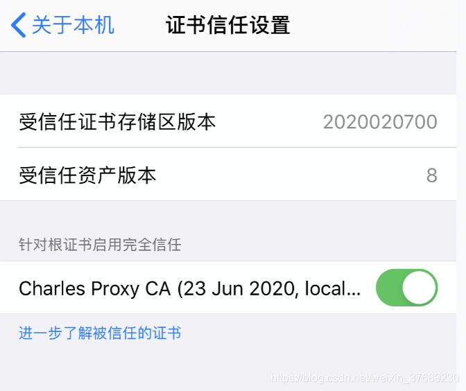

# Charles 安装配置 for Mac

开篇总结(HTTP/HTTPS)：

1、打开 Charles，选择 "Install Charles root Certificate" 给电脑装个证书

2、在电脑的 钥匙串访问 中双击打开 Charles Proxy CA 证书，展开 信任 选项，并选择 "始终信任"，保存

3、在 Charles 中设置代理的端口号

4、查看手机连接 Charles 的代理地址、安装证书及配置方式

5、电脑与手机连接同一 Wi-Fi

6、在手机上设置 HTTP 代理 的方式为 "手动"，填入 Charles 提供的代理地址

7、设置 SSL 端口为 443

8、在手机 Safari 上访问 "chls.pro/ssl"，下载并安装证书

9、信任证书【重要】

charles 的下载安装

官网下载地址：https://www.charlesproxy.com/
安装很简单，一直下一步即可

### 破解

http://www.charles.ren  
进入上面的网站，随意输入一个 Registered Name，点击「生成」  
打开 charles-help-register，输入刚刚生成的，然后激活 Help->Register  
v5.x 的 charles 激活是 help => 输入 License

### HTTP 抓包配置

1、打开 Charles，选择 "Install Charles root Certificate" 给电脑装个证书

2、在电脑的 钥匙串访问 中双击打开 Charles Proxy CA 证书，展开 信任 选项，并选择 "始终信任"，保存

3、在 Charles 中设置代理的端口号

4、查看手机连接 Charles 的代理地址、安装证书及配置方式

5、电脑与手机连接同一 Wi-Fi，在手机上设置 HTTP 代理 的方式为 "手动"，填入 Charles 提供的代理地址

设置代理后，如果出现手机无法上网问题
Proxy->Access control settings，添加你的手机 IP（0.0.0.0/0 表示整个网络）。就可以正常访问了。

完成以上步骤，已经可以抓 HTTP 的包；如果需要抓 HTTPS 的包，还需要在手机上完成安装证书和信任证书

### HTTPS 抓包配置

6、设置 SSL 端口为 443

7、在手机 Safari 上访问 "chls.pro/ssl"，下载并安装证书
下载的证书可以在 "设置 --> 通用 --> 描述文件与设备管理" 中找到

8、信任证书【重要】
iOS 系统版本不同，设置可能有差别（部分低版本系统只需要安装，会自动信任证书）

iOS12 系统中安装的 CA 证书，必须要在 "设置 --> 通用 --> 关于本机（滑至最后） --> 证书信任设置" 中开启 "针对根证书启动完全信任"

完成以上步骤，就可以在 Charles 中抓 HTTPS 的包了
