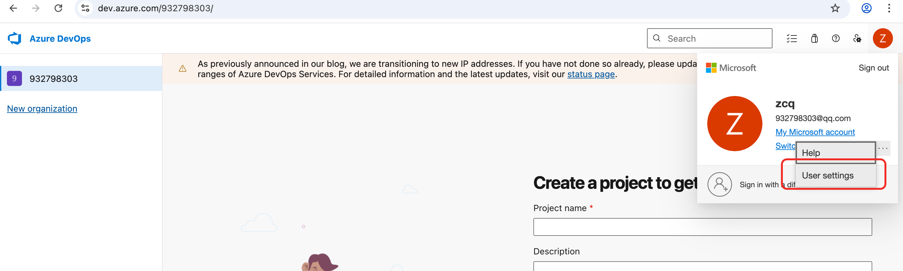
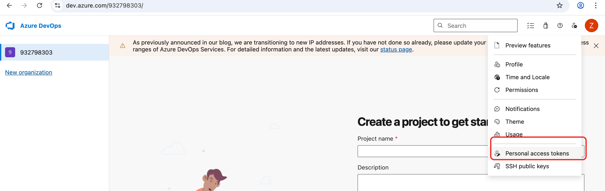
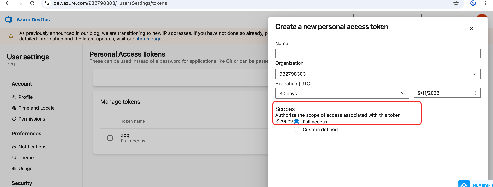

## **一、环境准备**
### 1. 安装必备工具
```bash
# 安装 Node.js (LTS 版本)
https://nodejs.org

# 安装 Yeoman 和 VSCode 插件生成器
npm install -g yo generator-code

# 安装 vsce (发布工具)
npm install -g @vscode/vsce
```

### 2. 验证安装
```bash
yo --version  # 应输出 Yeoman 版本
vsce --version  # 应输出 vsce 版本
```

## **二、创建插件项目**
### 1. 生成项目骨架
```bash
yo code
```
按提示选择：
- **Extension Type**: `New Extension (TypeScript)`
- **Extension Name**: 你的插件名（如 `my-extension`）
- **Identifier**: 保持默认（如 `my-extension`）
- **Description**: 插件描述
- **Initialize Git**: 建议选 `Yes`

### 2. 项目结构说明
```
.
├── .vscode/          # VSCode 调试配置
├── src/
│   ├── extension.ts   # 插件主入口
├── package.json       # 插件清单文件
├── tsconfig.json      # TypeScript 配置
└── README.md
```

---

## **三、核心开发流程**
### 1. 修改 `package.json` 配置
关键字段说明：
```json
{
  "name": "my-extension",
  "publisher": "your-publisher-name",
  "activationEvents": ["onCommand:my-extension.helloWorld"],
  "contributes": {
    "commands": [{
      "command": "my-extension.helloWorld",
      "title": "Hello World"
    }]
  }
}
```

### 2. 实现功能（示例：代码片段补全）
在 `src/extension.ts` 中添加：
```typescript
import * as vscode from 'vscode';

export function activate(context: vscode.ExtensionContext) {
  // 注册代码补全提供者
  const provider = vscode.languages.registerCompletionItemProvider(
    'javascript', // 针对 JS 文件
    {
      provideCompletionItems() {
        const snippet = new vscode.CompletionItem('ttt');
        snippet.insertText = new vscode.SnippetString(
          "console.log('${1:message}');\n$0"
        );
        snippet.documentation = "插入 console.log 代码片段";
        return [snippet];
      }
    },
    't' // 触发补全的字符
  );
  context.subscriptions.push(provider);
}
```

### 3. 调试插件
1. 按 `F5` 启动调试 （mac是按住Fn 再选F5）
2. 在新窗口中：
   - 打开一个 JS 文件
   - 输入 `ttt` 按 `Tab` 测试补全

---

## **四、实战案例：TSX 组件片段补全**
### 目标：输入 `ttsx` 生成 TSX 组件模板
修改 `extension.ts`：
```typescript
export function activate(context: vscode.ExtensionContext) {
  const provider = vscode.languages.registerCompletionItemProvider(
    ['typescript', 'typescriptreact'],
    {
      provideCompletionItems() {
        const item = new vscode.CompletionItem('ttsx');
        item.insertText = new vscode.SnippetString(
          `import React from 'react';\n\n` +
          `interface \${1:Props} {\n` +
          `  \${2:propName}: \${3:string};\n` +
          `}\n\n` +
          `const \${4:ComponentName} = ({ \${2:propName} }: \${1:Props}) => {\n` +
          `  return (\n` +
          `    <div>\n` +
          `      \${5:children}\n` +
          `    </div>\n` +
          `  );\n` +
          `};\n\n` +
          `export default \${4:ComponentName};`
        );
        item.documentation = "生成 TSX 组件模板";
        return [item];
      }
    },
    't' // 触发字符
  );
  context.subscriptions.push(provider);
}
```

---

## **五、发布插件**
### 1. 创建发布者账号
1. 访问 [Visual Studio Marketplace 发布门户](https://marketplace.visualstudio.com/manage)
2. 创建新发布者（如 `your-publisher-name`）

### 2. 生成 Personal Access Token (PAT)
1. 前往 [Azure DevOps PAT 页面](https://dev.azure.com/932798303)
   `https://dev.azure.com/932798303` 其中932798303要换成你自己的code
   

   

   
2. 创建新 Token，勾选：
   - **Marketplace** → **Manage**
   - 有效期设为 1 年

### 3. 登录并发布
```bash
vsce login your-publisher-name  # 输入 PAT
vsce publish
```

### 4. 验证发布
- 访问生成的 URL（如 `https://marketplace.visualstudio.com/items?itemName=your-publisher-name.my-extension`）
- 等待 5-30 分钟即可搜索到

---

## **六、进阶功能**
| 功能               | 实现方式                          |
|--------------------|----------------------------------|
| 自定义侧边栏视图   | `vscode.window.createTreeView`   |
| 状态栏按钮         | `vscode.window.createStatusBarItem` |
| 文件内容处理器     | `vscode.workspace.registerTextDocumentContentProvider` |
| 自定义设置         | `contributes.configuration` in `package.json` |

---

## **七、调试技巧**
1. **查看输出日志**：
   - 在调试控制台选择 `Extension Host`
   - 使用 `vscode.window.showInformationMessage()` 显示调试信息

2. **单元测试**：
   ```bash
   npm install -g @vscode/test-electron
   vscode-test --extensionDevelopmentPath=. --extensionTestsPath=out/test
   ```

---

## **八、常见问题解决**
1. **插件不生效**：
   - 检查 `activationEvents` 是否正确定义
   - 确认文件类型匹配（如 `onLanguage:typescript`）

2. **发布失败**：
   - 确保 PAT 有 `Marketplace: Manage` 权限
   - 清除缓存：`rm ~/.vsce-auth.json`

---

通过本指南，你可以快速开发并发布一个实用的 VSCode 插件。如需更复杂的功能，可参考 [VSCode API 文档](https://code.visualstudio.com/api)。

     
