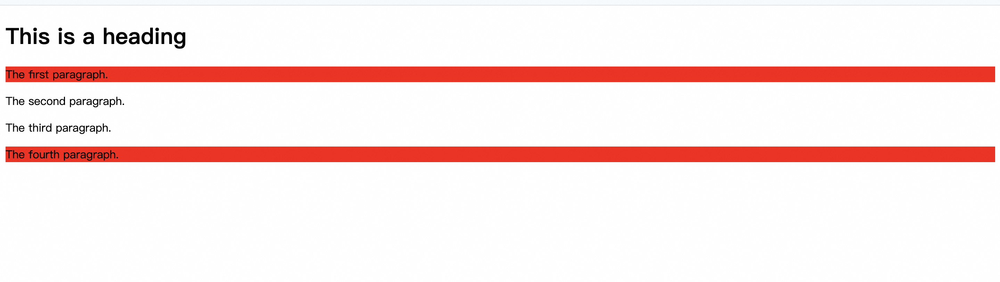

# nth-child

nth-child(an+b) n 从 0 开始 b 从 1 开始<br />
nth-of-type(n) n 从 1 开始 正序<br />
nth-last-of-type(n) n 从 1 开始 倒序<br />

```html
<!DOCTYPE html>
<html>
  <head>
    <meta charset="utf-8" />
    <title>菜鸟教程(runoob.com)</title>
    <style>
      p:nth-of-type(1) {
        background: #ff0000;
      }
      p:nth-last-of-type(1) {
        background: red;
      }
    </style>
  </head>
  <body>
    <!-- #ff0000 -->
    <h1>This is a heading</h1>
    <p>The first paragraph.</p>
    <p>The second paragraph.</p>
    <p>The third paragraph.</p>
    <!-- red -->
    <p>The fourth paragraph.</p>
  </body>
</html>
```


