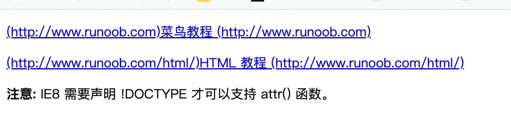

# 两行换行出现点点点

```css
overflow: hidden;
text-overflow: ellipsis;
display: -webkit-box;
-webkit-line-clamp: 2;
-webkit-box-orient: vertical;
word-break: break-all; /* 解决纯数字不生效问题 */
```

## css 兼容性问题检测

https://caniuse.com/?search=where

## 行内块元素

```html
 、<input>、<button>、<select>、<textarea>
```

1、和相邻行内元素（行内块）在一行上,但是之间会有空白缝隙，一行可以显示多个

2、默认宽度就是它本身内容的宽度

3、高度，行高、外边距以及内边距都可以控制。

## 浏览器默认字体大小

Chrome 浏览器默认字体大小是 16px，每个浏览器默认字体大小可能都不一样，正常情况下 Chrome 浏览器支持最小字体大小是 12px

如何让 Chrome 浏览器支持小于 12px 的文字

- 🚀 **方法一**

```html
<div><span> hello world</span></div>
<style>
  div {
    font-size: 10px;
  }
  div span {
    display: inline-block;
    transform: scale(0.6);
    -webkit-transform: scale(0.6); /* 则文字大小为6px 10*0.6 */
  }
</style>
```

- 🚀 **方法二**

```html
<style type="text/css">
  .span1 {
    font-size: 12px;
    display: inline-block;
    zoom: 0.8;
  }
  .span2 {
    display: inline-block;
    font-size: 12px;
  }
</style>
<body>
  <span class="span1">测试10px</span>
  <span class="span2">测试12px</span>
</body>
```

## 浏览器如何判断是否支持 webp 格式图片

- 1、宽高判断法。通过创建 image 对象，将其 src 属性设置为 webp 格式的图片，然后在 onload 事件中获取图片的宽高，
- 如果能够获取，则说明浏览器支持 webp 格式图片。如果不能获取或者触发了 onerror 函数，那么就说明浏览器不支持 webp 格 式的图片
  \*/

```js
const acceptWebp = (URL) => {
  return new Promise((resolve, reject) => {
    const img = new Image();
    img.src = URL;
    img.onload = function () {
      if (img.width && img.height) {
        resolve(true);
      }
    };
    img.onerror = function () {
      reject(new Error('加载失败'));
    };
  });
};

await acceptWebp('https://interview.poetries.top/logo.png');
```

- 2、canvas 判断方法。我们可以动态的创建一个 canvas 对象，通过 canvas 的 toDataURL 将设置为 webp 格式，
- 然后判断 返回值中是否含有 image/webp 字段，如果包含则说明支持 WebP，反之则不支持

## 网站置灰

```css
CSS 滤镜 -webkit-filter
blur 模糊-webkit-filter:blur(2px);
brightness 亮度-webkit-filter:brightness(25%);
contrast 对比度-webkit-filter: contrast(50%);
drop-shadow 阴影-webkit-filter: drop-shadow(5px 5px 5px rgba(0, 0, 0, 0.5));
opacity 透明度-webkit-filter: opacity(50%);
grayscale 灰度-webkit-filter: grayscale(80%);
sepia 褐色-webkit-filter: sepia(100%);
invert 反色-webkit-filter: invert(100%);
hue-rotate 色相旋转-webkit-filter:hue-rotate(180deg);
saturate 饱和度-webkit-filter: saturate(1000%);
```

```css
html { filter: grayscale(.95); -webkit-filter: grayscale(.95);
```

## 样式浏览器兼容写法

```css
-moz : firefox

-ms : IE

-webkit : chrome、safari
```

## 隐藏滚动条

```css
/*Safari*/
/*chrome*/
.classname::-webkit-scrollbar {
  display: none;
}

.classname {
  /* firefox */
  scrollbar-width: 0;
  /* IE 10+ */
  -ms-overflow-style: none;
}
```

# 隐藏元素的方法

1、opacity:0：本质上是将元素的透明度将为 0，就看起来隐藏了，但是依然占据空间且可以交互

2、visibility:hidden: 与上一个方法类似的效果，占据空间，但是不可以交互了

3、overflow:hidden: 这个只隐藏元素溢出的部分，但是占据空间且不可交互

4、display:none: 这个是彻底隐藏了元素，元素从文档流中消失，既不占据空间也不交互，也不影响布局

5、z-index:-9999: 原理是将层级放到底部，这样就被覆盖了，看起来隐藏了

6、transform: scale(0,0): 平面变换，将元素缩放为 0，但是依然占据空间，但不可交互

# 隐藏元素方法对事件的影响

1、设置元素 opacity:0 之后，也可以触发点击事件<br/>
2、visibility:hidden 的元素无法触发其点击事件<br/>
3、dispaly:none 元素不占据空间<br/>

# Attr 属性

```html
<!DOCTYPE html>
<html>
  <head>
    <meta charset="utf-8" />
    <title>菜鸟教程(runoob.com)</title>
    <style>
      a:after {
        content: ' (' attr(href) ')';
      }
      a:before {
        content: ' (' attr(href) ')';
      }
    </style>
  </head>

  <body>
    <p><a href="http://www.runoob.com">菜鸟教程</a></p>
    <p><a href="http://www.runoob.com/html/">HTML 教程</a></p>

    <p><strong>注意:</strong> IE8 需要声明 !DOCTYPE 才可以支持 attr() 函数。</p>
  </body>
</html>
```



# css 解决幽灵不换行问题

```css
p {
  word-break: break-all;
}
```

# CSS 设置背景颜色透明

1、通过 background-color 和 opacity 来设置

2、通过 rgba 方式设置背景颜色透明
background: rgba(R, G, B, A); A 为透明度

# css 注释

```css
/*
这是一个多行注释：
.container 选择器是给所有要容器指定基本的布局格式
*/
.container {
  display: flex;
  justify-content: center;
  align-items: center;
}

/* 这是一个单行注释 */
.selector {
  color: red; /* 这是一个单行注释 */
  /* 这是一个单行注释 */
  background: blue;
}
```

可以看到在 CSS 中只有 /\*\*/ 格式的注释，并没有 // 格式的，
这也解释了上述三大预处理器为什么会把 // 格式的注释在转化成最终 CSS 的时候进行舍弃，
因为标准的 CSS 不支持 // 这种格式的注释，不进行舍弃则会报错导致程序无法正常运行。
