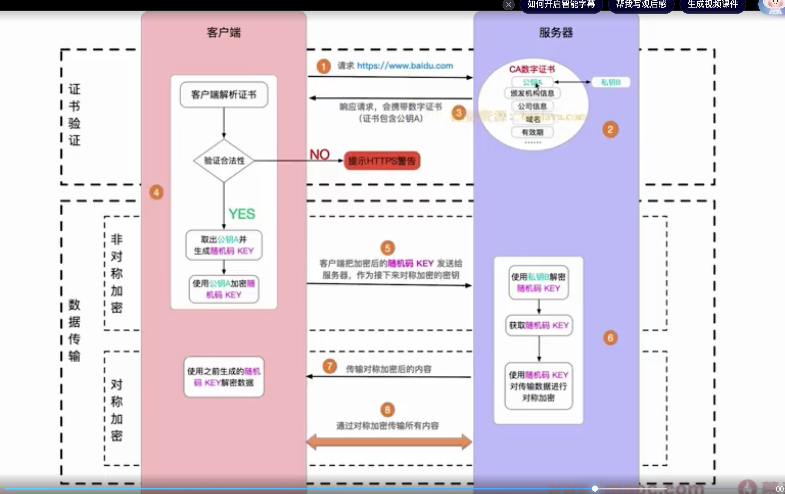

# https 中的加密方式

<a target="_blank" href="https://blog.csdn.net/FairLikeSnow/article/details/120943479">参考</a>

按照密钥的使用方式，加密可以分为两大类：对称加密和非对称加密。

# 流程图汇总

### 对称加密

就是指加密和解密时使用的密钥都是同一个，是“对称”的

### 非对称加密

1.公钥和私钥是一个算法中两个不同、但内在又相关联的参数集合，同时生成，但可以独立使用。  
2.公钥加密的数据只有对应的私钥才可以解密（公钥加密后公钥也不能解密）  
3.私钥加密的数据也只有对应的公钥才可以解密。

非对称加密的算法比对称加密要复杂且耗时，位数越多越耗时。因此在实际使用中，一般是先用非对称加密过程传递对称加密的密钥，之后再使用对称加密来保证后续的通信，这样安全性与速度就可以达到了一个平衡，HTTPS 所使用的就是这种方式。https 建立通信阶段使用非对称性加密，建立完毕后使用对称性加密进行传输

对称加密就是加密和解密都是一把密钥，传输速度上更快，但安全性较差。  
而非对称性加密私钥被存放在服务器，公钥加密只能私钥来解，私钥加密只能公钥来解，传输效率低，但更加安全。另外这两种加密方式的公钥中都没有数字证书这类东西，所以无法验证服务器身份

### https 原理

HTTPS （超文本传输安全协议）是一种用于在客户端（如网页浏览器）和服务器之间安全传输数据的协议。它在传统的 HTTP 协议之上加入了 SSL/TLS 协议层，以此来实现数据的加密、完整性校验和身份验证。以下是 HTTPS 实现原理的详细步骤：

### 1. 密钥交换

当用户通过浏览器访问一个 HTTPS 网站时，浏览器首先会向服务器发送一个连接请求。

服务器随后会发送它的 SSL 证书给浏览器。这个证书包含了公钥和网站的身份信息。

### 2. SSL/TLS 握手

#### 客户端 Hello

浏览器读取证书以获得服务器的公钥，并验证证书的有效性。它检查证书是否由一个受信任的证书颁发机构（CA）签发，证书是否已过期，以及证书上的域名是否与正在访问的网站匹配。

#### 服务器 Hello

一旦确认证书有效，浏览器就会生成一个随机的对称加密密钥（会话密钥），并使用服务器的公钥加密这个密钥，然后将其发送给服务器。服务器利用自己的私钥解密这个消息，获取对称加密密钥。

#### 密钥交换完成

此时，浏览器和服务器都有了相同的对称加密密钥，它们可以用该密钥来加密和解密通信中传输的数据。

### 3. 加密传输

接下来，客户端和服务器之间的所有通信都使用这个对称密钥进行加密。HTTP 数据在传输前被加密，到达目的地后再被解密。这确保了在传输过程中数据的保密性，即使数据被拦截，攻击者也无法解读数据的内容。

### 4. 数据完整性

除了加密，SSL/TLS 还提供数据完整性校验。每个消息都会带有一个消息认证码（MAC），确保消息在传输过程中没有被篡改。

### 5. 会话结束

通信结束时，会话密钥将被丢弃。下次用户再次访问网站时，整个过程将重新开始，生成一个新的会话密钥。

### 6. 续传加密

如果需要，SSL/TLS 提供了续传加密，这是一种优化手段，让之前建立的连接可以快速恢复，不必从头开始一个新的 SSL/TLS 握手。

总结来说，HTTPS 通过以下几个重要的安全特性来保护数据：

- **加密**：确保数据传输的隐私和保密性，防止窃听。
- **数据完整性**：确保数据在传输过程中未被篡改。
- **认证**：验证服务器的身份，防止中间人攻击。

HTTPS 已经成为了网络安全的标准，对于任何处理敏感数据的网站来说，如电子商务、在线银行等，使用 HTTPS 是必须的。
