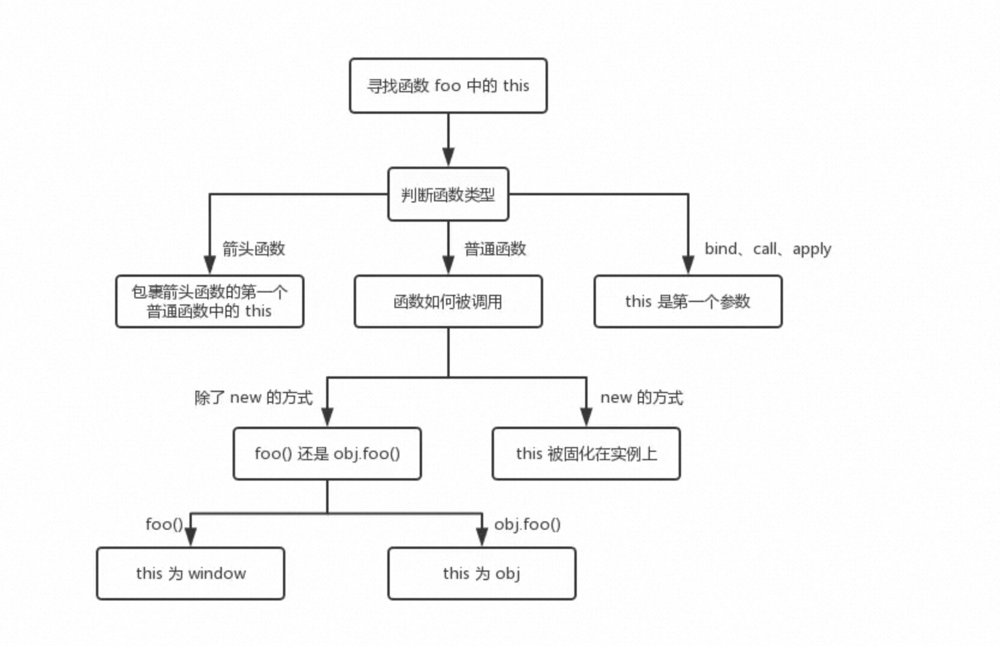

## 一张图搞懂 this

<a href='https://juejin.cn/post/6844903496253177863' target='_blank'>THIS</a>


```js
window.a = 'window';

let target = {
  a: 'target',
};

let test = {
  a: 'objTest',
  fn: function (params) {
    console.log('a', this.a);
    return { a };
  },
};

test.fn(target); //objTest
```

## DEMO

```js
// demo03
// 对象obj中的c属性使用this.a + 20来计算。这里我们需要明确的一点是，单独的{}是不会形成新的作用域的，因此这里的this.a，由于并没有作用域的限制，所以它仍然处于全局作用域之中。所以这里的this其实是指向的window对象。
var a = 20;
var obj = {
  a: 10,
  c: this.a + 20,
  fn: function () {
    return this.a;
  },
};

console.log(obj.c); // 40
console.log(obj.fn()); // 10
```

## 手写 call

```js
Function.prototype.my_call = function (context = window, ...args) {
  if (this === Function.prototype) {
    return undefined; // 用于防止 Function.prototype.my_call() 直接调用
  }
  const fn = Symbol;
  context[fn] = this;
  const res = context.fn(...args);
  delete context[fn];
  return res;
};

test.fn.my_call(target, 1, 2, 3);
```

## 手写 apply

```js
Function.prototype.my_apply = function (context = window, args) {
  if (this === Function.prototype) {
    return undefined;
  }
  let fn = Symbol;
  let res;
  context[fn] = this;
  if (Array.isArray(args)) {
    res = context[fn](...args);
  } else {
    res = context[fn]();
  }
  delete context[fn];
  return res;
};

test.fn.my_apply(target, [1, 2, 3]);
// apply 参数妙用 可以使push unshift传数组
let a = [1, 2, 3];
let b = [4, 5, 6];
Array.prototype.unshift.my_apply(a, b);
```

## 手写 bind

```js
Function.prototype.my_bind = function (context = window, ...args) {
  if (this === Function.prototype) {
    return undefined;
  }
  const fn = Symbol;
  context[fn] = this;
  const res = (...innerArgs) => {
    // 变相实现了函数curry
    context[fn](...args, ...innerArgs);
  };
  delete context[fn];
  return res;
};
test.fn.my_bind(target, 1, 2, 3);

// 类数组借用方法
var arrayLike = {
  0: 'java',
  1: 'script',
  length: 2,
};

Array.prototype.push.call(arrayLike, 'jack', 'lily');
console.log(typeof arrayLike); // 'object'
console.log(arrayLike);
// {0: "java", 1: "script", 2: "jack", 3: "lily", length: 4}

var bar = function () {
  console.log(this.x);
};
var foo = {
  x: 3,
};
var sed = {
  x: 4,
};
var func = bar.bind(foo).bind(sed);
func(); //?

var fiv = {
  x: 5,
};
var func = bar.bind(foo).bind(sed).bind(fiv);
func(); //?

// 答案是，两次都输出 3 ，而非期待中的 4 和 5 。原因是多次 bind() 是无效的。更深层次的原因与 bind() 的实现有关，相当于使用函数在内部包了一个 call / apply ，第二次 bind() 相当于再包住第一次 bind()，故第二次以后的 bind 是无法生效的。
```

## ES6 中箭头函数和普通函数的区别

- 箭头函数是匿名函数，不能作为构造函数去使用 new 关键字 , 没有 prototype，如果 new 会直接报错`is not a constructor`
- 箭头函数没有伪类 argument,可以使用 ...args 代替
- 箭头函数不会创建自己的 this，所以它没有自己的 this，它只会从自己的作用域链的上一层继承 this。
- call()、apply()、bind()方法不能改变箭头函数中的 this 指向
- 箭头函数不能做 generator 函数，不能使用 yeild 关键字
- 箭头函数继承而来的 this 指向永远不变，对象 obj 的方法 b 是使用箭头函数定义的，这个函数中的 this 就永远指向它定义时所处的全局执行环境中的 this，即便这个函数是作为对象 obj 的方法调用，this 依旧指向 Window 对象。

```js
const shape = {
  radius: 10,
  diameter() {
    return this.radius * 2;
  },
  perimeter: () => 2 * Math.PI * this.radius,
};

shape.diameter(); // 20
shape.perimeter(); // NaN

function a() {
  return () => {
    return () => {
      console.log(this);
    };
  };
}
console.log(a()()());

// 首先箭头函数其实是没有 this 的，箭头函数中的 this 只取决包裹箭头函数的第一个普通函数的 this。
// 在这个例子中，因为包裹箭头函数的第一个普通函数是 a，所以此时的 this 是 window。另外对箭头函数使用 bind这类函数是无效的。

let a = {};
let fn = function () {
  console.log(this);
};
fn.bind().bind(a)(); // => ?

// fn.bind().bind(a) 等于
// 嵌套函数的调用顺序是从外到里
let fn2 = function fn1() {
  return function () {
    return fn.apply();
  }.apply(a);
};
fn2();

// 可以从上述代码中发现，不管我们给函数 bind 几次，fn 中的 this 永远由第一次 bind 决定，所以结果永远是 window
```

## bind() 连续调用多次

```js
var bar = function () {
  console.log(this.x);
};
var foo = {
  x: 3,
};
var sed = {
  x: 4,
};
var func = bar.bind(foo).bind(sed);
func(); //3

var fiv = {
  x: 5,
};
var func = bar.bind(foo).bind(sed).bind(fiv);
func(); //3
```

## this 优先级

首先，new 的方式优先级最高，接下来是 bind 这些函数，然后是 obj.foo() 这种调用方式，
最后是 foo 这种调用方式，同时，箭头函数的 this 一旦被绑定，就不会再被任何方式所改变。

new 绑定优先级 > 显示绑定优先级 > 隐式绑定优先级 > 默认绑定优先级

## self、this 和 window 的区别

window 是浏览器环境中的全局对象，this 的值取决于函数的调用方式，而 self 通常用于指代当前的全局作用域，尤其是在 Web Workers 中。在主线程的浏览器环境中，self 和 window 可以互换使用，但在 Web Workers 环境中，self 会指向 Worker 的全局环境，而 window 对象在 Worker 中是不可用的。

## 变量提升

函数在运行的时候，会首先创建执行上下文，然后将执行上下文入栈，然后当此执行上下文处于栈顶时，开始运行执行上下文。

在创建执行上下文的过程中会做三件事：创建变量对象，创建作用域链，确定 this 指向，其中创建变量对象的过程中，首先会为 arguments 创建一个属性，值为 arguments，然后会扫码 function 函数声明，创建一个同名属性，值为函数的引用，接着会扫码 var 变量声明，创建一个同名属性，值为 undefined，这就是变量提升。

## globalThis

在现代 JavaScript 环境中，可以使用 globalThis 来访问全局对象。在浏览器环境中，globalThis 指向 window 对象；在 Node.js 环境中，globalThis 指向 global 对象。对于 const 和 let 变量，它们不会出现在 globalThis 上。

## 为什么 const 和 let 不在 window 上

const 和 let 的设计目标是提供更严格的作用域控制和避免全局变量污染。为了减少意外的全局变量污染，它们不自动添加到 window 对象上。

## 执行上下文

简单的来说，执行上下文是一种对 Javascript 代码执行环境的抽象概念，也就是说只要有 Javascript 代码运行，那么它就一定是运行在执行上下文中

执行上下文的类型分为三种：

全局执行上下文：只有一个，浏览器中的全局对象就是 window 对象，this 指向这个全局对象  
函数执行上下文：存在无数个，只有在函数被调用的时候才会被创建，每次调用函数都会创建一个新的执行上下文  
Eval 函数执行上下文： 指的是运行在 eval 函数中的代码，很少用而且不建议使用

## 执行上下文生命周期

### 创建阶段

1. 生成变量对象
2. 建立作作用域链
3. 确定 this 指向

### 执行阶段

在这阶段，执行变量赋值、代码执行

如果 Javascript 引擎在源代码中声明的实际位置找不到变量的值，那么将为其分配 undefined 值

### 回收阶段

执行上下文出栈等待虚拟机回收执行上下文
