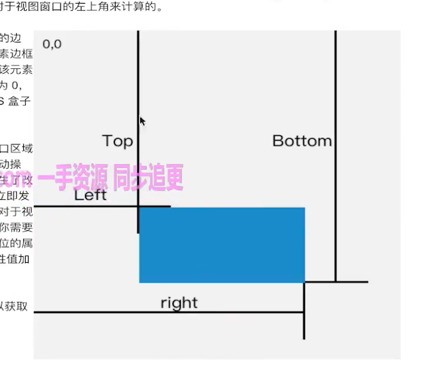

## 图片懒加载

<a href="https://fe.ecool.fun/topic/d3f21598-edfa-48f4-b2d3-d0c19d754b10?orderBy=updateTime&order=desc&tagId=0" target="_blank">参考</a>

### 图片懒加载最简单的方式

有兼容性问题

```js

```

### js 实现 (基于 getBoundingClientRect 手动计算)

实现原理

拿到所有的图片 dom 。<br/>
遍历每个图片判断当前图片是否到了可视区范围内。<br/>
如果到了就设置图片的 src 属性。<br/>
绑定 window 的 scroll 事件，对其进行事件监听。<br/>

```js
function lazyLoad() {
  let viewHeight =
    window.innerHeight ||
    document.documentElement.clientHeight ||
    document.body.clientHeight; //获取可视区高度，兼容不同浏览器
  let imgs = document.querySelectorAll('img[data-src]');
  imgs.forEach((item, index) => {
    if (item.dataset.src === '') return;

    // 用于获得页面中某个元素的左，上，右和下分别相对浏览器视窗的位置
    let rect = item.getBoundingClientRect();
    if (rect.bottom >= 0 && rect.top < viewHeight) {
      item.src = item.dataset.src;
      item.removeAttribute('data-src'); // 优化 下次获取的时候排除掉
    }
  });
}
window.addEventListener('scroll', lazyLoad);
```

使用 throttle 改进

```js
const throttle = (fn, timer) => {
  let pre = 0,
    t = null;
  return function (...args) {
    if (Date.now() - pre > timer) {
      clearTimeout(t);
      t = null;
      pre = Date.now();
      fn.apply(this, args);
    } else if (!t) {
      t = setTimeout(() => {
        fn.apply(this, args);
      }, timer);
    }
  };
};
window.addEventListener('scroll', throttle(lazyLoad, 200));

// throttle 基于lodash(_.throttle)
```

### getBoundingClientRect

getBoundingClientRect 返回的 DOMRect 对象包含以下属性：

left: 元素左边相对于视口左侧的距离。  
top: 元素上边相对于视口顶部的距离。  
right: 元素右边相对于视口左侧的距离。  
bottom: 元素下边相对于视口顶部的距离。  
width: 元素的宽度（right - left）。  
height: 元素的高度（bottom - top）。



### IntersectionObserver

基本用法

```js
var io = new IntersectionObserver(callback, option);

// 开始观察
io.observe(document.getElementById('example'));

// 停止观察
io.unobserve(element);

// 关闭观察器
io.disconnect();
```

使用 IntersectionObserver 实现懒加载

```js
const imgs = document.querySelectorAll('img[data-src]');
const config = {
  rootMargin: '0px',
  threshold: 0,
};
let observer = new IntersectionObserver((entries, self) => {
  entries.forEach((entry) => {
    if (entry.isIntersecting) {
      let img = entry.target;
      let src = img.dataset.src;
      if (src) {
        img.src = src;
        img.removeAttribute('data-src');
      }
      // 解除观察
      self.unobserve(entry.target);
    }
  });
}, config);

imgs.forEach((image) => {
  observer.observe(image);
});
```

## in 和 hasOwnProperty 的区别

```js
/**
 * in 会遍历原型对象上的属性
 * hasOwnProperty 不会遍历原型对象上的属性
 */

const person = { age: 18 };
person.hasOwnProperty('age'); // true
'age' in person; // true

'toString' in a; //  true
person.hasOwnProperty('toString'); // false
```

## document.getElementById 和 document.querySelector 的区别

document.getElementById 获取动态 dom
document.querySelector 获取静态 dom

## 项目中拦截器做了什么事情

在软件项目中，拦截器（Interceptor）是一种常用的设计模式，用来拦截一系列的操作，然后在这些操作之前或之后执行特定的功能

```bash
1、认证和授权
2、日志记录
3、数据验证、数据加工
4、错误处理
5、性能监控
6、缓存管理
7、请求和响应的修改
8、跨域处理
9、安全增强
10、限流和降级
```

## 所有的事件都有冒泡吗？

```bash
并不是所有的事件都有冒泡的，例如以下事件就没有：
onblur
onfocus
onmouseenter
onmouseleave
```

## js 中==、===和 Object.is()的区别

- == ：等于，两边值类型不同的时候，先进行类型转换，再比较(只要值相等便两者相等)；
  判断的类型是否是 String 和 Number，是的话，把 String 类型转换成 Number，再进行比较
  判断其中一方是否是 Boolean，是的话就把 Boolean 转换成 Number，再进行比较
  如果其中一方为 Object，且另一方为 String、Number 或者 Symbol，会将 Object 转换成字符串，再进行比较
- === ：严格等于，只有当类型和值都相等时，才相等；
- Object.is() ：与 === 的作用基本一样，但有些许不同。
- Object.is() 的行为与 === 基本一致，但有两处不同：
  a、+0 不等于 -0；
  b、NaN 等于自身。

```js
null == undefined; //true
```

## var a = '"123"';var b = "'123'";a === b

```js
var a = '"123"';
var b = "'123'";
console.log(a === b); // false;
```

在 JavaScript 中，字符串可以用单引号 (')、双引号 (") 或反引号 ( `) 来定义。单引号与双引号是等效的，主要取决于开发者的个人偏好或项目约定。反引号则通常用于定义模板字符串，可以包含多行文本和插入表达式。

变量 a 被赋予了一个使用双引号定义的字符串'"123"'。注意外层是单引号，里面的字符包括了双引号和数字 123。
变量 b 被赋予了一个使用单引号定义的字符串"'123'"。这里外层是双引号，里面的字符包括了单引号和数字 123。
因此，变量 a 和 b 分别保存的字符串是不同的。变量 a 包含了双引号字符，而变量 b 包含了单引号字符，它们的值不相同。

执行 console.log(a === b); 会比较这两个字符串是否相等。由于这两个字符串的内容不同，它们的比较结果为 false。

## [] == ![]结果是什么？为什么

== 中，左右两边都需要转换为数字然后进行比较
[]转换为数字为 0
![] 首先是转换为布尔值，由于[]作为一个引用类型转换为布尔值为 true
因此![]为 false，进而在转换成数字，变为 0
0 == 0 ， 结果为 true

Number([]) 等于 0

## 导致 JavaScript 中 this 指向混乱的原因是什么

在 JavaScript 中，this 关键字的指向通常是动态的，而不是静态的
这意味着 this 可以根据上下文环境的变化而发生改变，导致它的指向变得混乱或难以预测

1、函数调用方式不同：当一个函数被调用时，它的 this 值取决于调用方式。如果使用普通函数调用方式（如 func()），则 this 会指向全局对象 window；如果使用方法调用方式（如 obj.func()），则 this 会指向调用该方法的对象。

2、箭头函数的使用：箭头函数不具有自己的 this 值，它会捕获上下文中的 this 值。因此，如果在箭头函数中访问 this，它将引用外层作用域中的 this 值。

3、使用 apply、call 和 bind 方法：apply、call 和 bind 方法可以改变函数执行时的 this 值。其中，apply 和 call 方法可以立即执行函数并传入参数，而 bind 方法可以返回一个新函数，该函数的 this 值被绑定到指定的对象上。

4、DOM 事件处理程序的使用：在处理 DOM 事件时，浏览器会将事件处理程序内部的 this 指向触发事件的元素。

5、对象的嵌套和继承：当一个对象被嵌套在另一个对象中或者使用继承时，this 的指向可能会变得混乱。这是因为 this 的指向取决于函数被调用时的上下文环境，而不是对象本身。因此，在嵌套对象或继承类中使用 this 时，需要特别注意它的指向。

## 点击一个 input 依次触发的事件

onmouseenter -> onmousedown -> onfocus -> onclick

mousedown/mouseup -- 鼠标任意键按下/松起。

mouseenter/mouseleave -- 鼠标进入/离开元素，不会冒泡。

mouseover/mouseout -- 鼠标进入/离开元素，会冒泡，进入/离开子元素时也会触发。

## 如何实现 if (a===1 && a===2 && a===3)

```js
const obj = {
  get a() {
    this.value = this.value || 0;
    return ++this.value;
  },
};

var a = {
  value: 0,
  valueOf: function () {
    this.value++;
    return this.value;
  },
};

if (obj.a === 1 && obj.a === 2 && obj.a === 3) {
  console.log('进来了');
}
```

## 为什么 JS 阻塞页面加载

由于 JavaScript 是可操纵 DOM 的,如果在修改这些元素属性同时渲染界面（即 JavaScript 线程和 UI 线程同时运行）,那么渲染线程前后获得的元素数据就可能不一致了  
因此为了防止渲染出现不可预期的结果,`浏览器设置 GUI 渲染线程与 JavaScript 引擎为互斥的关系`
当 JavaScript 引擎执行时 GUI 线程会被挂起,GUI 更新会被保存在一个队列中等到引擎线程空闲时立即被执行  
从上面我们可以推理出,由于 GUI 渲染线程与 JavaScript 执行线程是互斥的关系,  
当浏览器在执行 JavaScript 程序的时候,GUI 渲染线程会被保存在一个队列中,直到 JS 程序执行完成,才会接着执行  
因此如果 JS 执行的时间过长,这样就会造成页面的渲染不连贯,导致页面渲染加载阻塞的感觉

## 为什么小程序里拿不到 dom 相关的 api

微信小程序采用了类似于 Web 的 WXML 和 WXSS 语言来描述页面结构和样式，但是却没有提供直接操作 DOM 的 API。

这是因为小程序本身是在一个 JavaScript 环境中运行的，其选用的是 JavaScriptCore 引擎，而不是浏览器中常见的 V8 引擎。JavaScriptCore 与 V8 引擎的实现方式存在较大差异，其中一个显著的特点是 JavaScriptCore 的执行速度较慢。对于小程序开发者来说，直接操作 DOM 会比较耗时，会导致性能下降和体验差。

另外，小程序的设计初衷也是为了提供一种更轻量级、更快速启动的应用方式，它的定位是“去中心化、低门槛、高灵活性”的。如果允许开发者直接操作 DOM，那么就可能会打破这种设计理念，增加小程序的复杂性和开发难度。

因此，微信小程序暂时不支持直接操作 DOM。开发者需要通过其他方式来实现类似的功能，例如使用组件或自定义组件，利用微信小程序提供的 API 进行页面渲染和交互。

## Array(3)和 Array(3, 4)的区别

```js
console.log(Array(3)) // [empty x 3]
console.log(Array(3, 4)) // [3, 4]

// 请创建一个长度为100，值为对应下标的数组
// cool的写法：
[...Array(100).keys()]

// 其他方法：
Array(100).join(",").split(",").map((v, i) => i)
Array(100).fill().map((v, i) => i)
```

## delete 可以删除原型上的属性

可以

```js
class Dog {
  constructor(name) {
    this.name = name;
  }
}

Dog.prototype.bark = function () {
  console.log(`Woof I am ${this.name}`);
};

const pet = new Dog('Mara');

pet.bark(); // "Woof I am Mara",

delete Dog.prototype.bark;

pet.bark(); //  TypeError
```

## import 编译阶段执行

import 命令是编译阶段执行的，在代码运行之前。因此这意味着被导入的模块会先运行，而导入模块的文件会后执行。  
这是 CommonJS 中 require（）和 import 之间的区别。使用 require()，您可以在运行代码时根据需要加载依赖项。  
如果我们使用 require 而不是 import，running index.js，running sum.js，3 会被依次打印。

```js
// index.js
console.log('running index.js');
import { sum } from './sum.js';
console.log(sum(1, 2));

// sum.js
console.log('running sum.js');
export const sum = (a, b) => a + b;

// running sum.js, running index.js, 3
```

## JavaScript 实现对上传图片的压缩

JavaScript 实现对上传图片的压缩  
读取用户上传的 File 对象，读写到画布（canvas）上，利用 Canvas 的 API 进行压缩，完成压缩之后再转成 File（Blob） 对象，  
上传到远程图片服务器；  
不过有时候我们也需要将一个 base64 字符串压缩之后再变为 base64 字符串传入到远程数据库或者再转成 File（Blob） 对象。

```html
<!DOCTYPE html>
<html lang="en">
  <head>
    <meta charset="UTF-8" />
    <title>Title</title>
  </head>

  <body>
    <input id="upload" type="file" />

    <script>
      const FILETYPES = ['image/png', 'image/jpg', 'image/jpeg']; // 受支持的文件类型
      const MAX_FILESIZE = 1024 * 1024 * 3; // 1024 * 1024 为1M
      const MAX_FILESIZESTRING = '3M'; // 文件大小字符
      const COMPRESSRATIO = 0.5; // 压缩比例 0 - 1
      const upload = document.querySelector('#upload');

      const imageToBase64 = (file, callback) => {
        const reader = new FileReader();
        reader.readAsDataURL(file); // 文件转base64
        reader.addEventListener('load', (e) => {
          callback && callback(e.target.result);
        });
      };

      const compress = (originalImage, compressRatio = 1, callback) => {
        const image = new Image();
        image.src = originalImage;
        // document.body.appendChild(image); // 原图预览

        /* 监听图片的load事件 */
        image.addEventListener('load', function () {
          let [sizeRatio, maxWidth, maxHeight] = [0, 100, 100]; // 图片压缩宽高比例和最大宽高
          let [imageWidth, imageHeight] = [
            this.naturalWidth,
            this.naturalHeight,
          ]; // 图片实际宽高
          let compressFlag = false; // 图片是否需要压缩

          // 如果图片宽度大于最大宽度就等比压缩图片的高度
          if (imageWidth > maxWidth) {
            compressFlag = true;
            sizeRatio = imageWidth / maxWidth;
            maxHeight = imageHeight / sizeRatio;
          }

          // 如果图片高度大于最大高度就等比压缩图片的宽度
          if (imageHeight > maxHeight) {
            compressFlag = true;
            sizeRatio = imageHeight / maxHeight;
            maxWidth = imageWidth / sizeRatio;
          }

          // 如果不需要压缩
          if (!compressFlag) {
            maxWidth = imageWidth;
            maxHeight = imageHeight;
          }

          // 使用canvas压缩图片
          const canvas = document.createElement('canvas');
          const ctx = canvas.getContext('2d');

          canvas.setAttribute('id', 'canvas');
          canvas.width = maxWidth;
          canvas.height = maxHeight;
          // document.body.appendChild(canvas); // canvas预览
          ctx.clearRect(0, 0, maxWidth, maxHeight); // 清除画布内所有像素
          ctx.drawImage(image, 0, 0, maxWidth, maxHeight); // canvas绘制当前图片
          const compressImage = canvas.toDataURL('image/jpeg', compressRatio); // 设置压缩类型和压缩比例获取压缩后的文件

          callback && callback(compressImage);
        });
      };

      upload.addEventListener('change', function (e) {
        const [file] = e.target.files;
        if (!file) this.value = ''; // file为空就阻止向下执行
        const { type: fileType, size: fileSize } = file; // 获取文件类型和大小
        // 检查是否支持的文件类型
        if (!FILETYPES.includes(fileType)) {
          this.value = '';
          alert(`不支持${fileType}类型文件`);
          return;
        }
        // 检查文件大小
        if (fileSize > MAX_FILESIZE) {
          this.value = '';
          alert(`文件不能超过${MAX_FILESIZESTRING}`);
          return;
        }

        imageToBase64(file, (originalImage) => {
          compress(originalImage, COMPRESSRATIO, (compressImage) => {
            const _img = new Image();
            _img.src = compressImage;
            const download = document.createElement('a');
            download.href = compressImage;
            download.innerText = '点击保存';
            download.setAttribute('download', 'demo.jpg');
            document.body.appendChild(download);
            document.body.appendChild(_img); // 压缩后的图片预览
          });
        });
      });
    </script>
  </body>
</html>
```

## JavaScript 中如何取消请求

众所周知，JavaScript 实现异步请求就靠浏览器提供的两个 API —— XMLHttpRequest 和 Fetch。  
我们平常用的较多的是 Promise 请求库 axios，它基于 XMLHttpRequest。  
本篇带来 XMLHttpRequest、Fetch 和 axios 分别是怎样“取消请求”的。

### XMLHttpRequest

```js
const xhr = new XMLHttpRequest();
xhr.open('GET', 'http://127.0.0.1:3000/api/get', true);
xhr.send();
setTimeout(() => {
  xhr.abort();
}, 500);

// 取消请求，readyState 会变成 XMLHttpRequest.UNSENT(0)；请求的 xhr.status 会被设为 0
```

### Fetch

```js
const controller = new AbortController();
void (async function () {
  const response = await fetch('http://127.0.0.1:3000/api/get', {
    signal: controller.signal,
  });
  const data = await response.json();
})();

setTimeout(() => {
  controller.abort();
}, 1000);

// controller.abort() 传入“取消请求的原因”参数，然后可以进行 try...catch 捕获
```

### axios

注意：axios 之前用于取消请求的 CancelToken 方法已经被弃用

```js
const controller = new AbortController();
const API_URL = 'http://127.0.0.1:3000/api/get';
void (async function () {
  const response = await axios.get(API_URL, {
    signal: controller.signal,
  });
  const { data } = response;
})();
setTimeout(() => {
  controller.abort();
}, 1000);
```

## null 和 undefined 的区别

一、语义上  
null：代表空对象  
undefined：代表未定义的值

二、检测上  
typeof null === "object"  
typeof undefined === "undefined"

三、隐式类型转换上  
Number(null) => 0  
Number(undefined) => NaN

四、其他角度  
函数的默认返回值是 undefined  
原型链的终点是 null  
JS 底层中的对象机器码是以"000"开头，而 null 的机器码全都是 0

## Promise then 第二个参数和 catch 的区别是什么

then 方法的第二个参数和 catch 方法都是用于处理 Promise 的 rejected 状态的情况，但前者需要在每次调用 then 方法时都传递第二个参数，而后者则可以链式调用。

## 判断字符串格式

给定字符串 str，检查其是否符合如下格式  
1、XXX-XXX-XXXX  
2、其中 X 为 Number 类型

```js
function matchesPattern(str) {
  return /^\d{3}-\d{3}-\d{4}$/.test(str);
}
```

## 颜色转化 rgb->16 进制, 后面的空格数不固定，不符合格式直接返回输入值

```js
function rgbToHex(rgb) {
  // 正则表达式匹配 rgb 格式
  const regex = /^rgb\s*\(\s*(\d{1,3})\s*,\s*(\d{1,3})\s*,\s*(\d{1,3})\s*\)$/;
  const match = rgb.match(regex);

  if (!match) {
    // 如果不匹配，返回原字符串
    return rgb;
  }

  // 将 rgb 值转换为十六进制，并确保它们是两位数
  function toHex(component) {
    const hex = parseInt(component, 10).toString(16);
    return hex.length === 1 ? '0' + hex : hex;
  }

  // 从正则表达式匹配中提取颜色分量
  const r = toHex(match[1]);
  const g = toHex(match[2]);
  const b = toHex(match[3]);

  // 拼接成十六进制颜色表示
  return `#${r}${g}${b}`.toUpperCase();
}

// 测试函数
console.log(rgbToHex('rgb(255, 200, 100)')); // 输出: #FFC864
console.log(rgbToHex('rgb(255,255,255)')); // 输出: #FFFFFF
console.log(rgbToHex('rgb(0, 0, 0)')); // 输出: #000000
console.log(rgbToHex('rgb(255, 200)')); // 输出: rgb(255, 200)
```

## 操作数组的常用方法

1、添加删除

```js
const arr = [1, 2, 3];
arr.push(4);
arr.unshift(323);

arr.pop();
arr.shift();

arr.splice(1, 1);
arr.slice();
arr.concat();
```

2、查询

```js
const arr = [1, 2, 3];
arr.find;
arr.findIndex;
arr.includes;
arr.indexOf;
arr.lastIndexOf;
arr.filter;
```

3.转换

```js
const arr = [1, 2, 3];
arr.map;
arr.reduce;
arr.reduceRight;
arr.sort;
arr.reverse;
arr.join;
```

Array.of() 将一组值转换为数组

## 手写 unshift

```js
Array.prototype.myUnshift = function () {
  const params = arguments;
  for (let i = params.length - 1; i >= 0; i--) {
    this.splice(0, 0, params[i]);
  }
  return this.length;
};
const a = [1, 2, 4];
a.myUnshift(4, 5);
// a.unshift(4, 5);
console.log('a', a);
```

## 操作字符串的常用方法

1、添加

```js
const str = '123';
str.concat('32');
```

concat 传入数组会解构第一层;

```js
let arr = [];
arr.concat([1, 2, 3, [4]]);
console.log('arr: ', arr); // [1, 2, 3, [4]]
```

2、substring 和 substr 的区别是什么
参数不同：substring() 方法接受两个参数，分别表示起始位置和结束位置（不包括结束位置对应的字符），而 substr() 方法接受两个参数，第一个参数表示起始位置，第二个参数表示要截取的字符个数。

```js
var str = 'hello world';

console.log(str.substring(3, 7)); // 输出 "lo w"
console.log(str.substr(3, 4)); // 输出 "lo w"

console.log(str.substring(7, 3)); // 输出 "lo w"（起始位置和结束位置会自动调整）
console.log(str.substr(7, -2)); // 输出 ""（负数参数转换为 0）

console.log(str.substring(-3, 8)); // 输出 "hello "（负数参数转换为 0）
console.log(str.substr(-3, 2)); // 输出 "rl"（-3 表示倒数第三个字符，2 表示截取两个字符）
```

3、改
replace() trimRight trimLeft trim padStart padEnd toUpperCase toLowerCase

4、查
indexOf includes lastIndexOf find endsWith startWith

5、转换 split

该方法有两个参数：

separator：必需。字符串或正则表达式，从该参数指定的地方分割 string。
limit：可选。该参数可指定返回的数组的最大长度。如果设置了该参数，返回的子串不会多于这个参数指定的数组。如果没有设置该参数，整个字符串都会被分割，不考虑它的长度。

其实在将字符串分割成数组时，可以同时拆分多个分割符，使用正则表达式即可实现：

```js
let str = 'abcdef';
str.split('c'); // 输出结果：["ab", "def"]
str.split('', 4); // 输出结果：['a', 'b', 'c', 'd']

const list = 'apples,bananas;cherries';
const fruits = list.split(/[,;]/);
console.log(fruits); // 输出结果：["apples", "bananas", "cherries"]
```

## 如何确保你的构造函数只能被 new 调用，而不能被普通调用？

1、使用 instanceof

```js
function Person(name) {
  if (!this instanceof Person) {
    throw new TypeError(
      'Function constructor A cannot be invoked without "new"',
    );
  }
  this.name = name;
}
```

2、使用 new.target
JavaScript 官方也发现了这个让人棘手的问题，因此 ES6 中提供了 new.target 属性。

《ECMAScript 6 入门》中讲到: ES6 为 new 命令引入了一个 new.target 属性，该属性一般用在构造函数之中，返回 new 命令作用于的那个构造函数。如果构造函数不是通过 new 命令或 Reflect.construct() 调用的，new.target 会返回 undefined ，因此这个属性可以用来确定构造函数是怎么调用的。

new.target 就是为确定构造函数的调用方式而生的，太符合这个场景了，我们来试一下 new.target 的用法。

```js
function Person() {
  console.log(new.target);
}
// new: Person {}
console.log('new: ', new Person());
// not new: undefined
console.log('not new:', Person());

function Person() {
  if (!new.target) {
    throw new TypeError(
      'Function constructor A cannot be invoked without "new"',
    );
  }
}
// Uncaught TypeError: Function constructor A cannot be invoked without "new"
console.log('not new:', Person());
```

3、类

## ['1', '2', '3'].map(parseInt) 的输出值是什么

[1, NaN, NaN]

parseInt(str,radix)， radix 默认等于 10  
radix = > (2-36)， 0 当不存在 10 处理

```js
parseInt('1', 0); // 1
parseInt('2', 1); // NaN
parseInt('3', 2); // NaN
```

## 写一个返回数据类型的函数，要求自定义的类实例化的对象返回定义的类名

正则表达式 /\[object\s(.+)\]/ 解释
/.../ 是正则表达式的定界符。  
 \[object\s 部分：  
 \[object 匹配字符串 [object。方括号是一个特殊字符，所以用反斜杠转义。
\s 匹配一个空格字符（包括空格、制表符等）。
(.+) 部分：
() 是捕获组，表示我们要捕获的内容。
.+ 表示匹配一个或多个任意字符（除了换行符）。
\] 匹配字符串中的 ] 字符，同样需要转义。
"\$1"  
 \$1 表示第一个捕获组的内容。在这个正则表达式中，捕获组就是 (.+)，也就是 [object 和 ] 之间的内容。

```js
const myType = (params) => {
  const toString = Object.prototype.toString;
  let type = toString.call(params).replace(/\[object\s(.+)\]/, '$1');
  if (type === 'Object') {
    type = params.constructor.name;
  }
  return params instanceof Element ? 'Element' : type;
};
```

## 序列化 和反序列化

在 JavaScript 中，序列化是将一个 JavaScript 对象或值转换为字符串的过程。序列化的主要用途是在网络传输中发送数据，或者将数据保存到本地存储、文件等地方。通常使用 JSON.stringify() 方法来完成序列化，反过来的过程叫做反序列化，即将 JSON 字符串转换回 JavaScript 对象，这通常使用 JSON.parse() 方法实现

## setTimeout 和 setInterval 误差

事件循环机制：JavaScript 是单线程的，事件循环机制意味着如果主线程正在处理其他任务（如处理 DOM、网络请求、其他定时器等），setTimeout 的回调函数可能会被推迟执行。

计时器精度：setTimeout 的延迟时间不是绝对的。根据 HTML5 规范，延迟时间会被视为一个最小值，而不是一个准确的值。这意味着浏览器可能会将实际的延迟时间延长到这个值或更长，而不是严格遵循你传入的时间。

系统性能：在高负载的系统或者低性能的设备上，JavaScript 引擎的执行可能会受到影响，从而导致延迟增加。

低频率的定时器：大多数浏览器在窗口不活动时会降低定时器的频率。例如，在一个标签页没有被激活的情况下，setTimeout 的精度可能会受到影响。

1. 使用 requestAnimationFrame：

```js
function step() {
  console.log('render---');
  // 你的逻辑
  window.requestAnimationFrame(step);
}
window.requestAnimationFrame(step);
```

2. 保持计算时间间隔的一致性：
   在 setTimeout 或 setInterval 的回调中使用实际的时间戳来计算下一个时间点，而不是仅依赖设定的间隔。

```js
const expectedInterval = 1000; // 期望的间隔时间，单位为毫秒

let lastTimestamp = Date.now();

function accurateInterval() {
  const now = Date.now();
  const drift = now - lastTimestamp - expectedInterval;

  // 更新 lastTimestamp 为现在
  lastTimestamp = now;

  // 在这里执行任务
  console.log('Interval task is executed.');

  // 根据误差进行调整
  setTimeout(accurateInterval, expectedInterval - drift);
}

setTimeout(accurateInterval, expectedInterval);
```

3. 使用 Web Workers：
4. 减少代码阻塞
   尽可能优化和避免阻塞主线程的代码，比如减少 DOM 操作和复杂计算，同时谨慎使用同步 API。

5. 监控和调整系统负载：
   观察和分析系统负载状况，避免在浏览器任务繁忙的时候执行高频定时器任务

## 验证 setTimeout 递归产生的时差

```js
let time = 0;
let nowTime = +new Date();
let timer;
const poll = function () {
  timer = setTimeout(() => {
    const lastTime = nowTime;
    nowTime = +new Date();
    console.log('递归setTimeout(fn,0)产生时间差：', nowTime - lastTime);
    poll();
  }, 0);
  time++;
  if (time === 20) clearTimeout(timer);
};
poll();
```

## 封装一个减少误差的 setTimeout

```ts
type CallbackFunction = () => void;

interface CorrectedSetTimeoutOptions {
  interval: number;
  callback: CallbackFunction;
}

class CorrectedSetTimeout {
  private start: number;
  private expected: number;
  private interval: number;
  private callback: CallbackFunction;
  private timerId: number | null = null;
  private rafId: number | null = null;

  constructor({ interval, callback }: CorrectedSetTimeoutOptions) {
    this.start = new Date().getTime();
    this.expected = this.start + interval;
    this.interval = interval;
    this.callback = callback;

    this.run = this.run.bind(this);
    this.correctedTimeout = this.correctedTimeout.bind(this);
    this.clear = this.clear.bind(this);

    this.rafId = requestAnimationFrame(this.run);
    this.timerId = setTimeout(
      this.correctedTimeout,
      interval,
    ) as unknown as number;
  }

  private run() {
    if (this.rafId !== null) {
      this.rafId = requestAnimationFrame(this.run);
    }
  }

  private correctedTimeout() {
    if (this.rafId !== null) {
      cancelAnimationFrame(this.rafId);
      this.rafId = null;
    }
    this.callback();

    // Calculating the drift
    const drift = new Date().getTime() - this.expected;
    if (drift > 0) {
      // If there is a drift, recalculate the next expected time
      this.expected += this.interval;
      this.timerId = setTimeout(
        this.correctedTimeout,
        this.interval - drift,
      ) as unknown as number;
    }
  }

  public clear() {
    if (this.timerId !== null) {
      clearTimeout(this.timerId);
      this.timerId = null;
    }
    if (this.rafId !== null) {
      cancelAnimationFrame(this.rafId);
      this.rafId = null;
    }
  }
}

export default CorrectedSetTimeout;

// 使用示例
// const correctedTimeout = new CorrectedSetTimeout({
//   interval: 1000, // 1秒间隔
//   callback: () => {
//     console.log('1秒后执行了');
//   },
// });

// 取消定时器的示例
// correctedTimeout.clear();
```

## js 连续赋值

```js
let a = (b = 2);
// 相当于 b =2 ; a= b 从左往右 （倒序）
// a.x 属性赋值比直接赋值优先级要高
a.x = 100;
// 拆解
// 1  a.x =undefined
// 2  a.x = 100
```

题目
`属性赋值比直接赋值优先级要高`

```js
let a = { n: 1 };
let b = a;
a.x = a = { n: 2 };

console.log(a.x);
console.log(b.x);

//解析
// let a = { n: 1 };
// let b = a;
// a.x  = undefined
// a = { n: 2 }
// 结果   undefined  |  { n: 2 }
```

## [typeof null, null instanceof Object]

答案 ["object", false]

typeof null 的结果是 "object"，它是 ECMAScript 的 bug，其实应该是 "null"。但这个 bug 由来已久，在 JavaScript 中已经存在了将近二十年，也许永远不会修复，因为这牵扯到太多的 Web 系统，修复它会产生更多的 bug，令许多系统无法正常工作。而 instanceof 运算符是用来测试一个对象在其原型链构造函数上是否具有 prototype 属性，null 值并不是以 Object 原型创建出来的，所以 null instanceof Object 返回 false。

## 愤怒的 reduce

如果数组为空并且没有提供 initialValue， 会抛出 TypeError 。如果数组仅有一个元素（无论位置如何）并且没有提供 initialValue， 或者有提供 initialValue 但是数组为空，那么此唯一值将被返回并且 callback 不会被执行。

```js
[[3, 2, 1].reduce(Math.pow), [].reduce(Math.pow)];

// A. an error
// B. [9, 0]
// C. [9, NaN]
// D. [9, undefined]
```

## 该死的优先级

```js
var val = 'smtg';
console.log('Value is ' + (val === 'smtg') ? 'Something' : 'Nothing');

// A. Value is Something
// B. Value is Nothing
// C. NaN
// D. other
```

答案是 D。实际上输出 "Something"，因为 + 的优先级比条件运算符 condition ? val1 : val2 的优先级高。

## 死循环陷阱

```js
var END = Math.pow(2, 53);
var START = END - 100;
var count = 0;
for (var i = START; i <= END; i++) {
  count++;
}
console.log(count);

// A. 0
// B. 100
// C. 101
// D. other
```

答案是 D。在 JavaScript 中，2^53 是最大的值，没有比这更大的值了。所以 2^53 + 1 == 2^53，所以这个循环无法终止

## 字符串陷阱

```js
function showCase(value) {
  switch (value) {
    case 'A':
      console.log('Case A');
      break;
    case 'B':
      console.log('Case B');
      break;
    case undefined:
      console.log('undefined');
      break;
    default:
      console.log('Do not know!');
  }
}
showCase(new String('A'));

// A. Case A
// B. Case B
// C. Do not know!
// D. undefined
```

答案是 C。在 switch 内部使用严格相等 === 进行判断，并且 new String("A") 返回的是一个对象，而 String("A") 则是直接返回字符串 "A"

```js
function showCase(value) {
  switch (value) {
    case 'A':
      console.log('Case A');
      break;
    case 'B':
      console.log('Case B');
      break;
    case undefined:
      console.log('undefined');
      break;
    default:
      console.log('Do not know!');
  }
}
showCase(String('A'));

// A. Case A
// B. Case B
// C. Do not know!
// D. undefined
```

答案显然是 A。与上面唯一不同的是没有使用 new 关键字，所以直接返回字符串，实际上，typeof string("A") === "string" 的结果是 true

## 数组原型是数组

Object.prototype.toString.call(Array.prototype) === '[object Array]' // true

## 一言难尽的强制转换

```js
var a = [0];
if ([0]) {
  console.log(a == true);
} else {
  console.log('wut');
}

// A. true
// B. false
// C. "wut"
// D. other
```

当 [0] 需要被强制转成 Boolean 的时候会被认为是 true。所以进入第一个 if 语句，而 a == true 的转换规则在 ES5 规范的第 11.9.3 节中已经定义过，你可以自己详细探索下。

规范指出，== 相等中，如果有一个操作数是布尔类型，会先把他转成数字，所以比较变成了 [0] == 1；同时规范指出如果其他类型和数字比较，会尝试把这个类型转成数字再进行宽松比较，而对象（数组也是对象）会先调用它的 toString() 方法，此时 [0] 会变成 "0"，然后将字符串 "0" 转成数字 0，而 0 == 1 的结果显然是 false。

## 过滤器魔法

```js
var ary = [0, 1, 2];
ary[10] = 10;
ary.filter(function (x) {
  console.log('执行了'); // 执行4次
  return x === undefined;
});

// A. [undefined x 7]
// B. [0, 1, 2, 10]
// C. []
// D. [undefined]
```

filter 为数组中的每个元素调用一次 callback 函数，并利用所有使得 callback 返回 true 或 等价于 true 的值 的元素创建一个新数组。callback 只会在已经赋值的索引上被调用，对于那些已经被删除或者从未被赋值的索引不会被调用。那些没有通过 callback 测试的元素会被跳过，不会被包含在新数组中。

```js
var ary = Array(3);
ary[0] = 2;
ary.map(function (elem) {
  console.log('执行了'); // 执行1次
  return '1';
});

// A. [2, 1, 1]
// B. ["1", "1", "1"]
// C. [2, "1", "1"]
// D. other
```

答案是 D。实际上结果是 ["1", undefined x 2]，因为规范写得很清楚：
map 方法会给原数组中的每个元素都按顺序调用一次 callback 函数。callback 每次执行后的返回值组合起来形成一个新数组。 callback 函数只会在有值的索引上被调用；那些从来没被赋过值或者使用 delete 删除的索引则不会被调用。

## 统统算我的

```js
function sidEffecting(ary) {
  ary[0] = ary[2];
}

function bar(a, b, c) {
  c = 10;
  sidEffecting(arguments);
  return a + b + c;
}

bar(1, 1, 1);

// A. 3
// B. 12
// C. error
// D. other
```

答案是 D。实际上结果是 21。在 JavaScript 中，参数变量和 arguments 是双向绑定的。改变参数变量，arguments 中的值会立即改变；而改变 arguments 中的值，参数变量也会对应改变。

## 最小的正值

```js
Number.MIN_VALUE > 0;

// A. false
// B. true
// C. error
// D. other
```

答案是 B。看规范描述吧 MIN_VALUE 属性是 JavaScript 里最接近 0 的正值，而不是最小的负值。

## 谨记优先级

```js
[1 < 2 < 3, 3 < 2 < 1];

// A. [true, true]
// B. [true, false]
// C. error
// D. other
```

答案是 A。<和>的优先级都是从左到右，所以 1 < 2 < 3 会先比较 1 < 2，这会得到 true，但是 < 要求比较的两边都是数字，所以会发生隐式强制转换，将 true 转换成 1，所以最后就变成了比较 1 < 3，结果显然为 true。同理可以分析后者

## 结构赋值

```js
const obj = { a: 1 };
const { a } = (obj = { a: 2 });
// 解构的是原始 obj，还是新对象？
console.log(a); // 2（解构的是赋值后的值）
```

执行顺序：

右侧 obj = {a:2} 先执行赋值，返回新对象  
左侧对新对象进行解构，提取 a=2  
原理总结：解构赋值表达式的返回值是等号右侧的值，解构操作发生在赋值之后。

```js
function fn({ x = 0 } = {}) {
  // 参数默认值与解构默认值叠加
  return x;
}

fn(undefined); // 0（正常）
fn({ x: undefined }); // 0（预期应为 undefined）
```

## 直接在目标对象上调用 hasOwnProperty 方法并不安全

ts 警告 Do not access Object.prototype method 'hasOwnProperty' from target object

因为目标对象可能会被修改或是一个某种不具备该方法的对象。这可能会导致以下几种问题：

对象原型被篡改：如果我们的目标对象是一个用户定义的对象，可能会重写 hasOwnProperty 方法，导致意外的行为。

继承自标准对象的实例：某些对象的实例可能没有 hasOwnProperty 方法，因为它们不是从 Object 继承的，或被代理等。

无法调用方法：如果使用了一些库或框架，它们可能在对象上创建了同名的方法，直接调用会导致不可预测的结果。

```js
const obj = {
  hasOwnProperty: function () {
    return false; // 重新定义hasOwnProperty方法
  },
  a: 1,
};

// 使用直接调用可能导致意外结果
console.log(obj.hasOwnProperty('a')); // 输出: false

// 安全调用
console.log(Object.prototype.hasOwnProperty.call(obj, 'a')); // 输出: true

```

## event.target 与event.currentTarget区别

- event.target：表示事件触发的具体元素。
- event.currentTarget：表示当前正在处理事件的元素，即事件监听器绑定的元素。
```js

<div id="parent">
  Parent
  <button id="child">Click Me!</button>
</div>

const parent = document.getElementById('parent');

parent.addEventListener('click', function(event) {
  console.log('Current Target: ', event.currentTarget); // 这里会输出父元素
  console.log('Target: ', event.target);               // 这里会输出具体被点击的元素，比如按钮
});

```

## 输出什么?

```js
const user = {
	email: "my@email.com",
	updateEmail: email => {
		this.email = email
	}
}

user.updateEmail("new@email.com")
console.log(user.email)
```

updateEmail 函数是一个箭头函数，它没有和 user 对象绑定。这就意味着 this 关键字不会引用到 user 对象，但是会引用到全局对象。 user 对象内部的 email 的值不会更新。当打印 user.email 的时候， 原始值 my@email.com 被返回。

## 输出什么?


```js
const user = {
	email: "e@mail.com",
	password: "12345"
}

const updateUser = ({ email, password }) => {
	if (email) {
		Object.assign(user, { email })
	}

	if (password) {
		user.password = password
	}

	return user
}

const updatedUser = updateUser({ email: "new@email.com" })

console.log(updatedUser === user) // true
```

updateUser 函数更新user的 email 和 password 属性的值， 如果它们的值传入函数， 函数返回的就是 user 对象。 updateUser 函数的返回值是 user 对象，意味着updatedUser的值与 user 指向的是同一个 user 对象。updatedUser === user 为 true.


## 解释
```js
const person = {
  name: "Lydia Hallie",
  age: 21
}

[...person] //  报错 
{...person} // 不报错
```

当你使用展开运算符 ... 来试图展开一个对象 person 到一个数组时，JavaScript 会抛出错误，因为 person 是一个普通对象，而不是一个可迭代的对象（iterable）。

可迭代对象是实现了 Symbol.iterator 方法的对象，比如数组、字符串、Set 和 Map 等。而普通对象（如字面量对象）不具备这个特性。

使用 {...person} 是利用扩展运算符（spread operator）来创建一个新的对象。这是合法的，因为对象的扩展运算符用于展开对象的键值对到一个新对象中。

这个操作会复制 person 对象的属性到一个新的对象中，而不是尝试将其转换为数组。

## 类的私有变量

```js
class Counter {
  #number = 10

  increment() {
    this.#number++
  }

  getNum() {
    return this.#number
  }
}

const counter = new Counter()
counter.increment()

console.log(counter.#number)
```

在 ES2020 中，通过 # 我们可以给 class 添加私有变量。在 class 的外部我们无法获取该值。当我们尝试输出 counter.#number，语法错误被抛出：我们无法在 class Counter 外部获取它!

有同学反馈，上面的代码在 Chrome console里，是可以打印出 11 这个值的，测试之后确实能看到，这一点在MDN上也有明确说明（只在Chrome的console控制台里，才能够访问到私有属性，这是为了开发调试的便利）

## 怎样能在 index.js 中调用 sum.js 中的 sum 方法？
```js
// sum.js
export default function sum(x) {
	return x + x;
}

// index.js
import * as sum from "./sum";
```
答案： sum.default(4)

使用符号 *，我们引入文件中的所有值，包括默认和具名。如果我们有以下文件：


```js
// info.js
export const name = "Lydia";
export const age = 21;
export default "I love JavaScript";
// index.js
import * as info from "./info";
console.log(info);
```
info--:
```json
{
  default: "I love JavaScript",
  name: "Lydia",
  age: 21
}
```

## 输出什么？

```js
const randomValue = 21;

function getInfo() {
	console.log(typeof randomValue);
	const randomValue = "Lydia Hallie";
}

getInfo();
```

// ReferenceError

通过 const 关键字声明的变量在被初始化之前不可被引用：这被称之为 暂时性死区。在函数 getInfo 中, 变量 randomValue 声明在getInfo 的作用域的此法环境中。在想要对 typeof randomValue 进行log之前，变量 randomValue 仍未被初始化： 错误ReferenceError 被抛出! JS引擎并不会根据作用域链网上寻找该变量，因为我们已经在 getInfo 函数中声明了 randomValue 变量

## 输出什么？
```js
const spookyItems = ["👻", "🎃", "🕸"];
({ item: spookyItems[3] } = { item: "💀" });

console.log(spookyItems);
```
正确：["👻", "🎃", "🕸", "💀"]

通过解构对象们，我们可以从右手边的对象中拆出值，并且将拆出的值分配给左手边对象同名的属性。在这种情况下，我们将值 "💀" 分配给 spookyItems[3]。相当于我们正在篡改数组 spookyItems，我们给它添加了值 "💀"。当输出 spookyItems 时，结果为 ["👻", "🎃", "🕸", "💀"]。

## 输出什么
```js
const name = "Lydia Hallie";

console.log(!typeof name === "object");
console.log(!typeof name === "string");
```
false false

typeof name 返回 "string"。字符串 "string" 是一个 truthy 的值，因此 !typeof name 返回一个布尔值 false。 false === "object" 和 false === "string" 都返回 false。 （如果我们想检测一个值的类型，我们应该用 !== 而不是 !typeof）


