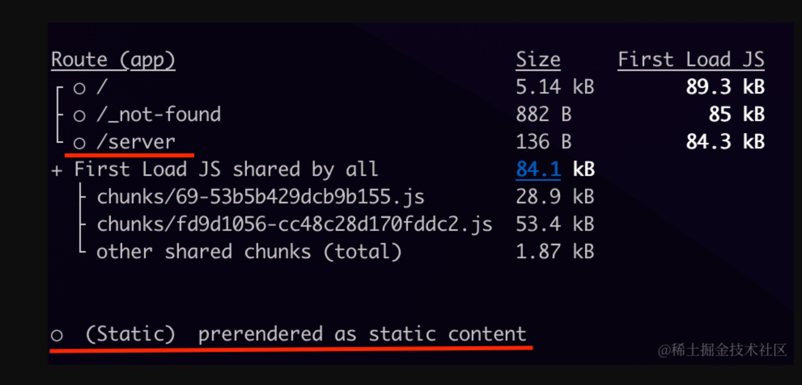
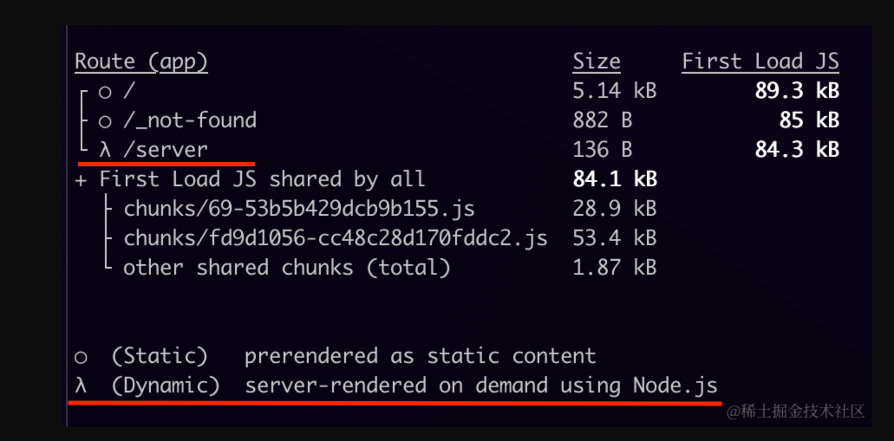

## 前言

现在让我们新建一个 `app/server/page.js`，代码如下：

```js
export default async function Page() {
  const url = (
    await (await fetch('https://api.thecatapi.com/v1/images/search')).json()
  )[0].url;

  return ;
}
```

其中，<https://api.thecatapi.com/v1/images/search> 是一个返回猫猫图片的接口，每次调用都会返回一张随机的猫猫图片数据。

现在让我们运行 `npm run dev`，开发模式下，每次刷新都会返回一张新的图片

现在让我们运行 `npm run build && npm run start`，然而此时每次刷新都还是这张 emo 的猫猫：

这是为什么呢？

让我们看下构建时的输出结果：



`/server` 被标记为 `Static`，表示被预渲染为静态内容。也就是说，`/server`的返回内容其实在构建的时候就已经决定了。页面返回的图片正是构建时调用猫猫接口返回的那张图片。

那么问题来了，如何让 `/server` 每次都返回新的图片呢？

这就要说到 Next.js 的服务端渲染策略了。

## 服务端渲染策略

Next.js 存在三种不同的服务端渲染策略：

- 静态渲染
- 动态渲染
- Streaming

我们来一一介绍。

### 1. 静态渲染（Static Rendering）

**这是默认渲染策略**，**路由在构建时渲染，或者在重新验证后后台渲染**，其结果会被缓存并且可以推送到 CDN。适用于未针对用户个性化且数据已知的情况，比如静态博客文章、产品介绍页面等。

开头中的例子就是构建时渲染。那么如何在重新验证后后台渲染呢？

具体重新验证的方法我们会在[《缓存篇 | Caching》](https://juejin.cn/book/7307859898316881957/section/7309077169735958565#heading-9)中详细介绍。这里为了举例说一种 —— 使用路由段配置项 `revalidate`。

修改 `app/server/page.js`，代码如下：

```js
export const revalidate = 10;

export default async function Page() {
  const url = (
    await (await fetch('https://api.thecatapi.com/v1/images/search')).json()
  )[0].url;

  return ;
}
```

此时虽然在 `npm run build`的输出中，`/server`依然是标记为静态渲染，但图片已经可以更新了，虽然每隔一段时间才更新：

其中 `revalidate=10`表示设置重新验证频率为 10s，但是要注意：

这句代码的效果并不是设置服务器每 10s 会自动更新一次 `/server`。而是至少 10s 后进行重新验证。

举个例子，假设你现在访问了 `/server`，此时时间设为 0s，10s 内持续访问，`/server` 返回的都是之前缓存的结果。当 10s 过后，假设你第 12s 又访问了一次 `/server`，此时虽然超过了 10s，但依然会返回之前缓存的结果，但同时会触发服务器更新缓存，当你第 13s 再次访问的时候，就是更新后的结果。

简单来说，超过 revalidate 设置时间的首次访问会触发缓存更新，如果更新成功，后续的返回就都是新的内容，直到下一次触发缓存更新。

### 2. 动态渲染（Dynamic Rendering）

路由在请求时渲染，适用于针对用户个性化或依赖请求中的信息（如 cookie、URL 参数）的情况。

在渲染过程中，**如果使用了动态函数（Dynamic functions）或者未缓存的数据请求（uncached data request），Next.js 就会切换为动态渲染**：

| 动态函数 | 数据缓存 | 渲染策略 |
| -------- | -------- | -------- |
| 否       | 缓存     | 静态渲染 |
| 是       | 缓存     | 动态渲染 |
| 否       | 未缓存   | 动态渲染 |
| 是       | 未缓存   | 动态渲染 |

注意：作为开发者，无须选择静态还是动态渲染，Next.js 会自动根据使用的功能和 API 为每个路由选择最佳的渲染策略

#### 2.1. 使用动态函数（Dynamic functions）

**动态函数指的是获取只有在请求时才能得到信息（如 cookie、请求头、URL 参数）的函数**。

在 Next.js 中这些动态函数是：

- [cookies()](https://juejin.cn/book/7307859898316881957/section/7309079651500949530#heading-7) 和 [headers()](https://juejin.cn/book/7307859898316881957/section/7309079651500949530#heading-20) ：获取 cookie 和 header
- `searchParams`：页面查询参数

使用这些函数的任意一个，都会导致路由转为动态渲染。

第一个例子，修改 `app/server/page.js`，代码如下：

```js
import { cookies } from 'next/headers';

export default async function Page() {
  const cookieStore = cookies();
  const theme = cookieStore.get('theme');

  const url = (
    await (await fetch('https://api.thecatapi.com/v1/images/search')).json()
  )[0].url;

  return ;
}
```

运行 `npm run build && npm run start`，此时 `/server`显示为动态渲染：



第二个例子，使用 searchParams，修改 `app/server/page.js`，代码如下：

```js
export default async function Page({ searchParams }) {
  const url = (
    await (await fetch('https://api.thecatapi.com/v1/images/search')).json()
  )[0].url;
  return (
    <>
      
      {new Date().toLocaleTimeString()}
      {JSON.stringify(searchParams)}
    </>
  );
}
```

运行 `npm run build && npm run start`，此时 `/server`显示为动态渲染：


但是图片却没有在页面刷新的时候改变（此时又是一只 emo 的猫猫）：

页面确实是动态渲染，因为每次刷新时间都发生了改变。但为什么图片没有更新呢？

这是因为动态渲染和数据请求缓存是两件事情，页面动态渲染并不代表页面涉及的请求一定不被缓存。正是因为 fetch 接口的返回数据被缓存了，这才导致了图片每次都是这一张。

修改 `app/server/page.js`，代码如下：

```js
export default async function Page({ searchParams }) {
  const url = (
    await (
      await fetch('https://api.thecatapi.com/v1/images/search', {
        cache: 'no-store',
      })
    ).json()
  )[0].url;
  return (
    <>
      
      {new Date().toLocaleTimeString()}
      {JSON.stringify(searchParams)}
    </>
  );
}
```

我们为 fetch 请求添加了 `{ cache: 'no-store' }`，使 fetch 请求退出了缓存。此时运行生产版本，图片和时间在刷新的时候都会改变：

注：同样是转为动态渲染，为什么使用 cookies 的时候，fetch 请求没有被缓存呢？这就是接下来要讲的内容。

当你在 `headers` 或 `cookies` 方法之后使用 fetch 请求会导致请求退出缓存，这是 Next.js 的自动逻辑，但还有哪些情况导致 fetch 请求自动退出缓存呢？让我们往下看。

#### 2.2. 使用未缓存的数据请求（uncached data request）

在 Next.js 中，fetch 请求的结果默认会被缓存，但你可以设置退出缓存，一旦你设置了退出缓存，就意味着使用了未缓存的数据请求（uncached data request），会导致路由进入动态渲染，如：

- `fetch` 请求添加了 `cache: 'no-store'`选项
- `fetch` 请求添加了 `revalidate: 0`选项
- `fetch` 请求在路由处理程序中并使用了 `POST` 方法
- 在`headers` 或 `cookies` 方法之后使用 `fetch`请求
- 配置了路由段选项 `const dynamic = 'force-dynamic'`
- 配置了路由段选项`fetchCache` ，默认会跳过缓存
- `fetch` 请求使用了 `Authorization`或者 `Cookie`请求头，并且在组件树中其上方还有一个未缓存的请求

注：关于数据请求，具体我们还会在[《数据获取篇 | 数据获取、缓存与重新验证》](https://juejin.cn/book/7307859898316881957/section/7309076949182709811)中详细介绍。

举个例子，修改 `app/server/page.js`，代码如下：

```js
export default async function Page() {
  const url = (
    await (
      await fetch('https://api.thecatapi.com/v1/images/search', {
        cache: 'no-store',
      })
    ).json()
  )[0].url;
  return (
    <>
      
      {new Date().toLocaleTimeString()}
    </>
  );
}
```

此时页面会转为动态渲染，每次刷新页面都会出现新的图片。

关于动态渲染再重申一遍：数据缓存和渲染策略是分开的。假如你选择了动态渲染，Next.js 会在请求的时候再渲染 RSC Payload 和 HTML，但其中涉及的数据请求，依然是可以从缓存中获取的。

### 3. Streaming

使用 `loading.js` 或者 React Suspense 组件会开启 Streaming。具体参考小册[《渲染篇 | Suspense 与 Streaming》](https://juejin.cn/book/7307859898316881957/section/7342436717142409242)

## 其他术语防混淆

除了静态渲染、动态渲染、动态函数、未缓存数据请求等术语，阅读官方文档的时候，你还可能遇到局部渲染、动态路由等这些与“渲染”、“动态”、“静态”有关的词，所以我们在这里列出来帮助大家区分。

### 1. 局部渲染（Partial rendering）

局部渲染指的是仅在客户端重新渲染导航时更改的路由段，共享段的内容的继续保留。举个例子，当在两个相邻的路由间导航的时候, `/dashboard/settings` 和 `/dashboard/analytics`，`settings` 和 `analytics` 页面会重新渲染，共享的 `dashboard` 布局会保留。


局部渲染的目的也是为了减少路由切换时的传输数据量和执行时间，从而提高性能。

### 2. 动态路由（Dynamic Routes）

动态路由我们在小册[《路由篇 | 动态路由、路由组、平行路由和拦截路由》](https://juejin.cn/book/7307859898316881957/section/7308693561648611379)中讲过：

```js
export default function Page({ params }) {
  return <div>My Post: {params.slug}</div>;
}
```

动态路由并不一定是动态渲染，你也可以用 `generateStaticParams`静态生成路由。

但有的时候，动态路由（Dynamic Routes）会用来表达“动态渲染的路由”（dynamically rendered routes）这个意思。在官网中，很少用到静态路由（Static Routes）这个词，用到的时候是用来表达“静态渲染的路由”（statically rendered routes）。

### 3. 动态段（Dynamic Segment）

路由中的动态段，举个例子，`app/blog/[slug]/page.js`中 `[slug]`就是动态段。

## 小结

恭喜你，完成了本篇内容的学习！

这篇我们介绍了服务端渲染的三种策略。至此，渲染篇基本介绍完毕，我们开始进入数据获取篇！
