---
nav:
  title: 前端技术
  order: 1
toc: content
title: 实战篇 -  React Notes
order: 40
---

## 前言

本篇我们来实现右侧笔记编辑部分。

## 笔记编辑界面

当点击 `New` 按钮的时候进入编辑界面：

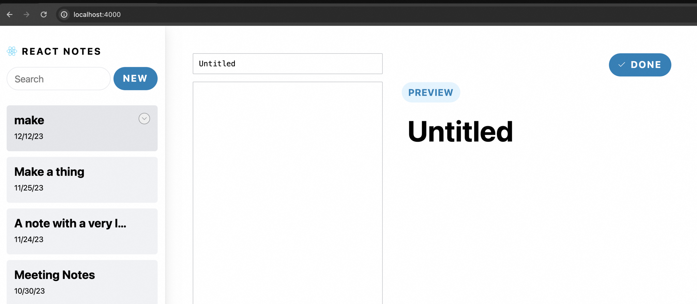

当点击具体笔记的 `Edit` 按钮的时候进入该笔记的编辑页面：

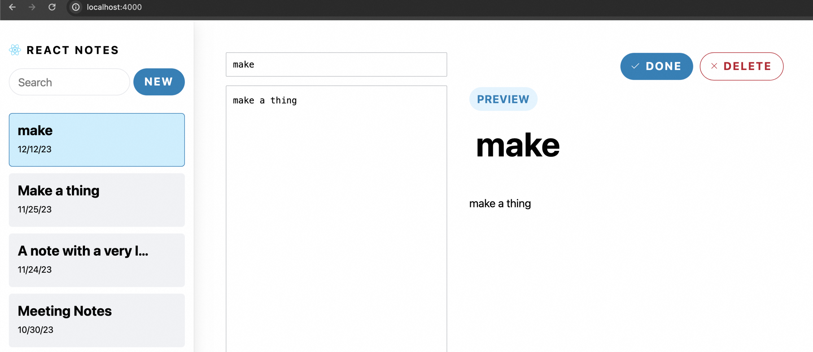

回忆下之前的路由设计，当点击 `New` 的时候，导航至 `/note/edit`路由，当点击 `Edit` 的时候，导航至 `/note/edit/xxxx` 路由。

那么我们开始动手吧！

`/app/note/edit/page.js`代码如下：

```js
import NoteEditor from '@/components/NoteEditor';

export default async function EditPage() {
  return <NoteEditor note={null} initialTitle="Untitled" initialBody="" />;
}
```

`/app/note/edit/loading.js`代码如下：

```js
export default function EditSkeleton() {
  return (
    <div
      className="note-editor skeleton-container"
      role="progressbar"
      aria-busy="true"
    >
      <div className="note-editor-form">
        <div className="skeleton v-stack" style={{ height: '3rem' }} />
        <div className="skeleton v-stack" style={{ height: '100%' }} />
      </div>
      <div className="note-editor-preview">
        <div className="note-editor-menu">
          <div
            className="skeleton skeleton--button"
            style={{ width: '8em', height: '2.5em' }}
          />
          <div
            className="skeleton skeleton--button"
            style={{ width: '8em', height: '2.5em', marginInline: '12px 0' }}
          />
        </div>
        <div
          className="note-title skeleton"
          style={{ height: '3rem', width: '65%', marginInline: '12px 1em' }}
        />
        <div className="note-preview">
          <div className="skeleton v-stack" style={{ height: '1.5em' }} />
          <div className="skeleton v-stack" style={{ height: '1.5em' }} />
          <div className="skeleton v-stack" style={{ height: '1.5em' }} />
          <div className="skeleton v-stack" style={{ height: '1.5em' }} />
          <div className="skeleton v-stack" style={{ height: '1.5em' }} />
        </div>
      </div>
    </div>
  );
}
```

你可能会问，同级的 `page.js` 又没有数据请求，添加 `loading.js` 有什么用？

同级的`page.js`确实没有请求，但 `loading.js`会将 `page.js` 和其 `children` 都包裹在 `<Suspense>` 中，所以 `/app/note/edit/[id]/page.js`中的请求也会触发该 `loading.js`。

`/app/note/edit/[id]/page.js`代码如下：

```js
import NoteEditor from '@/components/NoteEditor';
import { getNote } from '@/lib/redis';

export default async function EditPage({ params }) {
  const noteId = params.id;
  const note = await getNote(noteId);

  // 让效果更明显
  const sleep = (ms) => new Promise((r) => setTimeout(r, ms));
  await sleep(5000);

  if (note === null) {
    return (
      <div className="note--empty-state">
        <span className="note-text--empty-state">
          Click a note on the left to view something! 🥺
        </span>
      </div>
    );
  }

  return (
    <NoteEditor
      noteId={noteId}
      initialTitle={note.title}
      initialBody={note.content}
    />
  );
}
```

我们抽离了一个 `<NoteEditor>` 组件用于实现编辑功能，`/components/NoteEditor.js` 代码如下：

```js
'use client';

import { useState } from 'react';
import NotePreview from '@/components/NotePreview';
import { useFormStatus } from 'react-dom';

export default function NoteEditor({ noteId, initialTitle, initialBody }) {
  const { pending } = useFormStatus();
  const [title, setTitle] = useState(initialTitle);
  const [body, setBody] = useState(initialBody);
  const isDraft = !noteId;

  return (
    <div className="note-editor">
      <form className="note-editor-form" autoComplete="off">
        <label className="offscreen" htmlFor="note-title-input">
          Enter a title for your note
        </label>
        <input
          id="note-title-input"
          type="text"
          value={title}
          onChange={(e) => {
            setTitle(e.target.value);
          }}
        />
        <label className="offscreen" htmlFor="note-body-input">
          Enter the body for your note
        </label>
        <textarea
          value={body}
          id="note-body-input"
          onChange={(e) => setBody(e.target.value)}
        />
      </form>
      <div className="note-editor-preview">
        <form className="note-editor-menu" role="menubar">
          <button
            className="note-editor-done"
            disabled={pending}
            type="submit"
            role="menuitem"
          >
            
            Done
          </button>
          {!isDraft && (
            <button
              className="note-editor-delete"
              disabled={pending}
              role="menuitem"
            >
              
              Delete
            </button>
          )}
        </form>
        <div className="label label--preview" role="status">
          Preview
        </div>
        <h1 className="note-title">{title}</h1>
        <NotePreview>{body}</NotePreview>
      </div>
    </div>
  );
}
```

因为需要控制输入框的状态，所以 `<NoteEditor>` 使用了客户端组件，我们在 `<NotePreview>` 中引用了 `<NotePreview>`组件，用于实现编辑时的实时预览功能。

此时编辑页面应该已经可以正常显示：

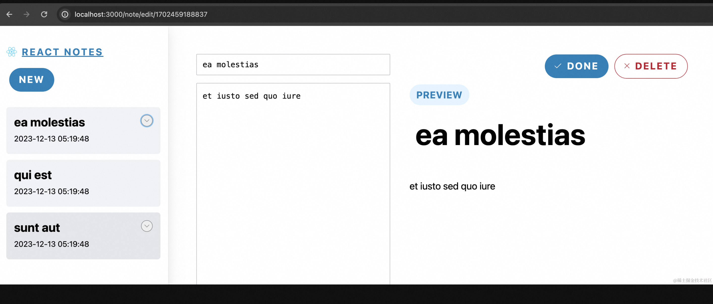

此时 `Done` 和 `Delete` 按钮还不能使用，这里我们使用 Server Actions 来实现。但实现之前，我们先看下目前的实现中一些要注意的点。

### 服务端组件和客户端组件

前面我们讲到关于服务端组件和客户端组件的使用指南，其中有一条：

> **服务端组件可以导入客户端组件，但客户端组件不能导入服务端组件**

但是这个例子中就很奇怪了。`<NoteEditor>` 是客户端组件，`<NotePreview>`是服务端组件，但我们却在 `<NoteEditor>` 中引用了 `<NotePreview>`组件，不是说不可以吗？怎么还成功渲染了！

这是一个初学者经常会遇到的误区。让我们回忆下[《渲染篇 | 服务端组件和客户端组件》](https://juejin.cn/book/7307859898316881957/section/7309076661532622885#heading-19)中是如何定义客户端组件的：

我们会在文件顶部添加一个 `'use client'` 声明。但准确的说，`'use client'` 声明的是服务端和客户端组件之间的边界，这意味着，当你在文件中定义了一个 `'use client'`，导入的其他模块包括子组件，都会被视为客户端 bundle 的一部分。

**换句话说，所有组件都是服务器组件，除非它使用了 **`'use client'`** 指令，或者被导入到 **`'use client'`** 模块中。此时它们会被视为客户端组件。视为客户端组件，就意味着它的代码要被打包到客户端 bundle 中。**

比如这里的 `<NotePreview>`，它被导入到 `<NoteEditor>`这个客户端组件中，它就变成了客户端组件。变成客户端组件，意味着 `<NotePreview>`中的代码，包括用到的 `marked` 和 `sanitize-html`库也要被打包到客户端中，要知道，这两个库没压缩前可是有几百 kB 的。

所以我们才要将服务端组件通过 props 的形式传给客户端组件，当通过这种形式的时候，组件还是服务端组件，会在服务端执行渲染，代码也不会打包到客户端中。当然在这个例子中，我们就是需要在客户端渲染 markdown 文件，所以代码就是要打包到客户端中的，没有办法避免。

让我们查看下 `http://localhost:3000/note/1702459188837`此时的源代码：

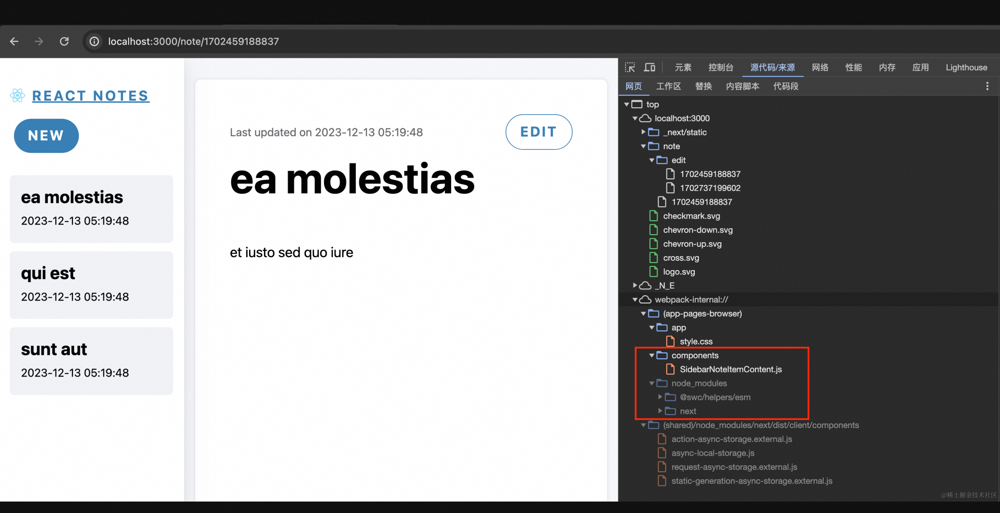

预览的时候，我们虽然用了 `<NotePreview>` 这个组件，但是代码没有打包到客户端中。但是当我们打开 `http://localhost:3000/note/edit/1702459188837`：

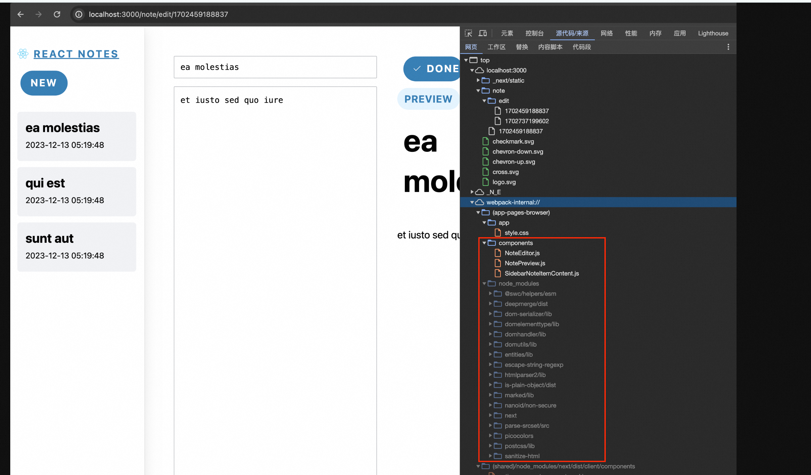

你会发现，下载了客户端组件 `<NoteEditor>` 和 `<NotePreview>`，对应也使用了很多库。`page.js` 也变大了很多（424 kB）：

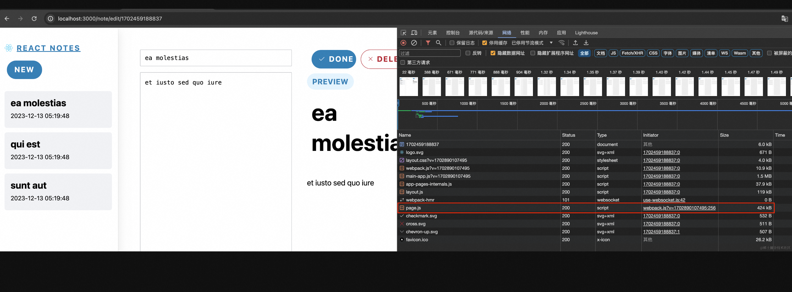

最后再说说使用客户端组件时的一个注意事项，那就是不要使用 `async/await`，可能会出现报错：

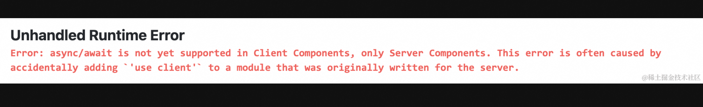

## 笔记编辑和删除

当点击 `Done` 的时候，导航至对应的笔记预览页面 `/note/xxxx`。当点击 `Delete` 的时候，导航至首页。

正常开发笔记的增加、更新和删除功能，为了实现前后端交互，可能要写多个接口来实现，比如当点击删除的时候，调用删除接口，接口返回成功，前端跳转至首页。但既然我们都用了 Next.js 14 了，没必要这么麻烦，Server Actions 直接搞定，省的一个个写接口了。

修改 `/components/NoteEditor.js` 代码：

```js
'use client';

// ...
import { deleteNote, saveNote } from '../app/actions';

export default function NoteEditor({ noteId, initialTitle, initialBody }) {
  //...
  return (
    <div className="note-editor">
      // ...
      <div className="note-editor-preview">
        <form className="note-editor-menu" role="menubar">
          <button
            className="note-editor-done"
            disabled={pending}
            type="submit"
            formAction={() => saveNote(noteId, title, body)}
            role="menuitem"
          >
            // ... Done
          </button>
          {!isDraft && (
            <button
              className="note-editor-delete"
              disabled={pending}
              formAction={() => deleteNote(noteId)}
              role="menuitem"
            >
              // ... Delete
            </button>
          )}
        </form>
        // ...
      </div>
    </div>
  );
}
```

其中最为核心的代码就是：

```html
<form className="note-editor-menu" role="menubar">
  <button formAction={() => saveNote(noteId, title, body)}>
    Done
  </button>
  <button formAction={() => deleteNote(noteId)} >
    Delete
  </button>
</form>
```

`app/actions.js`的代码如下：

```js
'use server';

import { redirect } from 'next/navigation';
import { addNote, updateNote, delNote } from '@/lib/redis';

export async function saveNote(noteId, title, body) {
  const data = JSON.stringify({
    title,
    content: body,
    updateTime: new Date(),
  });

  if (noteId) {
    updateNote(noteId, data);
    redirect(`/note/${noteId}`);
  } else {
    const res = await addNote(data);
    redirect(`/note/${res}`);
  }
}

export async function deleteNote(noteId) {
  delNote(noteId);
  redirect('/');
}
```

此时新增和删除看似可以“正常运行”了：

注：写这个 demo 的时候可能会遇到点了按钮没有反应，卡顿 5s 的情况，这是因为之前的 demo 里我们有在多个组件里写 sleep 5s，删除相应的代码即可。

## Server Actions

借助 Server Actions，我们很简单的就实现了笔记的新增和删除效果，但其实目前的代码中还有很多问题。

### 1. 完整路由缓存与 revalidate

比如当我们连续 2 次新增笔记时，观察左侧的笔记列表变化：

笔记列表初始有 3 条，新增第 1 条笔记后，左侧的笔记列表显示 4 条，但当我们新增第 2 条笔记的时候，左侧的笔记列表又变成了 3 条，新增第 2 条笔记后，左侧的笔记列表显示 5 条。

如果你导航至首页 `/`，你会发现还是 3 条，而且哪怕你清空缓存并硬性重新加载，还是 3 条，这是为什么呢？

这就是[完整路由缓存](https://juejin.cn/book/7307859898316881957/section/7309077169735958565#heading-13)。以 `/note/edit`为例，路由默认是静态渲染，也就是说，会在构建的时候，读取数据，然后将编译后的 HTML 和 RSC Payload 缓存，构建的时候，数据库里有 3 条数据，所以 HTML 中也只有 3 条数据，所以后续打开 `/note/edit`也都是 3 条数据。

还记得如何让完整路由缓存失效吗？

> 有两种方式可以使完整路由缓存失效：
>
> - 重新验证数据：重新验证数据缓存将使完整路由缓存失效，毕竟渲染输出依赖于数据
> - 重新部署：数据缓存是可以跨部署的，但完整路由缓存会在重新部署中被清除

此外，客户端路由缓存的失效也需要借助 revalidate：

> 有两种方法可以让路由缓存失效：
>
> - 在 Server Action 中：
>   - 通过 `revalidatePath` 或 `revalidateTag` 重新验证数据
>   - 使用 `cookies.set` 或者 `cookies.delete` 会使路由缓存失效
> - 调用 `router.refresh` 会使路由缓存失效并发起一个重新获取当前路由的请求

所以在进行数据处理的时候，一定要记得重新验证数据，也就是 [revalidatePath](https://juejin.cn/book/7307859898316881957/section/7309079586296791050#heading-12) 和 [revalidateTag](https://juejin.cn/book/7307859898316881957/section/7309079586296791050#heading-23)。现在我们修改下 `app/actions.js`：

```js
'use server';

import { redirect } from 'next/navigation';
import { addNote, updateNote, delNote } from '@/lib/redis';
import { revalidatePath } from 'next/cache';

export async function saveNote(noteId, title, body) {
  const data = JSON.stringify({
    title,
    content: body,
    updateTime: new Date(),
  });

  if (noteId) {
    updateNote(noteId, data);
    revalidatePath('/', 'layout');
    redirect(`/note/${noteId}`);
  } else {
    const res = await addNote(data);
    revalidatePath('/', 'layout');
    redirect(`/note/${res}`);
  }
}

export async function deleteNote(noteId) {
  delNote(noteId);
  revalidatePath('/', 'layout');
  redirect('/');
}
```

这里我们简单粗暴了清除了所有缓存，此时新增、编辑、删除应该都运行正常了。

### 2. 实现原理

现在让我们来看看当我们点击 `Done` 按钮的时候做了什么？

我们先注释掉 `actions.js` 中的 `redirect`，这样当更新笔记的时候，不会发生重定向。然后我们编辑一条笔记，然后点击 `Done`，可以看到页面发送了一条 POST 请求：

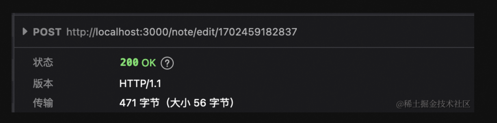

请求地址是当前页面，请求方法为 POST。请求内容正是我们传入的内容：

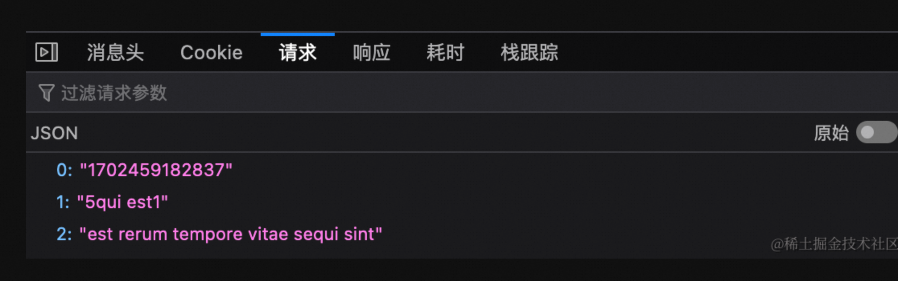

响应内容为：

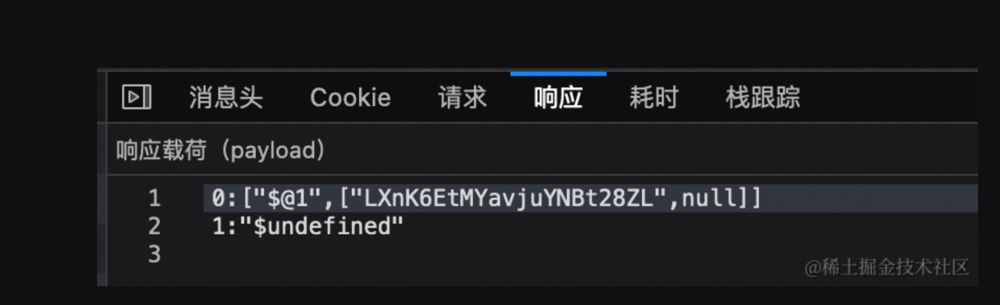

如果我们不注释掉 `actions.js` 中的 `redirect`，然后我们编辑一条笔记，然后点击 `Done`，可以看到页面发送了一条 POST 请求：

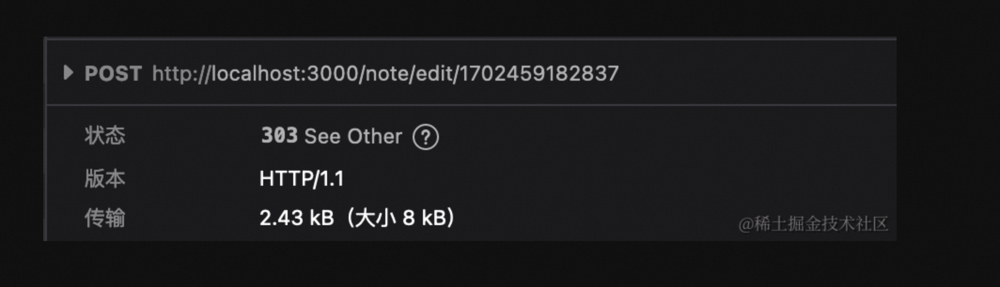

因为有重定向，所以请求状态变成了 303。响应内容为：

```js
3:I[5613,[],""]
5:I[1778,[],""]
4:["id","1702459182837","d"]
0:["SN0qCiPbAaKKSAlQfIuYC",[[["",{"children":["note",{"children":[["id","1702459182837","d"],{"children":["__PAGE__",{}]}]}]},"$undefined","$undefined",true],["",{"children":["note",{"children":[["id","1702459182837","d"],{"children":["__PAGE__",{},["$L1","$L2",null]]},["$","$L3",null,{"parallelRouterKey":"children","segmentPath":["children","note","children","$4","children"],"loading":["$","div",null,{"className":"note skeleton-container","role":"progressbar","aria-busy":"true","children":[["$","div",null,{"className":"note-header","children":[["$","div",null,{"className":"note-title skeleton","style":{"height":"3rem","width":"65%","marginInline":"12px 1em"}}],["$","div",null,{"className":"skeleton skeleton--button","style":{"width":"8em","height":"2.5em"}}]]}],["$","div",null,{"className":"note-preview","children":[["$","div",null,{"className":"skeleton v-stack","style":{"height":"1.5em"}}],["$","div",null,{"className":"skeleton v-stack","style":{"height":"1.5em"}}],["$","div",null,{"className":"skeleton v-stack","style":{"height":"1.5em"}}],["$","div",null,{"className":"skeleton v-stack","style":{"height":"1.5em"}}],["$","div",null,{"className":"skeleton v-stack","style":{"height":"1.5em"}}]]}]]}],"loadingStyles":[],"loadingScripts":[],"hasLoading":true,"error":"$undefined","errorStyles":"$undefined","errorScripts":"$undefined","template":["$","$L5",null,{}],"templateStyles":"$undefined","templateScripts":"$undefined","notFound":"$undefined","notFoundStyles":"$undefined","styles":null}]]},["$","$L3",null,{"parallelRouterKey":"children","segmentPath":["children","note","children"],"loading":"$undefined","loadingStyles":"$undefined","loadingScripts":"$undefined","hasLoading":false,"error":"$undefined","errorStyles":"$undefined","errorScripts":"$undefined","template":["$","$L5",null,{}],"templateStyles":"$undefined","templateScripts":"$undefined","notFound":"$undefined","notFoundStyles":"$undefined","styles":null}]]},[null,"$L6",null]],[[["$","link","0",{"rel":"stylesheet","href":"/_next/static/css/10169c963ccea784.css","precedence":"next","crossOrigin":"$undefined"}]],"$L7"]]]]
9:I[5250,["250","static/chunks/250-3c648b94097e3c7b.js","156","static/chunks/app/note/%5Bid%5D/page-5070a024863ac55b.js"],""]
6:["$","html",null,{"lang":"en","children":["$","body",null,{"children":["$","div",null,{"className":"container","children":["$","div",null,{"className":"main","children":["$L8",["$","section",null,{"className":"col note-viewer","children":["$","$L3",null,{"parallelRouterKey":"children","segmentPath":["children"],"loading":"$undefined","loadingStyles":"$undefined","loadingScripts":"$undefined","hasLoading":false,"error":"$undefined","errorStyles":"$undefined","errorScripts":"$undefined","template":["$","$L5",null,{}],"templateStyles":"$undefined","templateScripts":"$undefined","notFound":[["$","title",null,{"children":"404: This page could not be found."}],["$","div",null,{"style":{"fontFamily":"system-ui,\"Segoe UI\",Roboto,Helvetica,Arial,sans-serif,\"Apple Color Emoji\",\"Segoe UI Emoji\"","height":"100vh","textAlign":"center","display":"flex","flexDirection":"column","alignItems":"center","justifyContent":"center"},"children":["$","div",null,{"children":[["$","style",null,{"dangerouslySetInnerHTML":{"__html":"body{color:#000;background:#fff;margin:0}.next-error-h1{border-right:1px solid rgba(0,0,0,.3)}@media (prefers-color-scheme:dark){body{color:#fff;background:#000}.next-error-h1{border-right:1px solid rgba(255,255,255,.3)}}"}}],["$","h1",null,{"className":"next-error-h1","style":{"display":"inline-block","margin":"0 20px 0 0","padding":"0 23px 0 0","fontSize":24,"fontWeight":500,"verticalAlign":"top","lineHeight":"49px"},"children":"404"}],["$","div",null,{"style":{"display":"inline-block"},"children":["$","h2",null,{"style":{"fontSize":14,"fontWeight":400,"lineHeight":"49px","margin":0},"children":"This page could not be found."}]}]]}]}]],"notFoundStyles":[],"styles":null}]}]]}]}]}]}]
7:[["$","meta","0",{"name":"viewport","content":"width=device-width, initial-scale=1"}],["$","meta","1",{"charSet":"utf-8"}],["$","link","2",{"rel":"icon","href":"/favicon.ico","type":"image/x-icon","sizes":"16x16"}]]
1:null
2:["$","div",null,{"className":"note","children":[["$","div",null,{"className":"note-header","children":[["$","h1",null,{"className":"note-title","children":"3qui est"}],["$","div",null,{"className":"note-menu","role":"menubar","children":[["$","small",null,{"className":"note-updated-at","role":"status","children":["Last updated on ","2023-12-19 05:33:09"]}],["$","$L9",null,{"href":"/note/edit/1702459182837","className":"link--unstyled","children":["$","button",null,{"className":"edit-button edit-button--outline","role":"menuitem","children":"Edit"}]}]]}]]}],["$","div",null,{"className":"note-preview","children":["$","div",null,{"className":"text-with-markdown","dangerouslySetInnerHTML":{"__html":"<p>est rerum tempore vitae sequi sint</p>\n"}}]}]]}]
a:"$Sreact.suspense"
8:["$","section",null,{"className":"col sidebar","children":[["$","$L9",null,{"href":"/","className":"link--unstyled","children":["$","section",null,{"className":"sidebar-header","children":[["$","img",null,{"className":"logo","src":"/logo.svg","width":"22px","height":"20px","alt":"","role":"presentation"}],["$","strong",null,{"children":"React Notes"}]]}]}],["$","section",null,{"className":"sidebar-menu","role":"menubar","children":["$","$L9",null,{"href":"/note/edit/","className":"link--unstyled","children":["$","button",null,{"className":"edit-button edit-button--solid","role":"menuitem","children":"New"}]}]}],["$","nav",null,{"children":["$","$a",null,{"fallback":["$","div",null,{"children":["$","ul",null,{"className":"notes-list skeleton-container","children":[["$","li",null,{"className":"v-stack","children":["$","div",null,{"className":"sidebar-note-list-item skeleton","style":{"height":"5em"}}]}],["$","li",null,{"className":"v-stack","children":["$","div",null,{"className":"sidebar-note-list-item skeleton","style":{"height":"5em"}}]}],["$","li",null,{"className":"v-stack","children":["$","div",null,{"className":"sidebar-note-list-item skeleton","style":{"height":"5em"}}]}]]}]}],"children":"$Lb"}]}]]}]
c:I[610,["250","static/chunks/250-3c648b94097e3c7b.js","185","static/chunks/app/layout-7bae744084688543.js"],""]
b:["$","ul",null,{"className":"notes-list","children":[["$","li","1702459182837",{"children":["$","$Lc",null,{"id":"1702459182837","title":"3qui est","expandedChildren":["$","p",null,{"className":"sidebar-note-excerpt","children":"est rerum tempore vi"}],"children":["$","header",null,{"className":"sidebar-note-header","children":[["$","strong",null,{"children":"3qui est"}],["$","small",null,{"children":"2023-12-19 05:33:09"}]]}]}]}],["$","li","1702459181837",{"children":["$","$Lc",null,{"id":"1702459181837","title":"sunt aut","expandedChildren":["$","p",null,{"className":"sidebar-note-excerpt","children":"quia et suscipit sus"}],"children":["$","header",null,{"className":"sidebar-note-header","children":[["$","strong",null,{"children":"sunt aut"}],["$","small",null,{"children":"2023-12-13 05:19:48"}]]}]}]}],["$","li","1702459188837",{"children":["$","$Lc",null,{"id":"1702459188837","title":"ea molestias","expandedChildren":["$","p",null,{"className":"sidebar-note-excerpt","children":"et iusto sed quo iur"}],"children":["$","header",null,{"className":"sidebar-note-header","children":[["$","strong",null,{"children":"ea molestias"}],["$","small",null,{"children":"2023-12-13 05:19:48"}]]}]}]}]]}]

```

此时重定向地址为 `/note/1702459182837`，从响应的内容中可以看出，其中包含了渲染后的笔记列表和此条笔记的具体内容。该内容也是流式加载的，所以内容会逐步渲染出来。比如我们把 `/note/[id]/page.js`的 `sleep` 设置为 10s，`/components/SidebarNoteList.js`的 sleep 设置为 3s，效果如下：

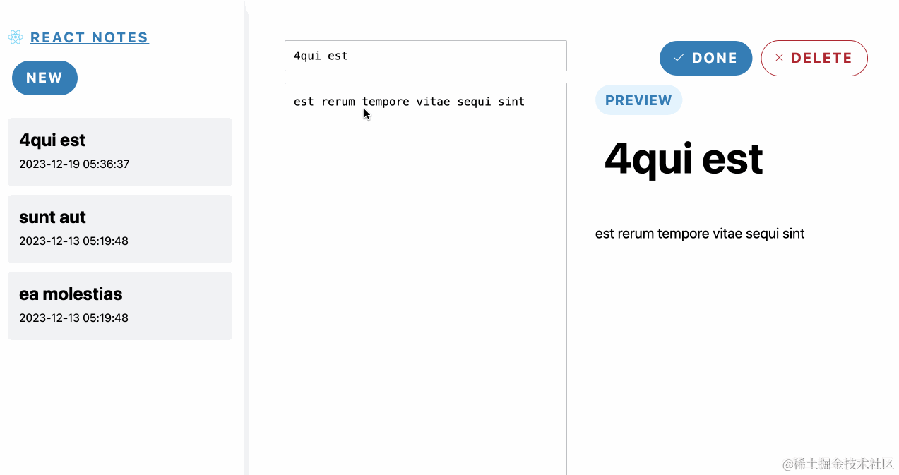

点击后，左侧笔记列表 3s 后发生了变化，右侧笔记预览 10s 后发生了变化。

所以当提交表单的时候发生了什么呢？其实就是将数据以 POST 请求提交给当前页面，服务端根据 Server Actions 中的定义进行处理。Next.js 怎么实现的呢？其实就相当于替你写了原本用于交互的接口。

### 3. 渐进式增强

使用 Server Actions 的一大好处就是渐进式增强，也就是说，即便你禁用了 JavaScript，照样可以生效。现在让我们查看 `Done`和 `Delete`按钮的源码：

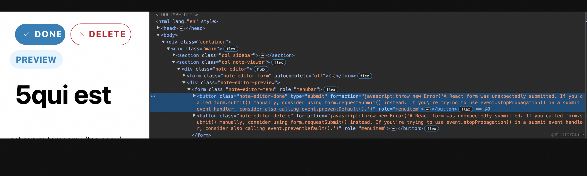

按钮的 `formaction` 属性变成了：

> javascript:throw new Error('A React form was unexpectedly submitted. If you called form.submit() manually, consider using form.requestSubmit() instead. If you're trying to use event.stopPropagation() in a submit event handler, consider also calling event.preventDefault().')"

这说明……代码写的有问题……

现在我们提交表单的代码为：

```html
<form className="note-editor-menu" role="menubar">
  <button formAction={() => saveNote(noteId, title, body)}>
    Done
  </button>
</form>
```

虽然这种写法也可以生效，但在禁用 JavaScript 的时候会失效，为了避免这个错误，最好是像下面这样写：

```html
<form className="note-editor-menu" role="menubar">
  <button formaction="{saveNote}">Done</button>
</form>
```

那么 noteId 该如何传入呢？我们可以使用传统的隐藏 input：

```html
<input type="hidden" name="noteId" value="{noteId}" />
```

现在让我们重新写下 `components/NoteEditor.js` 的代码：

```js
'use client';

import { useState } from 'react';
import NotePreview from '@/components/NotePreview';
import { useFormStatus } from 'react-dom';
import { deleteNote, saveNote } from '../app/actions';

export default function NoteEditor({ noteId, initialTitle, initialBody }) {
  const { pending } = useFormStatus();
  const [title, setTitle] = useState(initialTitle);
  const [body, setBody] = useState(initialBody);
  const isDraft = !noteId;

  return (
    <div className="note-editor">
      <form className="note-editor-form" autoComplete="off">
        <div className="note-editor-menu" role="menubar">
          <input type="hidden" name="noteId" value={noteId} />
          <button
            className="note-editor-done"
            disabled={pending}
            type="submit"
            formAction={saveNote}
            role="menuitem"
          >
            
            Done
          </button>
          {!isDraft && (
            <button
              className="note-editor-delete"
              disabled={pending}
              formAction={deleteNote}
              role="menuitem"
            >
              
              Delete
            </button>
          )}
        </div>
        <label className="offscreen" htmlFor="note-title-input">
          Enter a title for your note
        </label>
        <input
          id="note-title-input"
          type="text"
          name="title"
          value={title}
          onChange={(e) => {
            setTitle(e.target.value);
          }}
        />
        <label className="offscreen" htmlFor="note-body-input">
          Enter the body for your note
        </label>
        <textarea
          name="body"
          value={body}
          id="note-body-input"
          onChange={(e) => setBody(e.target.value)}
        />
      </form>
      <div className="note-editor-preview">
        <div className="label label--preview" role="status">
          Preview
        </div>
        <h1 className="note-title">{title}</h1>
        <NotePreview>{body}</NotePreview>
      </div>
    </div>
  );
}
```

`app/actions.js`的代码为：

```js
'use server';

import { redirect } from 'next/navigation';
import { addNote, updateNote, delNote } from '@/lib/redis';
import { revalidatePath } from 'next/cache';

export async function saveNote(formData) {
  const noteId = formData.get('noteId');

  const data = JSON.stringify({
    title: formData.get('title'),
    content: formData.get('body'),
    updateTime: new Date(),
  });

  if (noteId) {
    updateNote(noteId, data);
    revalidatePath('/', 'layout');
    redirect(`/note/${noteId}`);
  } else {
    const res = await addNote(data);
    revalidatePath('/', 'layout');
    redirect(`/note/${res}`);
  }
}

export async function deleteNote(formData) {
  const noteId = formData.get('noteId');

  delNote(noteId);
  revalidatePath('/', 'layout');
  redirect('/');
}
```

此时再查看 `Done` 和 `Delete` 按钮元素：

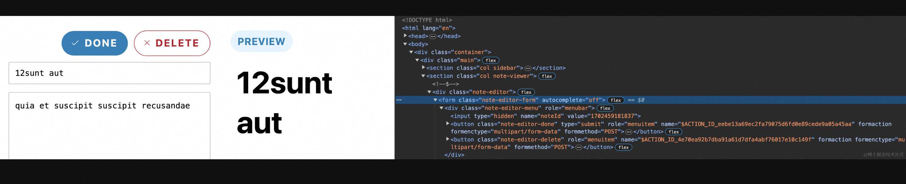

此时就没有刚才的错误信息了。现在让我们在开发者工具中禁用 JavaScript，你会发现表单依然能用：

当然在这个例子中，因为禁用了 JavaScript，所以左侧的笔记列表加载不出来，更改内容的时候右边也不会实时渲染，但至少表单提交成功了。

### 4. useFormState 与 useFormStatus

React 的 [useFormState](https://react.dev/reference/react-dom/hooks/useFormState) 和 [useFormStatus](useFormStatus) 非常适合搭配 Server Actions 使用。`useFormState` 用于根据 form action 的结果更新表单状态，`useFormStatus` 用于在提交表单时显示待处理状态。

比如使用 `useFormStatus` 实现表单提交时按钮的禁用效果：

```js
export default function NoteEditor() {
  const { pending } = useFormStatus();

  return <button disabled={pending}> Done </button>;
}
```

又或者在提交的时候按钮的文字变成 `Saving`：

```js
export default function NoteEditor() {
  const { pending } = useFormStatus();

  return <button> {pending ? 'Saving' : 'Done'} </button>;
}
```

注意使用 `useFormStatus` 的时候，建议将按钮抽离成单独的组件，在组件中使用 `useFormStatus`。

现在让我们修改下项目的效果，当点击 `Done` 的时候，不再重定向，而是出现 `Add Success!`提示，我们再加入 `useFormState`重写下 `components/NoteEditor.js` 的代码：

```js
'use client';

import { useState } from 'react';
import NotePreview from '@/components/NotePreview';
import { useFormState } from 'react-dom';
import { deleteNote, saveNote } from '../app/actions';
import SaveButton from '@/components/SaveButton';
import DeleteButton from '@/components/DeleteButton';

const initialState = {
  message: null,
};

export default function NoteEditor({ noteId, initialTitle, initialBody }) {
  const [saveState, saveFormAction] = useFormState(saveNote, initialState);
  const [delState, delFormAction] = useFormState(deleteNote, initialState);

  const [title, setTitle] = useState(initialTitle);
  const [body, setBody] = useState(initialBody);

  const isDraft = !noteId;

  return (
    <div className="note-editor">
      <form className="note-editor-form" autoComplete="off">
        <div className="note-editor-menu" role="menubar">
          <input type="hidden" name="noteId" value={noteId} />
          <SaveButton formAction={saveFormAction} />
          <DeleteButton isDraft={isDraft} formAction={delFormAction} />
        </div>
        <div className="note-editor-menu">{saveState?.message}</div>
        <label className="offscreen" htmlFor="note-title-input">
          Enter a title for your note
        </label>
        <input
          id="note-title-input"
          type="text"
          name="title"
          value={title}
          onChange={(e) => {
            setTitle(e.target.value);
          }}
        />
        <label className="offscreen" htmlFor="note-body-input">
          Enter the body for your note
        </label>
        <textarea
          name="body"
          value={body}
          id="note-body-input"
          onChange={(e) => setBody(e.target.value)}
        />
      </form>
      <div className="note-editor-preview">
        <div className="label label--preview" role="status">
          Preview
        </div>
        <h1 className="note-title">{title}</h1>
        <NotePreview>{body}</NotePreview>
      </div>
    </div>
  );
}
```

我们将 Done 和 Delete 按钮抽离成了两个组件。

`components/SaveButton.js`代码如下：

```js
import { useFormStatus } from 'react-dom';

export default function EditButton({ formAction }) {
  const { pending } = useFormStatus();
  return (
    <button
      className="note-editor-done"
      type="submit"
      formAction={formAction}
      disabled={pending}
      role="menuitem"
    >
      
      {pending ? 'Saving' : 'Done'}
    </button>
  );
}
```

`components/DeleteButton.js`代码如下：

```js
import { useFormStatus } from 'react-dom';

export default function DeleteButton({ isDraft, formAction }) {
  const { pending } = useFormStatus();
  return (
    !isDraft && (
      <button
        className="note-editor-delete"
        disabled={pending}
        formAction={formAction}
        role="menuitem"
      >
        
        Delete
      </button>
    )
  );
}
```

`app/actions.js`的代码为：

```js
'use server';

import { redirect } from 'next/navigation';
import { addNote, updateNote, delNote } from '@/lib/redis';
import { revalidatePath } from 'next/cache';
const sleep = (ms) => new Promise((r) => setTimeout(r, ms));

export async function saveNote(prevState, formData) {
  const noteId = formData.get('noteId');

  const data = JSON.stringify({
    title: formData.get('title'),
    content: formData.get('body'),
    updateTime: new Date(),
  });

  // 为了让效果更明显
  await sleep(2000);

  if (noteId) {
    updateNote(noteId, data);
    revalidatePath('/', 'layout');
  } else {
    const res = await addNote(data);
    revalidatePath('/', 'layout');
  }
  return { message: `Add Success!` };
}

export async function deleteNote(prevState, formData) {
  const noteId = formData.get('noteId');
  delNote(noteId);
  revalidatePath('/', 'layout');
  redirect('/');
}
```

此时再点击 `Done` 按钮：

当点击 `Done` 按钮的时候，`Done` 和 `Delete` 按钮都出现了 disabled 样式（毕竟这两个按钮在一个表单内），2s 后，出现 Add Success! 提示。

### 5. 数据校验

如果需要对数据进行校验，Next.js 推荐使用 [zod](https://zod.dev/README_ZH)，我们使用 zod 修改下 `/app/actions.js`：

```js
'use server';

import { redirect } from 'next/navigation';
import { addNote, updateNote, delNote } from '@/lib/redis';
import { revalidatePath } from 'next/cache';
import { z } from 'zod';

const schema = z.object({
  title: z.string(),
  content: z.string().min(1, '请填写内容').max(100, '字数最多 100'),
});

const sleep = (ms) => new Promise((r) => setTimeout(r, ms));

export async function saveNote(prevState, formData) {
  // 获取 noteId
  const noteId = formData.get('noteId');
  const data = {
    title: formData.get('title'),
    content: formData.get('body'),
    updateTime: new Date(),
  };

  // 校验数据
  const validated = schema.safeParse(data);
  if (!validated.success) {
    return {
      errors: validated.error.issues,
    };
  }

  // 模拟请求时间
  await sleep(2000);

  // 更新数据库
  if (noteId) {
    await updateNote(noteId, JSON.stringify(data));
    revalidatePath('/', 'layout');
  } else {
    await addNote(JSON.stringify(data));
    revalidatePath('/', 'layout');
  }

  return { message: `Add Success!` };
}

export async function deleteNote(prevState, formData) {
  const noteId = formData.get('noteId');
  delNote(noteId);
  revalidatePath('/', 'layout');
  redirect('/');
}
```

`components/NoteEditor.js`代码如下：

```js
'use client';

import { useEffect, useRef, useState } from 'react';
import NotePreview from '@/components/NotePreview';
import { useFormState } from 'react-dom';
import { deleteNote, saveNote } from '../app/actions';
import SaveButton from '@/components/SaveButton';
import DeleteButton from '@/components/DeleteButton';

const initialState = {
  message: null,
};

export default function NoteEditor({ noteId, initialTitle, initialBody }) {
  const [saveState, saveFormAction] = useFormState(saveNote, initialState);
  const [delState, delFormAction] = useFormState(deleteNote, initialState);

  const [title, setTitle] = useState(initialTitle);
  const [body, setBody] = useState(initialBody);

  const isDraft = !noteId;

  useEffect(() => {
    if (saveState.errors) {
      // 处理错误
      console.log(saveState.errors);
    }
  }, [saveState]);

  return (
    <div className="note-editor">
      <form className="note-editor-form" autoComplete="off">
        <input type="hidden" name="noteId" value={noteId || ''} />
        <div className="note-editor-menu" role="menubar">
          <SaveButton formAction={saveFormAction} />
          <DeleteButton isDraft={isDraft} formAction={delFormAction} />
        </div>
        <div className="note-editor-menu">
          {saveState?.message}
          {saveState.errors && saveState.errors[0].message}
        </div>
        <label className="offscreen" htmlFor="note-title-input">
          Enter a title for your note
        </label>
        <input
          id="note-title-input"
          type="text"
          name="title"
          value={title}
          onChange={(e) => {
            setTitle(e.target.value);
          }}
        />
        <label className="offscreen" htmlFor="note-body-input">
          Enter the body for your note
        </label>
        <textarea
          name="body"
          value={body}
          id="note-body-input"
          onChange={(e) => setBody(e.target.value)}
        />
      </form>
      <div className="note-editor-preview">
        <div className="label label--preview" role="status">
          Preview
        </div>
        <h1 className="note-title">{title}</h1>
        <NotePreview>{body}</NotePreview>
      </div>
    </div>
  );
}
```

### 6. 最佳实践：Server Actions

写 Server Actions 基本要注意的点就这些了，定义在 actions 的代码要注意：

1.  从 [formData](https://developer.mozilla.org/zh-CN/docs/Web/API/FormData/FormData) 中获取提交的数据
2.  使用 [zod](https://zod.dev/README_ZH) 进行数据校验
3.  使用 [revalidate](https://juejin.cn/book/7307859898316881957/section/7309079586296791050#heading-12) 更新数据缓存
4.  返回合适的信息

定义表单的代码要注意：

1.  搭配使用 [useFormState](https://react.dev/reference/react-dom/hooks/useFormState) 和 [useFormStatus](useFormStatus)
2.  特殊数据使用隐藏 input 提交

## 总结

那么今天的内容就结束了，本篇我们完善了笔记的编辑效果，了解了客户端组件与服务端组件的划分以及在实战中使用 Server Actions，学习书写 Server Actions 时的注意事项和最佳实践。

本篇的代码我已经上传到[代码仓库](https://github.com/mqyqingfeng/next-react-notes-demo/tree/main)的 Day 4 分支：<https://github.com/mqyqingfeng/next-react-notes-demo/tree/day4>，本篇的不同版本以不同的 commit 进行了提交，此外直接使用的时候不要忘记在本地开启 Redis。
