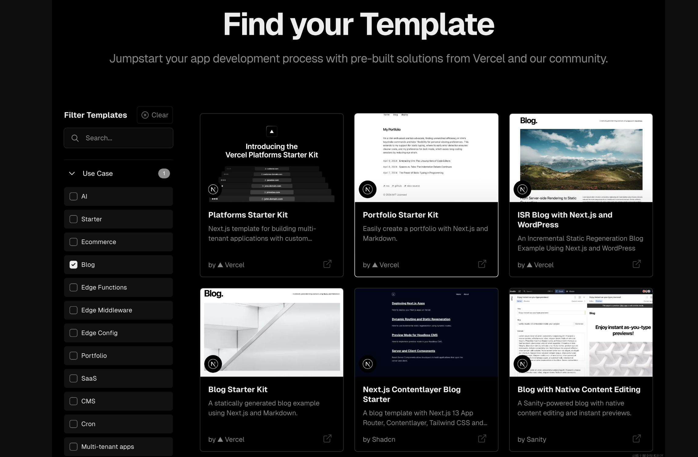
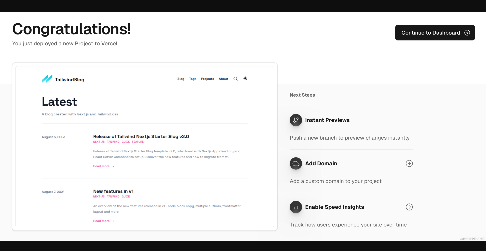
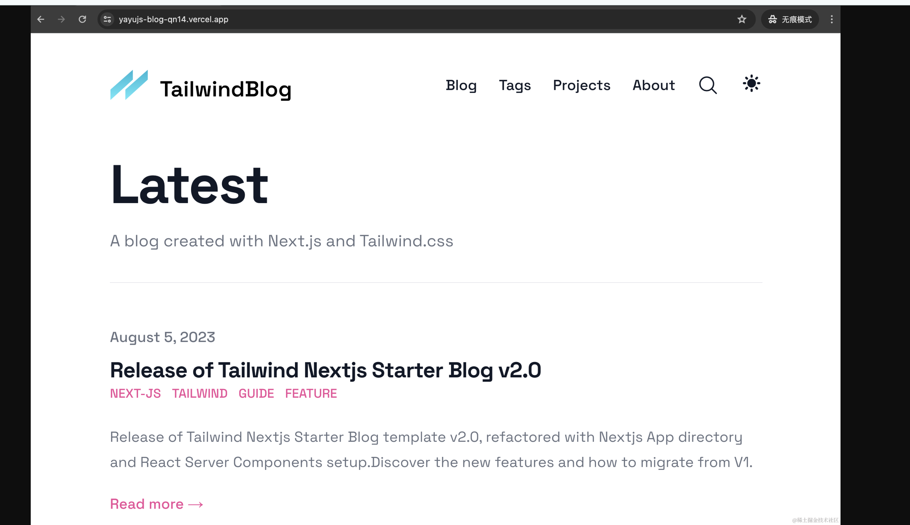
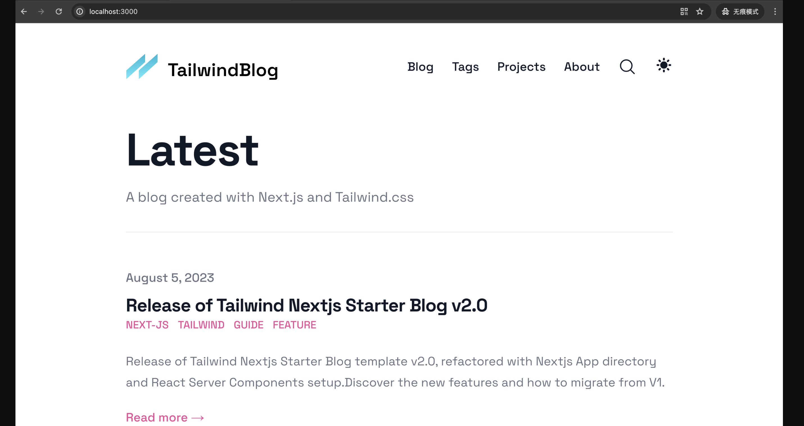
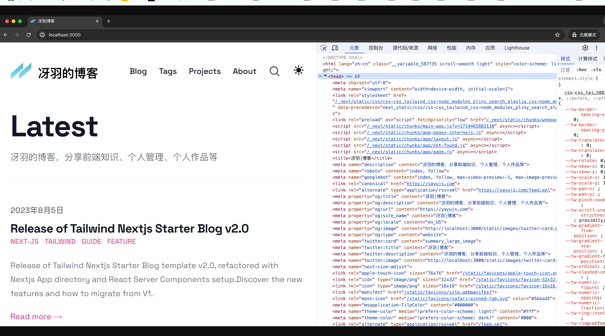
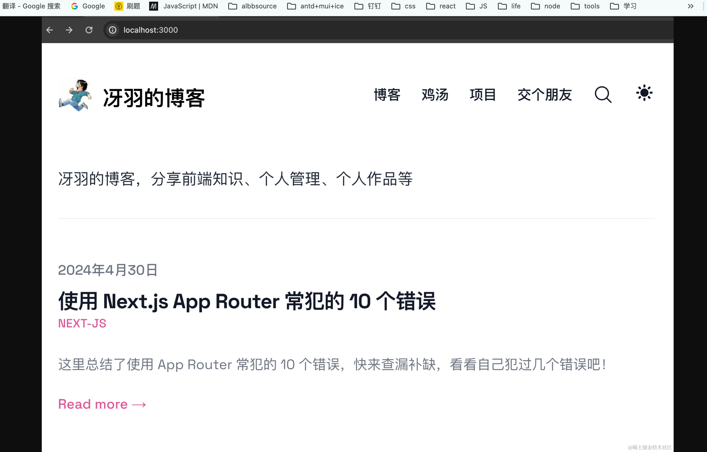
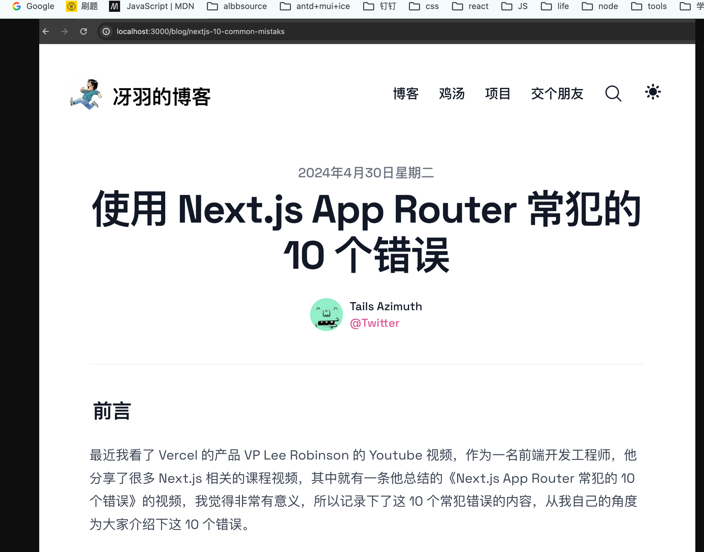
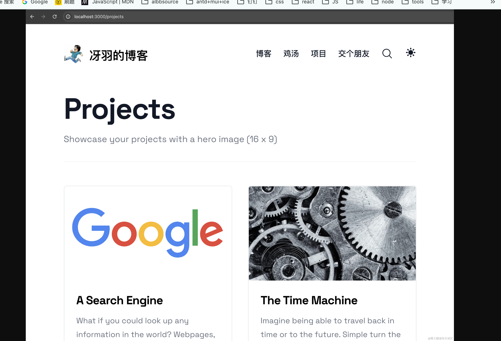

## 怎么做博客

从头建吗？自己设计产品、自己构思 UI、自己开发，自己运维？即使有 AI 辅助，也太累了。我又不是要找工作，写个博客还可以充当项目经历，感觉没必要。

半自建？相关技术选型琳琅满目：WordPress、Gitbook、Hexo、VuePress、Docusaurus、Nextra、Docsify、mdBook、NextBook……一时间都不知道如何选择。

且让我捋捋：

1.  WordPress：老牌 CMS 框架，插件众多，背后技术选型为 PHP + MySQL
2.  [Gitbook](https://www.gitbook.com/)：方便与 GitHub 集成，支持 Markdown 格式编写文档，现在转向商业，不建议用
3.  [Hexo](https://hexo.io/zh-cn/)：快速、简洁且高效的博客 Node.js 框架，主题、插件众多，支持 Markdown
4.  [VuePress](https://vuepress.vuejs.org/zh/)：基于 Vue 的静态网站生成器，本质将 Markdown 编译为 HTML。
    1.  网站参考：[VuePress](https://vuepress.vuejs.org/zh/)、[TypeScript 中文](https://ts.yayujs.com/)
5.  [Docusaurus](https://docusaurus.io/)：Facebook 开源的建站工具，基于 React，本质也是将 Markdown 编译为 HTML。
    1.  网站参考：[Redux](https://react-redux.js.org/)、[Create React App](https://create-react-app.dev/)、[Prettier](https://prettier.io/)
6.  [Docsify](https://docsify.js.org/#/)：不同于构建的时候将 MD 编译为 HTML，Docsify 是运行时，不是静态网站生成器，不适合搜索引擎优化
7.  [Nextra](https://nextra.site/)：基于 Next.js 的静态网站生成器，目前还不支持 App Router
8.  [mdBook](https://github.com/rust-lang/mdBook)：你可以理解为 Rust 版的 Gitbook
9.  [NextBook](https://next-book.vercel.app/intro)：你可以理解为 Next.js 版的 Gitbook，更适合于技术书籍或文档的风格样式
    1.  网站参考：[NextBook](https://next-book.vercel.app/reference/markdown)

说是博客，其实这很多都偏向于建立文档网站。

如果是建立文档网站，我个人的建议是，如果你会 Vue，推荐使用 VuePress 或 VitePress，如果你会 React，推荐使用 Docusaurus。当然这些技术选型本身并不难，也可以根据自己喜欢的样式进行选择。

至于我们的博客项目，我们都不选择。

毕竟我们做的是博客，博客的一大目的在于展示自己，比如嵌入自己的作品、做一个简历页、添加广告位等等，所以需要更高的灵活度。使用这些工具虽然可以快速构建出一个文档站点，但有些内容自定义会变得特别麻烦。

所以我们还是以写项目的形式做这个博客。

但我也不想从 Next.js 的脚手架开始做起来……有没有做好的半成品可以让我直接用呢……

## 经验：多找找前人栽的树

遇到这种情况:

### 1. 找找 Vercel 模板

首先到 Vercel 的[模板页面](https://vercel.com/templates?search=blog)看看。比如以“Blog”作为关键词进行搜索，你会发现有不少现成的模板：



每个模板都提供了 Demo 和源码地址，看看样式、相关技术选型是否满足你的需求。

### 2. 找找 GitHub

然后到 GitHub，比如以 Next.js + Blog 作为关键词进行搜索，按照匹配度、Stars 等进行排序，看看是否有合适的项目。

### 3. 找找技术网站

最后除了 Google 直接搜索，还可以到各大技术网站比如 [Medium](https://medium.com/)、[Dev.to](https://dev.to/)、[Hacker News](https://news.ycombinator.com/news)、[Indie Hackers](https://www.indiehackers.com/)，搜索相关内容。

至于国内的技术网站，想必大家都很熟了，就不多说了。

当然，各种 AI 工具用起来也很不错。

比如我就找到了一篇不错的文章：[28 Open-source Free Next.js Blog Templates Starters](https://medevel.com/28-next-js-blog-starter/)，其中有不少不错的博客模板，可以参考。

最终选了这样一个模板：<https://github.com/timlrx/tailwind-nextjs-starter-blog>

主要有以下这些原因：

1.  Next.js、Tailwind CSS Blog start template，作为项目初始模板，接下来正常使用 Next.js 开发即可，保证了项目最大灵活度
2.  GitHub 7k Star，依然在持续维护中
3.  支持 MDX、支持 dark 主题
4.  SEO 友好、移动端友好、代码轻量

初期博客不会有什么流量，购买服务器进行部署，性价比太低。干脆直接用 Vercel 部署，然后使用自定义域名。这样需要花费的就只是一个域名钱。

## 快速开始

### 1. Vercel 部署

这个 GitHub 仓库也有对应的 Vercel 模板：[Tailwind CSS Blog](https://vercel.com/templates/next.js/tailwind-css-starter-blog)：


点击 Create，部署完成后自动跳转到：



点击左侧的预览图片，查看部署效果：



### 2. 添加自定义域名

添加自定义域名，并保证国内能够正常访问，参考[《实战篇 | React Notes | Vercel 部署》](https://juejin.cn/book/7307859898316881957/section/7309114840307400714#heading-8)，比如我设置的域名为 [yayujs.com](https://yayujs.com)

### 3. 下载代码

找到仓库的 GitHub 地址，下载到本地：

```bash
# 替换为自己的仓库地址
git clone git@github.com:mqyqingfeng/yayujs-blog.git

# 进入仓库，替换为自己的项目地址
cd yayujs-blog

# 安装依赖项并启动
npm i && npm run dev
```

打开 <http://localhost:3000/>，查看效果：



### 4. 修改代码

#### 4.1. 修改站点信息

首先修改 `/data/siteMetadata.js`，这里存放的是站点相关的信息，会被多个地方用到：


修改后，可以发现主页展示的内容和 HTML 元数据都发生了变化：



#### 4.2. 修改 logo


这个就是我们的 logo，对应的图片位置是 `/data/logo.svg`，可以直接替换。

如果你想直接用图片，比如添加一张图片 `/data/logo.png`，还需要修改 `/components/Header.tsx`，修改后的代码如下：

```js
import Logo from '@/data/logo.png';
import Image from 'next/image';

const Header = () => {
  return (
    <header className="flex items-center justify-between py-10">
      <div>
        <Link href="/" aria-label={siteMetadata.headerTitle}>
          <div className="flex items-center justify-between">
            <div className="mr-3">
              <Image src={Logo} alt="logo" width="50" />
            </div>
            // ...
          </div>
        </Link>
      </div>
      // ...
    </header>
  );
};

export default Header;
```

修改的主要内容就是将原来的`<Logo>` 改为 `<Image src={Logo} alt="logo" width="50" />`。

此时效果如下：


#### 4.3. 修改导航栏信息

右侧导航栏的信息在 `/data/headerNavLinks.ts`，根据自己的需求修改即可。


#### 4.4. 修改主页样式

这里的内容看着有些奇怪：


对应的代码地址为 `app/Main.tsx`，根据自己的需求修改即可。我直接注释掉了，修改后的效果如下：


#### 4.5. 添加一篇文章

博客的文章都以 mdx 格式存在 `/data/blog`下，Next.js 会根据这些内容自动生成博客列表。我们在 `/data/blog`下新建 `nextjs-10-common-mistaks.mdx`，代码如下：

```markdown
---
title: '使用 Next.js App Router 常犯的 10 个错误'
date: '2024-04-30'
tags: ['next-js']
summary: '这里总结了使用 App Router 常犯的 10 个错误，快来查漏补缺，看看自己犯过几个错误吧！'
---

## 前言

最近我看了 Vercel 的产品 VP Lee Robinson 的 Youtube 视频，作为一名前端开发工程师，他分享了很多 Next.js 相关的课程视频，其中就有一条他总结的《Next.js App Router 常犯的 10 个错误》的视频，我觉得非常有意义，所以记录下了这 10 个常犯错误的内容，从我自己的角度为大家介绍下这 10 个错误。
```

`---`包裹的内容是文章的元数据，其中 title 和 date 是必须的，其他可选，具体还有哪些可以参考官网的[介绍](https://github.com/timlrx/tailwind-nextjs-starter-blog?tab=readme-ov-file#frontmatter)。

但是与使用 VuePress 这类工具不同，因为是自己的项目，其实属性和具体如何使用都可以自定义。

此时首页效果如下：



PS：Read more 按钮的文案也是在 `/app/Main.tsx`进行修改。

#### 4.6. 修改作者信息

点进这篇新增的文章，查看具体内容：



你会发现，作者信息不太对。因为我们并没有在 Frontmatter 中设置作者信息，所以它会走到默认的作者信息。修改 `/data/authors/default.mdx`，设置默认作者信息，用于展示作者信息和设置文章页面的元数据：


修改 `/layouts/PostLayout.tsx`，大概在第 74 行左右，将 twitter 改为使用 github：

```js
<dl className="whitespace-nowrap text-sm font-medium leading-5">
  <dt className="sr-only">Name</dt>
  <dd className="text-gray-900 dark:text-gray-100">{author.name}</dd>
  <dt className="sr-only">GitHub</dt>
  <dd>
    {author.github && (
      <Link
        href={author.github}
        className="text-primary-500 hover:text-primary-600 dark:hover:text-primary-400"
      >
        {author.github.replace('https://github.com/', '@')}
      </Link>
    )}
  </dd>
</dl>
```

此时效果如下：


#### 4.7. 修改项目信息

打开 <http://localhost:3000/projects>，可以查看到预设的项目信息：



修改位置在 `/data/projectsData.ts`，根据自己的需要进行修改即可。

#### 4.8. 修改布局

文章页面支持三种布局格式：

1.  PostLayout：默认选项，两列内容，一列文章元数据，一列文章内容
2.  PostSimple： PostLayout 的简化版，没有文章元数据
3.  PostBanner：文章带 banner

具体使用方式在文章的 Frontmatter 中设置：

```js
---
layout: PostSimple
---
```

### 5. 部署新代码

修改完成后，将代码提交到远程 GitHub，Vercel 会自动进行部署。

不过提交之前，先本地运行 `npm run build`试试看能不能编译成功（因为构建的时候还会做一些检查）。

## 总结

使用这个模板，我们至少节省了这些工作：

1.  实现博客列表和博客文章，渲染 MDX，支持高级 MD 语法如数学
2.  SEO 优化、文章标签功能
3.  实现 light 和 dark 主题
4.  移动端友好，响应式设计
5.  脚手架的设置如 prettier、husky

至于博客剩下的地方，当成正常的 Next.js 项目进行开发即可。

那行，我们的第二个项目——博客项目就实现了！完结！撒花！🎉

……

……

……

等等，如此实现好像太随意了些……

这倒也是，不过，实战就是这样，谁没事天天造轮子呢。做产品也是这样，遇到新的东西，快速纳为己用，将其改造为自己的产品壁垒。

不过为了能够帮助大家理解其原理，我们还是从 Next.js 最基本的脚手架开始做起，往现在的技术方案靠近（也不一定）。明白其原理，你才能自由定制想要的功能或模板，有一天为后人栽树。
