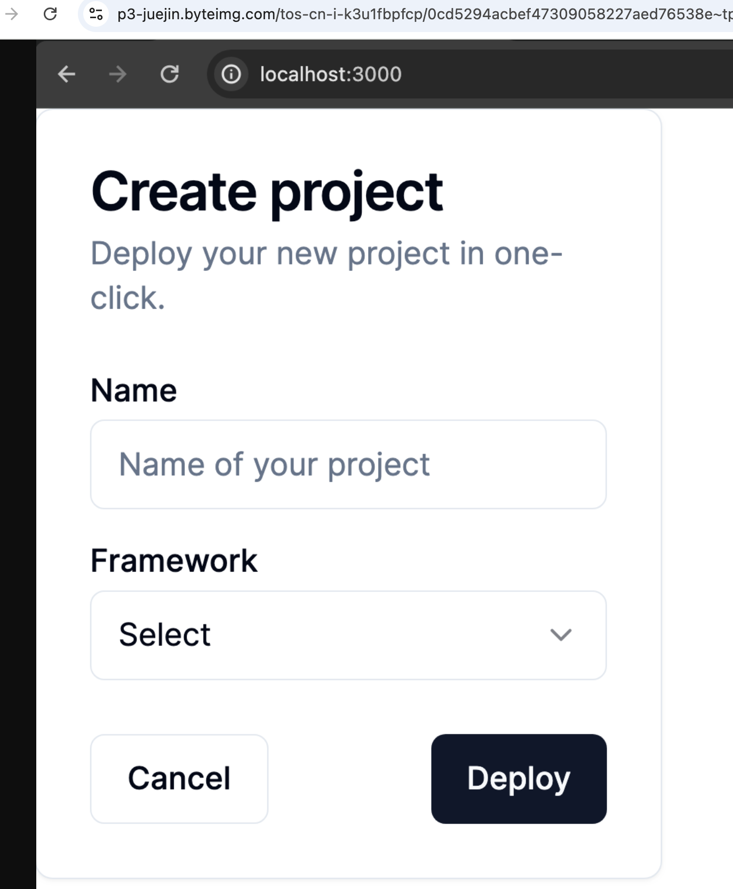

## 前言

要问 2023 年 JavaScript 领域 GitHub Stars 增长最多的开源项目是什么？那便是 [Shadcn UI](https://github.com/shadcn-ui/ui)，2023 年 1 月创建的项目，一年便涨了 39.5K Star，足以看出其火爆程度。

Shadcn UI 是一个 React UI 组件库，当然用组件库这样的说法并不算准确，与我们常用的 Ant Design 等组件库不同，Shadcn UI 并不是可下载的 NPM 包，相反，你可以通过终端命令将 Shadcn UI 的组件代码添加到代码仓库中，这样开发者就可以方便的进行修改。准确的说，Shadcn UI 是能让我们复制粘贴代码的组件集合。

Shadcn UI 采用的是 TailwindCSS，你可以通过 TailwindCSS 自定义样式。所以 Next.js 项目的组件库使用 Shadcn UI 也是非常流行的选择。

## Shadcn UI

Next.js 项目如何使用 Shadcn UI 呢？

### 1. 项目初始化

运行：

```js
npx create-next-app@latest
```

因为 Shadcn UI 基于 TailwindCSS，所以至少要选择使用 TailwindCSS：

你可以在运行的时候添加 `--tailwind`直接跳过 Tailwind CSS 的选择：

```js
npx create-next-app@latest project-name --tailwind
```

Shadcn 全面使用 TypeScript，如果项目使用 TypeScript，你也可以直接运行：

```js
npx create-next-app@latest project-name --typescript --tailwind --eslint
```

### 2. 运行 Shadcn UI CLI

运行以下命令初始化 Shadcn UI：

```js
npx shadcn-ui@latest init
```

运行后会有 3 个选择。

#### 2.1. 风格选择

第一个选择：

```js
Which style would you like to use?

1. Default
2. New York
```

Shadcn UI 的组件样式都有两种风格，一种风格为 “Default”，一种风格为“New York”，Shadcn UI 组件的左上角可以预览这两种风格的效果：

总体来说：

- Default 风格文字更大，输入框更大，图标使用 [lucide-react](https://lucide.dev/icons/)，使用 tailwindcss-animate 实现动画
- New York 风格整体更加紧凑、padding 更小，图标使用 [Radix Icons](https://www.radix-ui.com/icons)

你可以简单的理解为：普通型（Default）与紧凑型（New York）。

这里选择哪一种都行，这些选择会写入配置文件 `components.json`，如果后面需要修改，直接更改配置文件即可。

#### 2.2. 基础色选择

第二个选择是：

```bash
Which color would you like to use as base color?

1. Slate
2. Gray
3. Zinc
4. Neutral
5. Stone
```

这里相当于选择组件的主题色，打开 Shadcn UI 的[主题页面](https://ui.shadcn.com/themes)，你可以查看不同的主题色效果：

注意：这里选择的 Slate、Gray、Zinc、Neutral、Stone 差别不大，在这些主题色之间切换，你甚至可能没有发现差别，但其实还是有些细微的差别，切换到 dark 模式下差别会更加明显一些。

#### 2.3. CSS 变量

第三个选择：

```js
Would you like to use CSS variables for colors?

1. no
2. yes
```

是否要使用 CSS 变量配置颜色？这个选择要慎重一点，初始化完成之后，如果再要切换，需要删除和重新安装组件。

这是因为，在 Shadcn UI 中，有两种设置主题的方式， Tailwind CSS 工具类和 CSS 变量：

- Tailwind CSS 工具类是直接使用 Tailwind CSS 中的颜色类名，但不方便自定义主题色，但使用这种方式对配置文件和公共样式文件的改动较小
- CSS 变量是通过自定义主题相关的 CSS 变量控制主题色

总的来说，**使用 CSS 变量更为推荐**。CSS 变量可以更自由的定制主题，且可以在[主题配置](https://ui.shadcn.com/themes)页面直接拷贝 CSS 变量，使用起来也很方便。

选择完成后，你会发现多个文件都发生了修改：

首先是 `package.json`，安装了相关依赖。

然后是修改了 `tailwind.config.js` 和`app/globals.css`，添加了 CSS 变量相关的代码。

再然后是新建了 `components.json`和 `lib/utils.js`文件，`components.json` 是 Shadcn UI 的配置文件，`lib/utils.js` 是 Shadcn UI 会用到的一个工具函数。

最后你会发现新建了 `components`文件夹，使用 Shadcn UI CLI 添加的组件会放到该文件夹下。

### 3. 配置字体（非必须）

参考文档： <https://ui.shadcn.com/docs/installation/next#fonts>

### 4. 使用组件

打开 Shadcn UI 的[组件页面](https://ui.shadcn.com/docs/components/accordion)，选择需要用到的组件，每个组件页面下方都会有对应的 Cli 命令，我们以 [Card 组件](https://ui.shadcn.com/docs/components/card)为例：

首先添加组件：

```bash
npx shadcn-ui@latest add card button input label select
```

可以看到 `components/ui`下自动添加了这些组件文件：


然后使用组件，修改 `app/page.js`，代码如下：

```js
import * as React from 'react';

import { Button } from '@/components/ui/button';
import {
  Card,
  CardContent,
  CardDescription,
  CardFooter,
  CardHeader,
  CardTitle,
} from '@/components/ui/card';
import { Input } from '@/components/ui/input';
import { Label } from '@/components/ui/label';
import {
  Select,
  SelectContent,
  SelectItem,
  SelectTrigger,
  SelectValue,
} from '@/components/ui/select';

// 这里注意要添加一个 default，原本的代码没有这个 default
export default function CardWithForm() {
  return (
    <Card className="w-[350px]">
      <CardHeader>
        <CardTitle>Create project</CardTitle>
        <CardDescription>Deploy your new project in one-click.</CardDescription>
      </CardHeader>
      <CardContent>
        <form>
          <div className="grid w-full items-center gap-4">
            <div className="flex flex-col space-y-1.5">
              <Label htmlFor="name">Name</Label>
              <Input id="name" placeholder="Name of your project" />
            </div>
            <div className="flex flex-col space-y-1.5">
              <Label htmlFor="framework">Framework</Label>
              <Select>
                <SelectTrigger id="framework">
                  <SelectValue placeholder="Select" />
                </SelectTrigger>
                <SelectContent position="popper">
                  <SelectItem value="next">Next.js</SelectItem>
                  <SelectItem value="sveltekit">SvelteKit</SelectItem>
                  <SelectItem value="astro">Astro</SelectItem>
                  <SelectItem value="nuxt">Nuxt.js</SelectItem>
                </SelectContent>
              </Select>
            </div>
          </div>
        </form>
      </CardContent>
      <CardFooter className="flex justify-between">
        <Button variant="outline">Cancel</Button>
        <Button>Deploy</Button>
      </CardFooter>
    </Card>
  );
}
```

注意：这里的代码我们是复制的 Card 组件页面的代码，用在 Next.js Page 的时候，注意添加一个 `export default`，否则页面会报错。

浏览器效果如下：



这里我们很快的就实现了一个 Card 组件，如果要修改其中的内容，直接修改 components 下的组件代码即可。

## 主题

### 1. 主题切换与 Dark Mode

Shadcn UI 组件支持 Dark Mode，现在让我们来实现一个 Dark Mode 切换效果。

安装 `next-themes`：

```js
npm install next-themes
```

新建 `components/theme-provider.jsx`，代码如下：

```js
'use client';

import * as React from 'react';
import { ThemeProvider as NextThemesProvider } from 'next-themes';

export function ThemeProvider({ children, ...props }) {
  return <NextThemesProvider {...props}>{children}</NextThemesProvider>;
}
```

修改 `app/layout.js`，代码如下：

```js
import { Inter } from 'next/font/google';
import './globals.css';
// 1. 引入 ThemeProvider
import { ThemeProvider } from '@/components/theme-provider';

const inter = Inter({ subsets: ['latin'] });

export const metadata = {
  title: 'Create Next App',
  description: 'Generated by create next app',
};

// 2. 使用 ThemeProvider
export default function RootLayout({ children }) {
  return (
    <html lang="en" suppressHydrationWarning>
      <body className={inter.className}>
        <ThemeProvider
          attribute="class"
          defaultTheme="system"
          enableSystem
          disableTransitionOnChange
        >
          {children}
        </ThemeProvider>
      </body>
    </html>
  );
}
```

新建 `components/theme-toggle.jsx`，代码如下：

```js
'use client';

import * as React from 'react';
import { Moon, Sun } from 'lucide-react';
import { useTheme } from 'next-themes';

import { Button } from '@/components/ui/button';
import {
  DropdownMenu,
  DropdownMenuContent,
  DropdownMenuItem,
  DropdownMenuTrigger,
} from '@/components/ui/dropdown-menu';

export function ModeToggle() {
  const { setTheme } = useTheme();

  return (
    <DropdownMenu>
      <DropdownMenuTrigger asChild>
        <Button variant="outline" size="icon">
          <Sun className="h-[1.2rem] w-[1.2rem] rotate-0 scale-100 transition-all dark:-rotate-90 dark:scale-0" />
          <Moon className="absolute h-[1.2rem] w-[1.2rem] rotate-90 scale-0 transition-all dark:rotate-0 dark:scale-100" />
          <span className="sr-only">Toggle theme</span>
        </Button>
      </DropdownMenuTrigger>
      <DropdownMenuContent align="end">
        <DropdownMenuItem onClick={() => setTheme('light')}>
          Light
        </DropdownMenuItem>
        <DropdownMenuItem onClick={() => setTheme('dark')}>
          Dark
        </DropdownMenuItem>
        <DropdownMenuItem onClick={() => setTheme('system')}>
          System
        </DropdownMenuItem>
      </DropdownMenuContent>
    </DropdownMenu>
  );
}
```

安装用到的组件：

```bash
npx shadcn-ui@latest add dropdown-menu button
```

修改 `app/page.js`，添加代码如下：

```js
import * as React from 'react';

// ...

import { ModeToggle } from '@/components/theme-toggle';

export default function CardWithForm() {
  return (
    <>
      <Card className="w-[350px]">// ...</Card>
      <ModeToggle />
    </>
  );
}
```

### 2. 修改主题

上节讲到，主题色的改变可以通过 CSS 变量来实现。现在我们的主题色是黑色，如果我们想改为其他色比如红色该怎么做呢？

其实很简单，打开 [Shadcn UI 主题页面](https://ui.shadcn.com/themes)，选择主题色，拷贝对应的 CSS 变量代码：


将这段代码替换掉 `app/globals.css`中的 `@layer base {}`代码。主题色就完成了修改：


### 3. 新增主题

如果我想要新增一个主题呢，当点击主题切换按钮的时候，新增一个 Rose 主题色，然后页面就对应切换为 Rose 主题。

修改 `app/layout.js`，代码如下：

```js
import { Inter } from 'next/font/google';
import './globals.css';
import { ThemeProvider } from '@/components/theme-provider';
const inter = Inter({ subsets: ['latin'] });

export const metadata = {
  title: 'Create Next App',
  description: 'Generated by create next app',
};

// 设置 themes prop
export default function RootLayout({ children }) {
  return (
    <html lang="en">
      <body className={inter.className}>
        <ThemeProvider
          attribute="class"
          defaultTheme="system"
          enableSystem
          themes={['light', 'dark', 'rose']}
          disableTransitionOnChange
        >
          {children}
        </ThemeProvider>
      </body>
    </html>
  );
}
```

修改 `theme-toggle.jsx`，代码如下：

```js
'use client';

import * as React from 'react';
import { Moon, Sun } from 'lucide-react';
import { useTheme } from 'next-themes';

import { Button } from '@/components/ui/button';
import {
  DropdownMenu,
  DropdownMenuContent,
  DropdownMenuItem,
  DropdownMenuTrigger,
} from '@/components/ui/dropdown-menu';

export function ModeToggle() {
  const { setTheme, themes } = useTheme();

  return (
    <DropdownMenu>
      <DropdownMenuTrigger asChild>
        <Button variant="outline" size="icon">
          <Sun className="h-[1.2rem] w-[1.2rem] rotate-0 scale-100 transition-all dark:-rotate-90 dark:scale-0" />
          <Moon className="absolute h-[1.2rem] w-[1.2rem] rotate-90 scale-0 transition-all dark:rotate-0 dark:scale-100" />
          <span className="sr-only">Toggle theme</span>
        </Button>
      </DropdownMenuTrigger>
      <DropdownMenuContent align="end">
        {themes.map((theme) => (
          <DropdownMenuItem key={theme} onClick={() => setTheme(theme)}>
            {theme}
          </DropdownMenuItem>
        ))}
      </DropdownMenuContent>
    </DropdownMenu>
  );
}
```

打开 [Shadcn UI 主题页面](https://ui.shadcn.com/themes)，选择主题色，拷贝对应的 CSS 变量代码，修改 `app/globals.css`，添加代码如下：

```js
  @layer base {
    :root {
      // ...
    }

    .dark {
        // ...
    }

    .rose {
      --background: 0 0% 100%;
      --foreground: 240 10% 3.9%;
      --card: 0 0% 100%;
      --card-foreground: 240 10% 3.9%;
      --popover: 0 0% 100%;
      --popover-foreground: 240 10% 3.9%;
      --primary: 346.8 77.2% 49.8%;
      --primary-foreground: 355.7 100% 97.3%;
      --secondary: 240 4.8% 95.9%;
      --secondary-foreground: 240 5.9% 10%;
      --muted: 240 4.8% 95.9%;
      --muted-foreground: 240 3.8% 46.1%;
      --accent: 240 4.8% 95.9%;
      --accent-foreground: 240 5.9% 10%;
      --destructive: 0 84.2% 60.2%;
      --destructive-foreground: 0 0% 98%;
      --border: 240 5.9% 90%;
      --input: 240 5.9% 90%;
      --ring: 346.8 77.2% 49.8%;
      --radius: 0.5rem;
    }
  }
```

浏览器效果如下：

## 最后

Shadcn UI 目前提供了 40+ 组件，设计干净整洁、支持通过 CSS 变量快速配置主题，支持 Dark Mode，可访问性也做的很好，算是 Next.js 项目常选择的组件库之一。

要说缺点的话，图表和表格方面（尤其是高性能的表格）做的有些弱，真要做后台管理系统这种，我个人觉得还是 Ant-Design 更好用一些。不过 Shadcn UI 热度如此之高，相信以后会做的越来越好。
