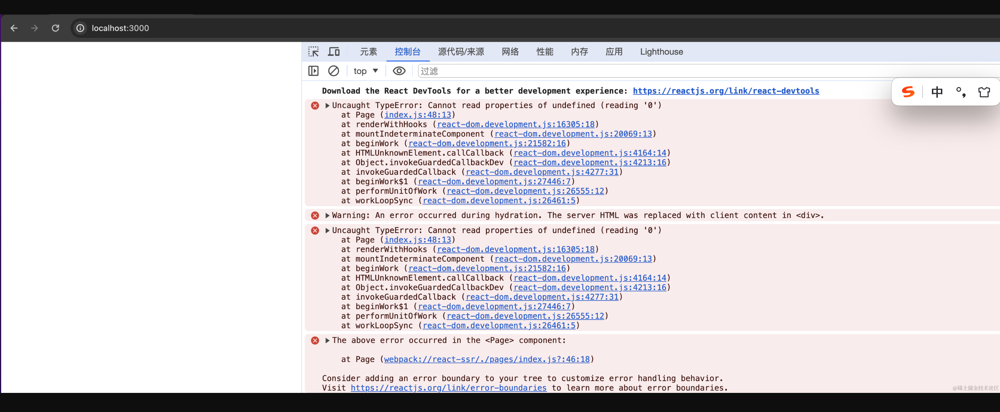
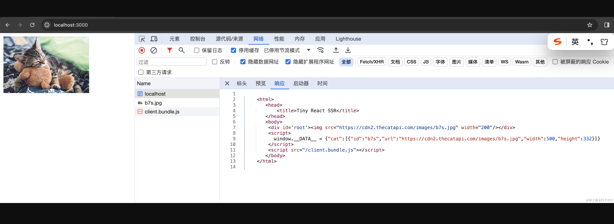
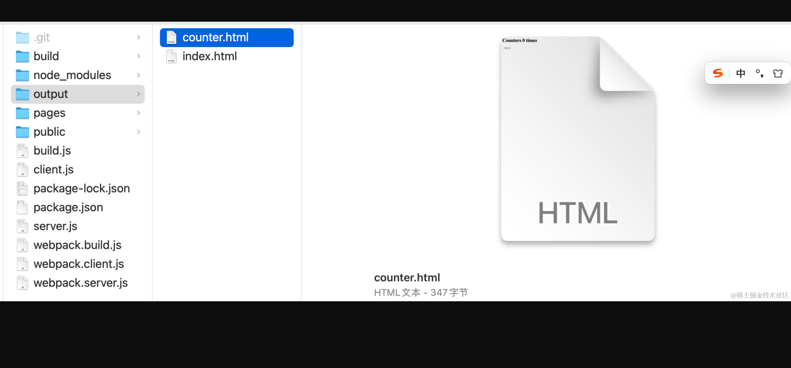

## 前言

上篇我们手写了一个 React SSR，实现了基本的服务端渲染和客户端绑定事件。

本篇我们先继续完善 React SSR，并在此基础上实现 React SSG 和 React ISR。

## 1. 优化 Ract SSR

### Step1：实现 getServerSideProps

在使用 Next.js Pages Router 的时候，经常会用到一个 [getServerSideProps](https://nextjs.org/docs/pages/building-your-application/data-fetching/get-server-side-props) 的 API，用于在页面请求时获取数据渲染页面的内容。举个例子：

```js
export async function getServerSideProps() {
  // 获取数据
  const res = await fetch('https://api.github.com/repos/vercel/next.js');
  const repo = await res.json();
  // 通过 props 将数据传给 page
  return { props: { repo } };
}

export default function Page({ repo }) {
  return (
    <main>
      <p>{repo.stargazers_count}</p>
    </main>
  );
}
```

这个功能该怎么实现呢？

其实思路很简单：import 该文件，获取导出的 getServerSideProps 函数。然后在服务端调用该函数，最后将返回的数据传入到组件中。

修改 `server.js`，完整代码如下：

```js
import express from 'express';
import React from 'react';
import { renderToString } from 'react-dom/server';
import { readdirSync } from 'fs';
import { join } from 'path';

const app = express();
app.use(express.static('public'));

app.get('/', async (req, res) => {
  const file = await import(`./pages/index.js`);
  let propsObj = {};
  if (file.getServerSideProps) {
    const { props } = await file.getServerSideProps({ query: req.query });
    propsObj = props;
  }
  const Component = file.default;

  const content = renderToString(<Component {...propsObj} />);
  res.send(`
    <html>
       <head>
           <title>Tiny React SSR</title>
       </head>
       <body>
        <div id='root'>${content}</div>
        <script src="/client.bundle.js"></script>
       </body>
    </html>
    `);
});

app.listen(3000, () => console.log('listening on port 3000!'));
```

为了测试效果，修改 `pages/index.js`，代码如下：

```js
import React from 'react';

export async function getServerSideProps() {
  const res = await fetch('https://api.thecatapi.com/v1/images/search');
  const cat = await res.json();
  return { props: { cat } };
}

export default function Page({ cat }) {
  return ;
}
```

运行 `npm start`，访问 `http://localhost:3000/`，此时页面空白且有报错：



但是让我们查看 localhost 页面的 HTML 返回：


至少 HTML 返回是正确的，并成功的获取了数据。

可是为什么会有报错呢？

根据报错的信息，是水合（hydration）时出现了错误。这是因为服务端渲染的 HTML 和客户端渲染的 HTML 并不匹配（前面我们说过，服务端渲染和客户端渲染一致，是复用 DOM 节点进行水合的前提）。

服务端渲染的时候我们调用接口传入了数据，但是客户端渲染的时候并没有调用接口传入数据，自然渲染不一致，导致了报错。

所以客户端渲染的时候也要获取数据，才能保证两端渲染一致。

尴尬的是我们的接口是一个随机返回数据的接口，每次调用都会返回不同的数据。

注：其实这种每次调用数据返回不一致的情况很常见，比如 feeds 流，客户端调用和服务端调用尽管时间差不了几秒，但可能数据已经发生了更改。

最为简单的方式是将数据写入 HTML 脚本中，然后客户端渲染的时候直接获取。

修改 `server.js`，完整代码如下：

```js
import express from 'express';
import React from 'react';
import { renderToString } from 'react-dom/server';
import { readdirSync } from 'fs';
import { join } from 'path';

const app = express();
app.use(express.static('public'));

app.get('/', async (req, res) => {
  const file = await import(`./pages/index.js`);
  let propsObj = {};
  if (file.getServerSideProps) {
    const { props } = await file.getServerSideProps({ query: req.query });
    propsObj = props;
  }
  const Component = file.default;

  const content = renderToString(<Component {...propsObj} />);
  res.send(`
    <html>
       <head>
           <title>Tiny React SSR</title>
       </head>
       <body>
        <div id='root'>${content}</div>
        <script>
          window.__DATA__ = ${JSON.stringify(propsObj)}
        </script>
        <script src="/client.bundle.js"></script>
       </body>
    </html>
    `);
});

app.listen(3000, () => console.log('listening on port 3000!'));
```

我们将数据放到 `window.__DATA__`变量中，然后在 JS 文件中就可以直接获取。

修改 `client.js`，代码如下：

```js
import React from 'react';
import { hydrateRoot } from 'react-dom/client';
import App from './pages/index';

hydrateRoot(document.getElementById('root'), <App {...window.__DATA__} />);
```

重新运行 `npm start`，访问 `http://localhost:3000/`，现在页面渲染正常了：



> 1. 功能实现：React SSR 实现 gerServerSideProps
> 2. 源码地址：<https://github.com/mqyqingfeng/next-app-demo/tree/react-ssr-2>
> 3. 下载代码：`git clone -b react-ssr-2 git@github.com:mqyqingfeng/next-app-demo.git`

### Step2：实现路由

Next.js 的路由基于的是文件系统，也就是说，一个文件就可以是一个路由。

举个例子，在 Next.js 的 Pages Router 下，你在 `pages` 目录下创建一个 `index.js` 文件，它会直接映射到 `/` 路由地址：

```js
import React from 'react';
export default () => <h1>Hello world</h1>;
```

在 `pages` 目录下创建一个 `about.js` 文件，它会直接映射到 `/about` 路由地址：

```js
import React from 'react';
export default () => <h1>About us</h1>;
```

如果我们要实现这个效果，该怎么实现呢？

实现思路其实很简单，判断路由地址，导入对应的模块进行渲染即可。

修改 `server.js`，完整代码如下：

```js
import express from 'express';
import React from 'react';
import { renderToString } from 'react-dom/server';
import { readdirSync } from 'fs';
import { join } from 'path';

const app = express();
app.use(express.static('public'));

const pagesDir = join(process.cwd(), '/pages');
const pages = readdirSync(pagesDir).map((page) => page.split('.')[0]);

app.get(/.*$/, async (req, res) => {
  const path = req.path.split('/')[1];
  const page = path ? path : 'index';

  if (pages.includes(page)) {
    const file = await import(`./pages/${page}.js`);
    const Component = file.default;

    let propsObj = {};
    if (file.getServerSideProps) {
      const { props } = await file.getServerSideProps({ query: req.query });
      propsObj = props;
    }

    const content = renderToString(<Component {...propsObj} />);
    res.send(`
      <html>
         <head>
             <title>Tiny React SSR</title>
         </head>
         <body>
          <div id='root'>${content}</div>
          <script>
            window.__DATA__ = ${JSON.stringify({
              props: propsObj,
              page: page,
            })}
          </script>
          <script src="/client.bundle.js"></script>
         </body>
      </html>
      `);
  } else {
    return res.status(200).json({ message: `${page} not found in ${pages}` });
  }
});

app.listen(3000, () => console.log('listening on port 3000!'));
```

但最为麻烦的地方是 `client.js`，之前的代码是：

```js
import React from 'react';
import { hydrateRoot } from 'react-dom/client';
import App from './pages/index';

hydrateRoot(document.getElementById('root'), <App />);
```

我们是固定导入的 App 组件，现在改成了跟随路由导入不同的组件，也就是说导入的组件要跟随路由不同而不同，然后打包成不同的 client.bundle.js。

一种方案是打包 pages 下的文件，分别对应生成不同的 bundle.js，比如 `index.js`生成 `index.bundle.js`，`cat.js`生成 `cat.bundle.js`，然后我们根据路由引入不同的 bundle.js。

一种方案可以参考最早的 [Next.js v1.0.0 源码](https://github.com/vercel/next.js/tree/1.0.0)，可以说是简单粗暴的解决了这个问题，那就是用 node.fs 读取 pages 下的文件，然后放入到 `window.__DATA__`，然后客户端渲染的时候获取组件代码进行渲染，伪代码如下：

```js
const {
  __NEXT_DATA__: { component },
} = window;

const Component = evalScript(component).default;

render(createElement(Component, appProps), container);
```

这两种方案都有些麻烦，这里我们直接使用 Webpack 动态加载来实现，修改 `client.js`，代码如下：

```js
import React from 'react';
import { hydrateRoot } from 'react-dom/client';

const { props, page } = window.__DATA__;

const importFile = async (path) => {
  return await import(`./pages/${path}.js`);
};
const data = await importFile(page);
const Component = data.default;

hydrateRoot(document.getElementById('root'), <Component {...props} />);
```

在 `pages` 目录下再新建一个 counter.js，代码如下:

```js
import React, { useState } from 'react';

export default function MyApp() {
  const [count, setCount] = useState(0);

  return (
    <div>
      <h1>Counters {count} times</h1>
      <button onClick={() => setCount(count + 1)}>Click me</button>
    </div>
  );
}
```

重新运行 `npm start`，访问 `http://localhost:3000/`，效果如下：

<!--  -->

当访问未定义的路由时，会出现错误提示：


> 1. 功能实现：React SSR 实现路由
> 2. 源码地址：<https://github.com/mqyqingfeng/next-app-demo/tree/react-ssr-3>
> 3. 下载代码：`git clone -b react-ssr-3 git@github.com:mqyqingfeng/next-app-demo.git`

## 2. 实现 React SSG

SSG 会在构建阶段，就将页面编译为静态的 HTML 文件。

其实核心方法不变，还是用 renderToString，只不过不写在路由中，而是渲染成具体的 HTML 文件。

让我们新建一个 `build.js`，代码如下：

```js
import { existsSync, readdirSync, mkdirSync, writeFileSync } from 'node:fs';
import { renderToString } from 'react-dom/server';
import { createElement } from 'react';
import { join } from 'path';

const pagesDir = join(process.cwd(), '/pages');
const pages = readdirSync(pagesDir).map((page) => page.split('.')[0]);

if (!existsSync('output')) {
  mkdirSync('output');
}

pages.forEach(async (page) => {
  const file = await import(`./pages/${page}.js`);
  const Component = file.default;

  let propsObj = {};
  if (file.getServerSideProps) {
    const { props } = await file.getServerSideProps();
    propsObj = props;
  }

  const content = renderToString(createElement(Component, propsObj));
  writeFileSync(
    `output/${page}.html`,
    `    <html>
    <head>
        <title>Tiny React SSR</title>
    </head>
    <body>
     <div id='root'>${content}</div>
     <script>
       window.__DATA__ = ${JSON.stringify({
         props: propsObj,
         page: page,
       })}
     </script>
     <script src="../public/client.bundle.js"></script>
    </body>
 </html>`,
  );
});
```

为了让 node 能够正确运行 `build.js`，我们需要新建一个 `webpack.build.js` 文件用于打包 build.js 文件：

```js
const path = require('path');

module.exports = {
  mode: 'development',
  target: 'node',
  entry: './build.js',
  output: {
    filename: 'build.bundle.js',
    path: path.resolve(__dirname, 'build'),
  },
  module: {
    rules: [
      {
        test: /\.(js|jsx)$/,
        exclude: /node_modules/,
        use: {
          loader: 'babel-loader',
          options: {
            presets: ['@babel/preset-env', '@babel/preset-react'],
          },
        },
      },
    ],
  },
};
```

现在让我们在 `package.json` 中添加一个脚本命令：

```js
{
  "scripts": {
    "build": "webpack --config webpack.client.js && webpack --config webpack.build.js && node ./build/build.bundle.js"
  }
}
```

现在运行 `npm run build`，`output`文件夹下会生成两个 HTML 文件：



浏览器直接打开这两个文件，都能正常运行：

<!--  -->

> 1. 功能实现：React SSG
> 2. 源码地址：<https://github.com/mqyqingfeng/next-app-demo/tree/react-ssr-4>
> 3. 下载代码：`git clone -b react-ssr-4 git@github.com:mqyqingfeng/next-app-demo.git`

## 3. 实现 React ISR

SSG 都实现了，就让我们再实现一个 ISR 吧！

其实原理很简单，就是在访问的时候检查是否过期，如果过期了，就重新生成 HTML 文件。

新建 `isr.js`，代码如下：

```js
import express from 'express';
import { createElement } from 'react';
import { renderToString } from 'react-dom/server';
import {
  existsSync,
  readdirSync,
  mkdirSync,
  writeFileSync,
  stat,
} from 'node:fs';
import { join } from 'path';

const app = express();
app.use(express.static('public'));

async function asyncForEach(array, callback) {
  for (let index = 0; index < array.length; index++) {
    await callback(array[index], index, array);
  }
}

const pagesDir = join(process.cwd(), '/pages');
const pages = readdirSync(pagesDir).map((page) => page.split('.')[0]);

const expiresTime = 1000 * 10;

async function build() {
  if (!existsSync('output')) {
    mkdirSync('output');
  }

  await asyncForEach(pages, async (page) => {
    const file = await import(`./pages/${page}.js`);
    const Component = file.default;

    let propsObj = {};
    if (file.getServerSideProps) {
      const { props } = await file.getServerSideProps();
      propsObj = props;
    }

    const content = renderToString(createElement(Component, propsObj));
    writeFileSync(
      `output/${page}.html`,
      `    <html>
      <head>
          <title>Tiny React SSR</title>
      </head>
      <body>
       <div id='root'>${content}</div>
       <script>
         window.__DATA__ = ${JSON.stringify({
           props: propsObj,
           page: page,
         })}
       </script>
       <script src="/client.bundle.js"></script>
      </body>
   </html>`,
    );
  });
}

app.get(/.*$/, async (req, res) => {
  const path = req.path.split('/')[1];
  const page = path ? path : 'index';

  if (pages.includes(page)) {
    const htmlPath = join('./output', page + '.html');

    stat(htmlPath, async function (err, stats) {
      if (err) {
        await build();
        return res.sendFile(join(process.cwd(), 'output', page + '.html'));
      }
      if (Date.now() - stats.mtime > expiresTime) {
        await build();
        return res.sendFile(join(process.cwd(), 'output', page + '.html'));
      } else {
        return res.sendFile(join(process.cwd(), 'output', page + '.html'));
      }
    });
  } else {
    return res.status(200).json({ message: `${page} not found in ${pages}` });
  }
});

app.listen(3000, () => console.log('listening on port 3000!'));
```

为了编译 isr.js 文件，新建 `webpack.isr.js`，代码如下：

```js
const path = require('path');

module.exports = {
  mode: 'development',
  target: 'node',
  entry: './isr.js',
  output: {
    filename: 'isr.bundle.js',
    path: path.resolve(__dirname, 'build'),
  },
  module: {
    rules: [
      {
        test: /\.(js|jsx)$/,
        exclude: /node_modules/,
        use: {
          loader: 'babel-loader',
          options: {
            presets: ['@babel/preset-env', '@babel/preset-react'],
          },
        },
      },
    ],
  },
};
```

`packages.json`文件添加对应的脚本命令：

```js
{
  "scripts": {
    "isr": "webpack --config webpack.isr.js && node ./build/isr.bundle.js"
  }
}

```

运行 `npm run isr`，交互效果如下：

<!--  -->

可以看到，10s 后图片数据发生了更新。

注：当然这个 ISR 的实现并不算贴近 Next.js 的 ISR 实现，Next.js 的 ISR 是在超过验证时间的首次，依然返回之前的结果，同时进行更新，然后下次访问才返回新的结果。这里我们直接同步构建并返回了新的结果。

> 1. 功能实现：React ISR
> 2. 源码地址：<https://github.com/mqyqingfeng/next-app-demo/tree/react-ssr-5>
> 3. 下载代码：`git clone -b react-ssr-5 git@github.com:mqyqingfeng/next-app-demo.git`

## 总结

本篇我们优化了 React SSR 的功能，并在此基础上实现了 React SSG 和 React ISR，但至此实现的都是 Next.js 的 Pages Router，也就是 Next.js v13 之前的实现。

Next.js v13 推出了基于 React Server Components 的 App Router，下篇开始，我们会进入 RSC 的实现讲解。
