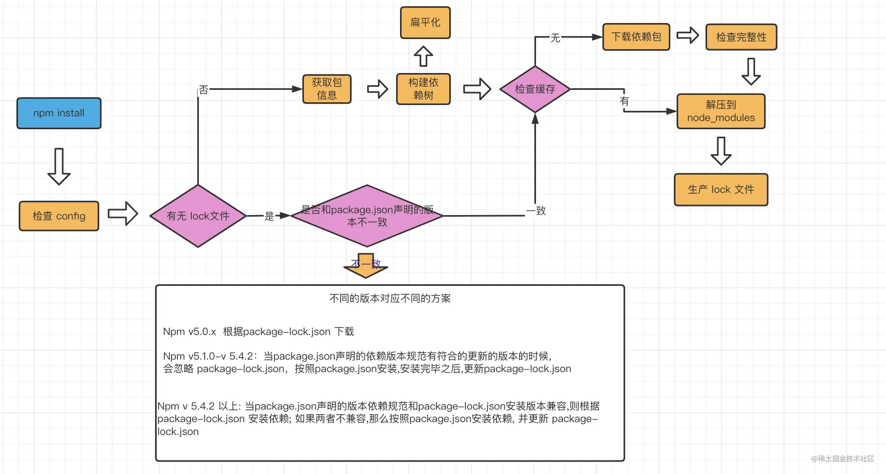

## npm 模块安装机制



npm install 执行之后，首先会检查和获取 npm 的配置，这里的优先级为：

项目级的.npmrc 文件 > 用户级的 .npmrc 文件 > 全局级的 .npmrc > npm 内置的 .npmrc 文件

然后检查项目中是否有 package-lock.json 文件

如果有，检查 package-lock.json 和 package.json 声明的依赖是否一致：

一致。直接使用 package-lock.json 中的信息,从网络或者缓存中加载依赖。
不一致。根据上述流程中的不同版本进行处理。
如果没有，那么会根据 package.json 递归构建依赖树，然后就会根据构建好的依赖去下载完整的依赖资源，在下载的时候，会检查有没有相关的资源缓存：

存在。直接解压到 node_modules 文件中。
不存在。从 npm 远端仓库下载包，校验包的完整性，同时添加到缓存中，解压到 node_modules 中。
最后，生成 package-lock.json 文件。

其实，在我们实际的项目开发中，使用 npm 作为团队的最佳实践: 同一个项目团队，应该保持 npm 版本的一致性。

从上面的安装流程，不知道大家注意到了一点没有，在实际的项目开发中，如果每次都去安装对应依赖时，如果相关的依赖包体积过大或者是依赖于网络，无疑会增加安装的时间成本。那么，缓存在这里的就是一个解决问题的好办法。

## devDependencies 和 dependencies 的区别

项目打包跟 devDependencies 这个字段并没什么关系。只要是项目中用到的依赖（且安装到 node_modules 中），不管这个依赖是放在 devDependencies 还是放在 dependencies ，都会被打包工具解析、构建，最后都打进 dist 产物中。

devDependencies 和 dependencies 的区别核心体现在 npm 包 中。只要开发的项目是发 npm 包提供给外部、其他业务项目使用的，需要非常注意依赖的安装地方，因为搞不好很容易在业务使用中会出现 bug。而如果只是自己项目用，不需要发 npm 包的话，把依赖安装到 devDependencies 或者 dependencies 中，实质上是没有任何区别的。

为什么在开发 npm 包 的时候 不严格区分 devDependencies 、 dependencies 进行装包可能会导致业务项目的使用中出现 bug 呢？笔者举一个例子来加深理解：

假设 npm 包开发者不小心把 vue3 的依赖写到了 dependencies 中（用于开发调试的），版本是 3.0.36。

业务项目自身用了 vue@3.0.0 的情况下，安装了这个 npm 包 ，由于 npm 包 中的 dependencies 有 vue@3.0.36 这个依赖，此时会在装 npm 包 的同时安装 36 版本的 vue。

由于 npm 包中会用到 vue，代码是这样引入的：import { onMount } from 'vue'，此时，npm 包会在自己内部的 node_modules 中找到 vue@3.0.36 的包并使用，此时就会产生 2 个 vue3 实例，就很容易出现一些奇怪的 bug。（业务项目的vue@3.0.0 和 npm 包的vue@3.0.36）

这里还要注意一点就是 externals 。有同学可能会说，npm 包打包的时候会 externals 掉第三方的库，比如上述中的 vue3 ，externals 只是保证 vue3 的代码不打包进 npm 包 的代码中而已

当你安装一个 npm 包时，通常只会安装其列在 dependencies 中的包，这些是该包运行时所必须的依赖。而 devDependencies 列出的依赖项仅用于该包的开发过程，比如写代码时的测试、构建或者文档生成等，因此在安装时不会自动安装 devDependencies 中的包。

换句话说，当你执行 npm install <package-name> 或者在你的项目中通过 package.json 添加一个包并运行 npm install 时，只会安装该包的 dependencies，不会安装其 devDependencies。

## npm 缓存

在执行 npm install 或 npm update 命令下载依赖后，除了将依赖包安装在 node_modules 目录下外，还会在本地的缓存目录缓存一份。我们可以通过以下命令获取缓存位置：

```bash
npm config get cache
```
