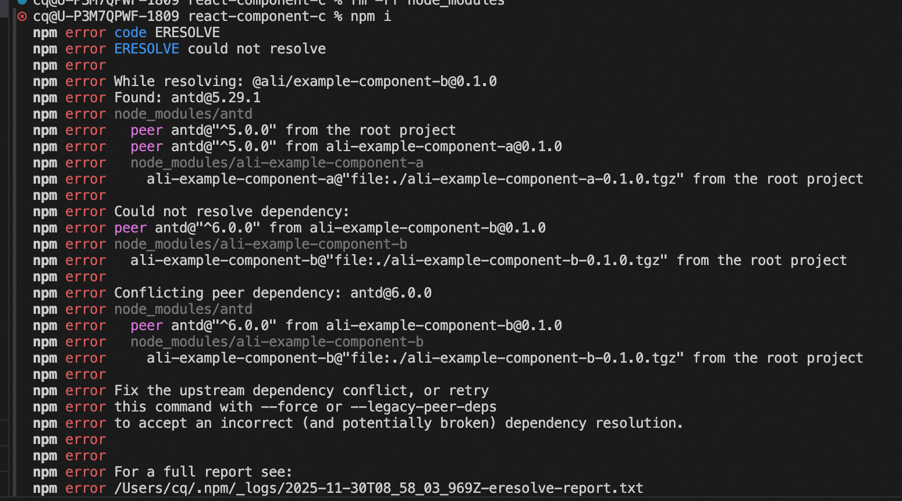

## pnpm、yarn 的基本安装和使用、查看与修改镜像源

### pnpm
支持monorepos

```bash
# npm 安装 pnpm
npm install -g pnpm
# 查看是否安装成功
pnpm -v
# 创建一个 package.json 文件
pnpm init
# 安装软件包及其依赖的任何软件包(如果 workspace 有配置会优先从 workspace 安装)
pnpm add <pkg>
# 安装项目所有依赖
pnpm install
# 更新软件包的最新版本
pnpm update
# 移除项目依赖
pnpm remove
# 运行脚本
pnpm run
# 以一个树形结构输出所有的已安装 package 的版本及其依赖
pnpm list

# 查看当前镜像
pnpm config get registry

# 设为淘宝镜像
淘宝镜像源一（推荐）
pnpm config set registry https://registry.npmmirror.com/
淘宝镜像源二
pnpm config set registry http://registry.npm.taobao.org/
设为官方默认镜像
pnpm config set registry https://registry.npmjs.org
阿里tnpm
pnpm config set registry https://registry.anpm.alibaba-inc.com
```

## yarn

```bash
npm 安装 yarn
npm install -g yarn

npm 卸载 yarn
npm uninstall -g yarn

# 查看是否安装/卸载成功
yarn -v

# 初始化项目

yarn init

# 装包

yarn add packagename
yarn add packagename --dev

# 更新包

yarn upgrade packagename

# 删除包

yarn remove packagename

# 安装所有包

yarn
yarn install

# 发布包

yarn publish

# 查看包的缓存列表

yarn cache list

# 全局安装包 == npm -g

yarn global

设置为淘宝镜像
淘宝镜像源一（推荐）

yarn config set registry https://registry.npmmirror.com/
淘宝镜像源二

yarn config set registry http://registry.npm.taobao.org/
设置为官方默认镜像
yarn config set registry https://registry.yarnpkg.com/
```

## pnpm 对比 npm/yarn 的优点

https://fe.ecool.fun/topic/b6d72acf-0360-4fc1-8835-6a6f8a3a4025?orderBy=updateTime&order=desc&tagId=0s

1、更快速的依赖下载（跨项目共用包，节省了下载时间）<br/>
2、更高效的利用磁盘空间（跨项目共用包，节省了空间）<br/>
3、更优秀的依赖管理<br/>

npm2 是通过嵌套的方式管理 node_modules 的，会有同样的依赖复制多次的问题。<br>
npm3+ 和 yarn 是通过铺平的扁平化的方式来管理 node_modules，解决了嵌套方式的部分问题，但是引入了幽灵依赖的问题，并且同名的包只会提升一个版本的，其余的版本依然会复制多次。<br>

pnpm 则是用了另一种方式，不再是复制了，而是都从全局 store 硬连接到 node_modules/.pnpm，然后之间通过软链接来组织依赖关系，pnpm 安装包的模式不再是平铺。

这样不但节省磁盘空间，也没有幽灵依赖问题，安装速度还快，从机制上来说完胜 npm 和 yarn。

pnpm 就是凭借这个对 npm 和 yarn 降维打击的。

## 什么是幽灵依赖

比如我装个 a 包，我居然就能用 b。为什么？因为 a 依赖 b，然后 b 被装在 node_modules 最外层，根据 nodejs 找包的机制，我们就能用这个 b 库。
如果 a 更新后不再依赖 b，b 就不会被安装，而我们的项目刚好用到它，那就找不到然后报错了。

## npm 与 yarn 使用缓存包的方式

当我们在项目 A 中第一次安装 vue 依赖包的时候  
首先在项目 A 中下载一份 vue 的包  
在缓存中下载一份 vue 的包  
当在另外一个项目 B 中也要安装 vue 包  
此时会在缓存中直接通过`拷贝`的形式把 vue 的安装包拷贝到项目 B 中  
那么此时，项目 A，项目 B，缓存中，都有一份 vue 安装包  
磁盘会被大量占用，而且拷贝的过程也比较耗费时间

## pnpm 使用缓存包，运用符号链接和软连接的方式

当我们在项目 A 中第一次安装 vue 依赖包的时候  
直接在缓存中下载一份 vue  
项目 A 中的 vue 通过一种类似于快捷方式的软连接去链接到 缓存中的 Vue  
那么再项目 B 中也安装 vue 的话，也是一样的，会直接通过链接的方式来指向缓存中的 vue 包  
这样做不需要拷贝包，全部在缓存中，节省了磁盘空间，另外不需要拷贝，也节省的安装包的时候


## 举例验证
```json
  "name": "@ali/example-component-a"
  "peerDependencies": {
    "react": "^17 || ^18",
    "antd":"^5.0.0"
  },
```
```json
  "name": "@ali/example-component-b"
  "peerDependencies": {
    "react": "^17 || ^18",
    "antd":"^6.0.0"
  },
```
```json
  "name": "@ali/example-component-c"
  "dependencies": {
    "@swc/helpers": "^0.5.1",
    "@ice/jsx-runtime": "^0.3.0",
    "ali-example-component-b":"file:./ali-example-component-b-0.1.0.tgz",
    "ali-example-component-a":"file:./ali-example-component-a-0.1.0.tgz"
  },
  "peerDependencies": {
    "react": "^17 || ^18",
    "antd":"^5.0.0"
  },
```

npm i  

 npm i --force 后用的是antd 5 还是6？  

你的项目最终安装的是 antd@5.29.1（v5 版本），而不是 v6 版本。  
日志分析解读  
● 实际安装版本明确显示：  
npm warn Found: antd@5.29.1  
npm warn node_modules/antd  

版本选择原因：  
    ● 根项目和 ali-example-component-a 都要求 antd@^5.0.0  
    ● ali-example-component-b 要求 antd@^6.0.0  
    ● npm 优先满足根项目的依赖要求，所以选择了 v5  
"@ali/example-component-b" 被迫使用了不兼容的版本。  

 npm ls antd    

当ali-example-component-b把antd放到dependencies 时会发生什么？  

这验证了：`npm3+ 和 yarn 是通过铺平的扁平化的方式来管理 node_modules，解决了嵌套方式的部分问题，但是引入了幽灵依赖的问题，并且同名的包只会提升一个版本的，其余的版本依然会复制多次`

