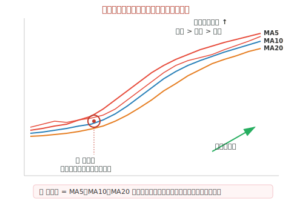

## 什么是金蜘蛛

金蜘蛛是一种**强烈的看涨信号**，指的是 **MA5、MA10、MA20 三条短期均线** 在低位**几乎同一点交叉**，随后**向上发散**形成多头排列的形态。因为三条均线的交叉发散像一只蜘蛛的腿张开，且预示后市看涨，故称为"**金**蜘蛛"。

与之相对的是**死蜘蛛**：三条均线在高位交叉后**向下发散**，预示后市看跌。

## 形态特征

- **(1)** 出现在**下跌末期**或**长时间横盘**之后，股价处于**相对低位**
- **(2)** MA5、MA10、MA20 三条均线在**很短的时间内**几乎在**同一价位**交叉
- **(3)** 交叉后三条均线**向上发散**，迅速形成**多头排列**（MA5 > MA10 > MA20）
- **(4)** 通常伴随**成交量明显放大**，验证多头力量
- **(5)** 股价**站稳**在三条均线上方

## 技术含义

- 三条均线代表近 5 日、10 日、20 日的**平均持仓成本**
- 三线交叉于一点意味着近一个月的**多空分歧达到平衡**
- 向上发散说明**多头力量瞬间占据绝对优势**，做多资金集中入场
- 是中期**底部反转**或**主升浪启动**的标志性信号

## 操作策略

### 出现金蜘蛛时

- **(1)** **果断买入**：金蜘蛛是中期看涨的强信号，可在交叉点确认后**积极建仓**
- **(2)** **分批介入**：第一次出现金蜘蛛时建仓 1/2，回踩 MA10 不破时加仓 1/2
- **(3)** **持股待涨**：金蜘蛛后通常有较长的上升周期，**避免短线频繁操作**
- **(4)** **关注量能**：金蜘蛛形成时**放量**则信号更可靠，缩量金蜘蛛需谨慎

### 辨别真假金蜘蛛

- **真金蜘蛛**：在**底部低位**出现 + **放量** + 形成后股价持续走强
- **假金蜘蛛**：在**高位**出现 + **缩量** + 形成后股价反复，可能是主力诱多

## 金蜘蛛 vs 死蜘蛛

| 形态 | 出现位置 | 形态特征 | 后市方向 | 操作建议 |
|------|---------|---------|---------|---------|
| **🕷️ 金蜘蛛** | 低位 | 三线交叉后**向上**发散 | 看涨 📈 | **买入** |
| **🕸️ 死蜘蛛** | 高位 | 三线交叉后**向下**发散 | 看跌 📉 | **卖出** |

## 实战注意事项

- **(1)** 金蜘蛛出现在**底部**时威力最大，出现在**高位反弹**中可能是反弹结束信号，需结合**位置**判断。
- **(2)** 金蜘蛛形成后，三条均线的**夹角越大**（发散越快），后市上涨动能越强。
- **(3)** 配合 **MACD 金叉**（DIF 上穿 DEA）和 **KDJ 金叉**（K 线在超卖区上穿 D 线）同时出现时，买入信号更加可靠。
- **(4)** 金蜘蛛后通常会有**回踩确认**：股价回踩 MA10 或 MA20 不跌破，是**第二买点**。
- **(5)** 如果金蜘蛛后股价**很快跌回三条均线下方**，说明信号失效，应果断止损。
- **(6)** 周线级别的金蜘蛛比日线级别的**更可靠**，是中长线布局的重要信号。
