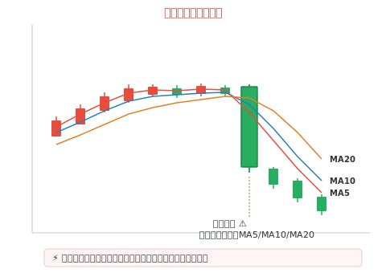

## 什么是断头闸刀

断头闸刀是一种**强烈的看跌信号**，指的是一根大阴线同时**向下跌破** MA5、MA10、MA20 三条短期均线的 K 线形态。因为其形态像一把闸刀将三条均线齐齐斩断，所以得名"断头闸刀"。

这种形态往往出现在**上涨末期**或**盘整末期**，预示着多头力量的彻底崩溃，后市大概率进入下跌趋势。

## 形态特征

- **(1)** 股价前期处于**上涨**或**高位盘整**状态，MA5、MA10、MA20 均线多头排列或交织在一起
- **(2)** 突然出现一根**放量大阴线**，一举跌破 MA5、MA10、MA20 三条均线
- **(3)** 大阴线的**实体较长**，通常跌幅在 5% 以上
- **(4)** 成交量明显**放大**，说明抛压沉重

## 技术含义

- 三条均线代表近 5 日、10 日、20 日的**平均持仓成本**
- 大阴线跌破三条均线，意味着近一个月内买入的投资者**全部被套**
- 市场**多头信心崩溃**，恐慌性抛盘涌出
- 均线系统由多头排列迅速转为**空头排列**，趋势发生逆转

## 操作策略

### 出现断头闸刀时

- **(1)** **立即止损卖出**：断头闸刀是强烈的卖出信号，不要心存侥幸，应果断离场
- **(2)** **不要急于抄底**：大阴线出现后，短期内可能继续下跌，不宜盲目接盘
- **(3)** **观察次日走势**：如果第二天继续低开低走，则确认下跌趋势成立
- **(4)** **关注成交量**：如果大阴线伴随巨量，说明主力出货坚决，后市看淡

### 辨别真假断头闸刀

- **真断头闸刀**：大阴线伴随**放量**，后续几日股价无法收回均线上方
- **假断头闸刀**：大阴线**缩量**或成交量一般，后续 1-2 日迅速收回均线上方（可能是主力洗盘）

## 实战注意事项

- **(1)** 断头闸刀出现在**高位**时杀伤力最强，出现在**低位**时可能是洗盘动作，需要结合位置判断。
- **(2)** 如果大阴线跌破的不仅是三条短期均线，还跌破了 **MA60（季线）**，则信号更加危险。
- **(3)** 断头闸刀出现后，原来的均线支撑会全部转为**压力位**，后续反弹往往受阻于这些均线。
- **(4)** 配合 **MACD 死叉** 和 **KDJ 超买区死叉** 同时出现时，下跌信号更加可靠。
- **(5)** 实战中宁可**错杀**也不要**被套**，断头闸刀一旦确认，犹豫往往意味着更大的亏损。
