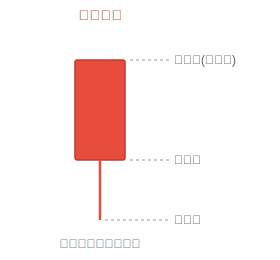
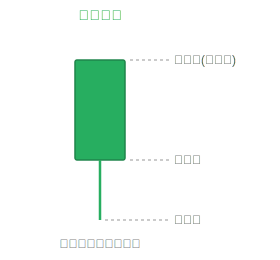
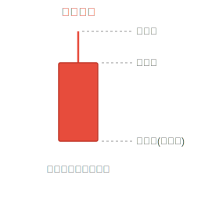
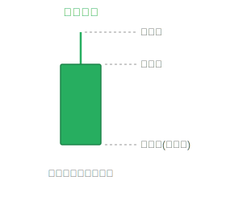

## K 线「光头阳线」操作技巧

> 光头阳线：没有上影线的阳线，表示买方力量强劲，收盘价即为最高价。

- **(1)** 在**上涨**途中，出现光头阳线，继续**看涨**。
- **(2)** 在**下跌末期**或者**上涨初期**，出现光头阳线，后市**看涨**。
- **(3)** 在**下跌**途中出现光头阳线，继续看空，**观望**为主。
- **(4)** 在**下跌初期**，出现光头阳线，谨慎看涨，积极**看空**。
- **(5)** 在连续**加速上涨**行情中，出现光头阳线，要警惕可能是**见顶**信号。
- **(6)** 在连续**下跌**行情中，出现光头阳线，谨慎看空，可能是**见底**信号！

## K 线「光头阴线」操作技巧

> 光头阴线：没有上影线的阴线，表示卖方力量强劲，开盘价即为最高价。

- **(1)** 在**上涨末期**或者**下跌初期**，出现光头阴线，后市**看跌**。
- **(2)** 在**下跌**途中，出现光头阴线，继续**看跌**。
- **(3)** 在连续加速**下跌**行情中，出现光头阴线，可能是**见底**信号。
- **(4)** 在**上涨初期**，出现光头阴线，谨慎看跌，积极**看涨**。
- **(5)** 在**上涨**途中，出现光头阴线，继续看多，**观望**为主。
- **(6)** 在连续**上涨**行情中，出现光头阴线，谨慎看多，可能是**见顶**信号。

## K 线「光脚阳线」操作技巧

> 光脚阳线：没有下影线的阳线，表示开盘价即为最低价，买方从开盘就占据主导。

- **(1)** 光脚阳线的出现，意味着股价趋势向好的方面发展，但也要看它所出现的**位置**。
- **(2)** 当出现在**上涨行情初期**或是**上涨途中**时，光脚阳线是一种**看多做多**的信号！
- **(3)** 但当股价有了**较大**的涨幅，尤其是在上涨后期，已出现了快速拉升走势后再出现光脚阳线，此时就要想到是不是庄家在**骗线**，骗线的目的当然是为了**引诱**投资者高位接盘，以便顺利出货。
- **(4)** 有些个股高位出现光脚阳线后股价仍会继续向上盘升，但获利风险却在加大，因此对于不善于**短线操作**的普通股民来说应该回避，以免遭受损失！

## K 线「光脚阴线」操作技巧

> 光脚阴线：没有下影线的阴线，表示收盘价即为最低价，卖方从始至终占据主导。

- **(1)** 光脚阴线的出现，意味着股价趋势向坏的方面发展，但也要看它所出现的**位置**。
- **(2)** 当出现在**下跌行情初期**或是**下跌途中**时，光脚阴线是一种**看空做空**的信号！
- **(3)** 但当股价有了**较大**的跌幅，尤其是在下跌后期，已出现了快速下杀走势后再出现光脚阴线，此时就要想到是不是主力在**诱空**，诱空的目的是为了**恐吓**散户低位割肉，以便顺利吸筹。
- **(4)** 有些个股低位出现光脚阴线后股价仍会继续向下探底，但做空风险却在减小，因此对于善于**抄底操作**的投资者来说可以适当关注，但普通股民仍需谨慎！
