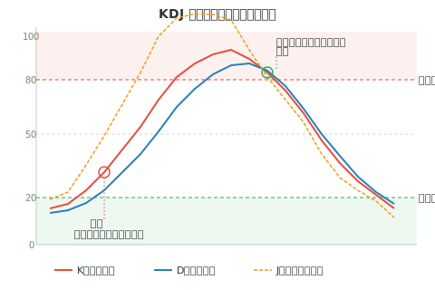

## 什么是 KDJ

KDJ 指标又叫**随机指标**（Stochastic Oscillator），由 George Lane 于 1950 年代提出。它通过计算一定周期内的最高价、最低价和收盘价之间的比例关系，来反映市场的**超买超卖**状态和价格趋势的转折信号。

KDJ 是一种**短线敏感型指标**，相比 MACD 反应更快，特别适合短线交易者使用。



## KDJ 的组成

- **K 线（快速线）**：对价格变化反应最灵敏，波动最大
- **D 线（慢速线）**：K 值的移动平均，相对平滑
- **J 线（方向敏感线）**：K 与 D 的偏离程度，波动最剧烈，常用于判断超买超卖的极端状态

## 计算公式

```
RSV =（今日收盘价 - 最近N日最低价）÷（最近N日最高价 - 最近N日最低价）× 100

K = 前一日 K × 2/3 + 今日 RSV × 1/3
D = 前一日 D × 2/3 + 今日 K × 1/3
J = 3K - 2D
```

> 一般 N 取 9 日，K、D 初始值取 50。

## 核心用法

### 一、超买与超卖

- **K、D 值 > 80**：进入**超买区**，股价可能即将回落，考虑卖出
- **K、D 值 < 20**：进入**超卖区**，股价可能即将反弹，考虑买入
- **J 值 > 100**：极度超买，短期见顶概率大
- **J 值 < 0**：极度超卖，短期见底概率大

### 二、金叉与死叉

- **金叉（买入信号）**：K 线从下方向上穿越 D 线
  - 在**超卖区**（20 以下）出现金叉，信号最强
  - 在 50 附近出现金叉，为中性信号
- **死叉（卖出信号）**：K 线从上方向下穿越 D 线
  - 在**超买区**（80 以上）出现死叉，信号最强
  - 在 50 附近出现死叉，为中性信号

### 三、顶背离与底背离

- **顶背离**：股价创新高，但 KDJ 没有同步创新高，预示上涨动能衰竭，可能**见顶**
- **底背离**：股价创新低，但 KDJ 没有同步创新低，预示下跌动能衰竭，可能**见底**

### 四、J 值的极端信号

- J 值连续多日 > 100 后开始回落 → 短线**卖出信号**
- J 值连续多日 < 0 后开始回升 → 短线**买入信号**

## 实战注意事项

- **(1)** KDJ 对价格变化**反应灵敏**，但在单边趋势行情中容易出现**钝化**现象（指标长期处于超买/超卖区不回头），此时不宜盲目操作。
- **(2)** 强势上涨行情中，KDJ 可能反复在高位金叉死叉，此时应以**趋势为主**，不要频繁卖出。
- **(3)** KDJ 更适合**震荡行情**中使用，配合 MACD 等趋势指标效果更佳。
- **(4)** 不同周期（日线、周线、月线）的 KDJ 信号可以相互验证，**周线 KDJ 金叉 + 日线 KDJ 金叉**是比较可靠的买入信号。
- **(5)** J 值是最敏感的指标，但也最容易产生**假信号**，建议结合 K、D 值综合判断。
