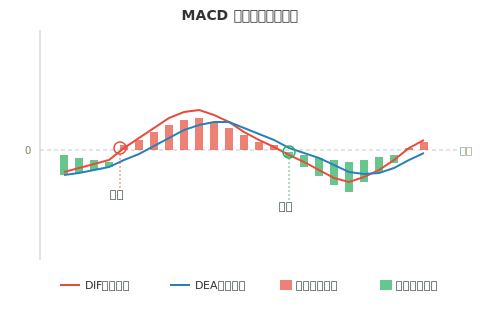
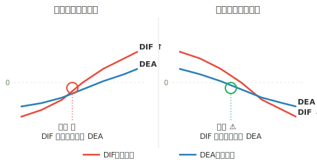

## 什么是 MACD

MACD（Moving Average Convergence Divergence），即**移动平均收敛/发散指标**，是一种趋势跟踪型的技术分析工具，由 Gerald Appel 于 1979 年提出。它通过计算两条不同周期的指数移动平均线（EMA）之间的差值，来判断买卖时机和市场趋势。



## MACD 的组成

MACD 由以下四部分组成：

- **DIF（快线）**：短期 EMA（12 日）与长期 EMA（26 日）的差值，反映短期与长期趋势的偏离程度
- **DEA（慢线）**：DIF 的 9 日指数移动平均线，是 DIF 的平滑处理，也叫信号线（Signal Line）
- **MACD 柱（红绿柱）**：(DIF - DEA) × 2，红柱表示多头力量占优，绿柱表示空头力量占优
- **零轴**：DIF 和 DEA 的分水岭，零轴之上为多头市场，零轴之下为空头市场

## 计算公式

```
EMA(12) = 前一日 EMA(12) × 11/13 + 今日收盘价 × 2/13
EMA(26) = 前一日 EMA(26) × 25/27 + 今日收盘价 × 2/27

DIF = EMA(12) - EMA(26)
DEA = 前一日 DEA × 8/10 + 今日 DIF × 2/10
MACD柱 = (DIF - DEA) × 2
```

## 核心用法

### 一、金叉与死叉



- **金叉（买入信号）**：DIF 从下方向上穿越 DEA，表示短期趋势转强
- **死叉（卖出信号）**：DIF 从上方向下穿越 DEA，表示短期趋势转弱

> 金叉/死叉出现在**零轴上方**时信号更强，出现在**零轴下方**时需谨慎。

### 二、零轴的意义

- **DIF 和 DEA 均在零轴上方**：属于多头市场，金叉为强烈买入信号
- **DIF 和 DEA 均在零轴下方**：属于空头市场，死叉为强烈卖出信号
- **DIF 和 DEA 在零轴附近**：市场处于震荡期，信号可靠性较低

### 三、红绿柱的变化

- **红柱逐渐变长**：多头力量增强，上涨趋势加速
- **红柱逐渐缩短**：多头力量减弱，可能出现回调
- **绿柱逐渐变长**：空头力量增强，下跌趋势加速
- **绿柱逐渐缩短**：空头力量减弱，可能出现反弹

### 四、顶背离与底背离

- **顶背离（看跌信号）**：股价创新高，但 MACD 指标没有同步创新高。说明上涨动能减弱，可能即将**见顶回落**
- **底背离（看涨信号）**：股价创新低，但 MACD 指标没有同步创新低。说明下跌动能减弱，可能即将**触底反弹**

> 背离信号是 MACD 中**最具实战价值**的用法之一，尤其在周线级别出现背离时，信号更加可靠。

## 实战注意事项

- **(1)** MACD 是**趋势型指标**，在震荡行情中容易产生**频繁的假信号**，建议结合其他指标（如 KDJ、布林带）综合判断。
- **(2)** **周线级别**的 MACD 信号比日线级别更可靠，适合中长线投资者参考。
- **(3)** 金叉/死叉不要机械使用，要结合**成交量**和**所处位置**（高位/低位）综合分析。
- **(4)** 顶背离和底背离可能**连续出现多次**，第一次背离后不一定立刻反转，需要等待确认信号。
- **(5)** MACD 指标具有**滞后性**，不适合用来精准抄底逃顶，更适合确认趋势方向。
