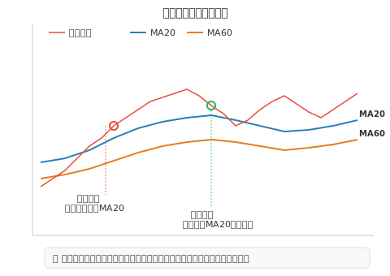

## 什么是压力与支撑

在股票技术分析中，**压力（阻力）** 和 **支撑** 是两个最基本也最重要的概念。它们代表了股价在上涨或下跌过程中，可能遇到阻碍而出现反转或停滞的价格区域。

- **压力位（阻力位）**：股价上涨过程中，卖方力量集中的价位区域，股价触及后容易**回落**
- **支撑位**：股价下跌过程中，买方力量集中的价位区域，股价触及后容易**反弹**

## 常见的压力与支撑类型

### 一、均线压力与支撑

均线（MA）是最常用的压力支撑参考工具：

- **MA5（5 日均线）**：超短线支撑/压力，适合日内和短线交易者
- **MA10（10 日均线）**：短线支撑/压力
- **MA20（20 日均线）**：中短线的重要分水岭，也叫"月线"
- **MA60（60 日均线）**：中线趋势的生命线，也叫"季线"
- **MA120（120 日均线）**：中长线重要支撑/压力，也叫"半年线"
- **MA250（250 日均线）**：长线牛熊分界线，也叫"年线"

**均线使用原则**：

- 股价在均线**上方运行**，均线构成**支撑**
- 股价在均线**下方运行**，均线构成**压力**
- **多条均线汇聚**的位置，压力/支撑效果更强
- 均线**周期越长**，支撑/压力作用越强

### 二、前高与前低

- **前期高点**：股价曾经到达但未能突破的最高价位，形成**压力位**
- **前期低点**：股价曾经到达但未再跌破的最低价位，形成**支撑位**

> 前高/前低被测试的次数越多，一旦被突破，形成的趋势越强。

### 三、整数关口

- 股价在**整数价位**（如 10 元、20 元、50 元、100 元）附近，往往会形成心理上的压力或支撑
- 大盘指数在整数关口（如 3000 点、3500 点）同样存在明显的心理效应

### 四、缺口压力与支撑

- **向上跳空缺口**：缺口下沿构成支撑，回补缺口则支撑失效
- **向下跳空缺口**：缺口上沿构成压力，回补缺口则压力解除

### 五、成交密集区

- 某个价位区间如果历史上成交量巨大，说明大量筹码**套牢**在此区域
- 股价从下方接近该区域时，会遇到较大的**抛压（压力）**
- 股价从上方回落至该区域时，会获得一定的**承接（支撑）**

## 压力与支撑的转换

一个关键原则：**压力位一旦被有效突破，就会转变为支撑位；支撑位一旦被有效跌破，就会转变为压力位。**

判断"有效突破"的参考标准：

- **幅度**：突破幅度超过 3%
- **时间**：站稳突破位 3 个交易日以上
- **成交量**：突破时伴随明显放量

## 实战注意事项

- **(1)** 压力和支撑是一个**区域**而非精确的价格点，不要过于纠结具体点位。
- **(2)** 越多次被验证的支撑/压力位越有效，但**一旦被突破，反向力量也越大**。
- **(3)** 上涨趋势中，每次回踩支撑位不跌破，是**加仓**的好时机。
- **(4)** 下跌趋势中，每次反弹到压力位受阻，是**减仓**的好时机。
- **(5)** 建议结合**成交量**来判断突破的有效性，无量突破往往是假突破。
